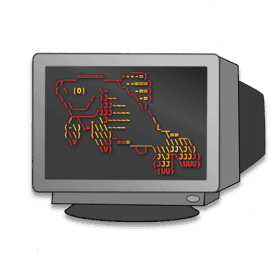
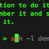
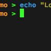
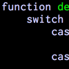
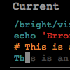
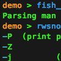
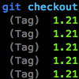

fish shell

 

#  Finally, a command

line shell for the 90s

fish is a smart and user-friendly command line
shell for macOS, Linux, and the rest of the family.

* * *

#### Autosuggestions

 

fish suggests commands as you type based on history and completions, just like a web browser. Watch out, Netscape Navigator 4.0!

#### Glorious VGA Color

 

fish supports 24 bit true color, the state of the art in terminal technology. Behold the monospaced rainbow.

#### Sane Scripting

 

fish is fully scriptable, and its syntax is simple, clean, and consistent. You'll never write esac again.

#### Web Based configuration

 

For those lucky few with a graphical computer, you can set your colors and view functions, variables, and history all from a web page.

#### Man Page Completions

 

Other shells support programmable completions, but only fish generates them automatically by parsing your installed man pages.

#### Works Out Of The Box

 

fish will delight you with features like tab completions and syntax highlighting that just work, with nothing new to learn or configure.

* * *

### Teach me to fish

 [Tutorial](http://fishshell.com/docs/current/tutorial.html)  [Documentation](http://fishshell.com/docs/current/index.html)  [FAQ](http://fishshell.com/docs/current/faq.html)

* * *

### Go fish

- [macOS](http://fishshell.com/#get_fish_osx)

- [Linux](http://fishshell.com/#get_fish_linux)

- [Windows](http://fishshell.com/#get_fish_windows)

- [tarball](http://fishshell.com/#get_fish_tarball)

####   [Homebrew](http://brew.sh/)

 

 brew install fish

####   [MacPorts](https://www.macports.org/)

 

 sudo port install fish

####   [Installer](http://fishshell.com/files/2.5.0/fish-2.5.0.pkg)

 

  10.6+: Installs to /usr/local/

####   [App](http://fishshell.com/files/2.5.0/fish-2.5.0.app.zip)

 

  10.6+
 [No installation required](http://fishshell.com/#)

* * *

### Release History

 [Release Notes](http://fishshell.com/release_notes.html)

- 2.5.0, released February 3, 2017

- 2.4.0, released November 8, 2016  ([tarball](http://fishshell.com/files/2.4.0/fish-2.4.0.tar.gz))

- 2.3.1, released July 3, 2016  ([tarball](http://fishshell.com/files/2.3.1/fish-2.3.1.tar.gz))

- 2.3.0, released May 20, 2016  ([tarball](http://fishshell.com/files/2.3.0/fish-2.3.0.tar.gz))

- 2.2.0, released July 12, 2015  ([tarball](http://fishshell.com/files/2.2.0/fish-2.2.0.tar.gz))

- 2.1.2, released February 24, 2015  ([tarball](http://fishshell.com/files/2.1.2/fish-2.1.2.tar.gz))

- 2.1.1, released September 26, 2014  ([tarball](http://fishshell.com/files/2.1.1/fish-2.1.1.tar.gz) - note that there are known issues on macOS)

- 2.1.0, released October 28, 2013  ([tarball](http://fishshell.com/files/2.1.0/fish-2.1.0.tar.gz) - note that there are known security vulnerabilities)

- 2.0.0, released May 17, 2013  ([tarball](http://fishshell.com/files/2.0.0/fish-2.0.0.tar.gz) - note that there are known security vulnerabilities)

* * *

### Development

fish development is [hosted on GitHub](https://github.com/fish-shell/fish-shell).

To clone the git repository:
git clone git://github.com/fish-shell/fish-shell.git

Build instructions are provided at the [bottom of the GitHub page](https://github.com/fish-shell/fish-shell/#building).

* * *

### Contact Us

- Questions, comments, rants and raves can be posted to the [official fish mailing list](https://lists.sourceforge.net/lists/listinfo/fish-users).

- Found a bug? Have an awesome idea? Please open an issue on the [github page](https://github.com/fish-shell/fish-shell/issues).

- You can e-mail ridiculous_fish directly at [corydoras@ridiculousfish.com](http://fishshell.com/mailto:co%72y%64ora%73@ri%64icul%6F%75%73fish.com).