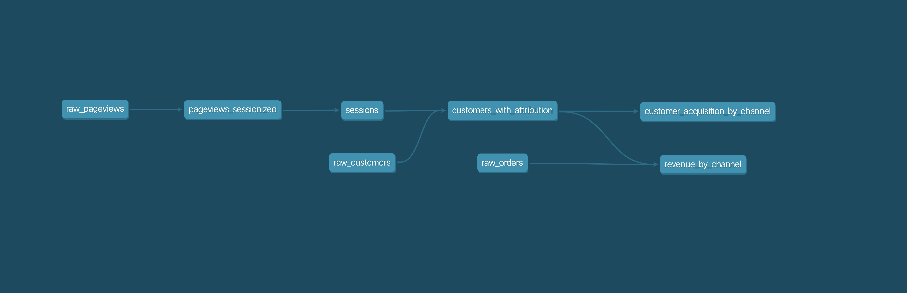

fishtown-analytics/dbt: dbt (data build tool) enables data analysts and engineers to transform their data using the same practices that software engineers use to build applications.

 

       

**[dbt](https://www.getdbt.com/)** (data build tool) enables data analysts and engineers to transform their data using the same practices that software engineers use to build applications.

dbt is the T in ELT. Organize, cleanse, denormalize, filter, rename, and pre-aggregate the raw data in your warehouse so that it's ready for analysis.

dbt can be used to [aggregate pageviews into sessions](https://github.com/fishtown-analytics/snowplow), calculate [ad spend ROI](https://github.com/fishtown-analytics/facebook-ads), or report on [email campaign performance](https://github.com/fishtown-analytics/mailchimp).

## Understanding dbt

Analysts using dbt can transform their data by simply writing select statements, while dbt handles turning these statements into tables and views in a data warehouse.

These select statements, or "models", form a dbt project. Models frequently build on top of one another – dbt makes it easy to [manage relationships](https://docs.getdbt.com/docs/ref) between models, and [visualize these relationships](https://docs.getdbt.com/docs/documentation), as well as assure the quality of your transformations through [testing](https://docs.getdbt.com/docs/testing).

## Getting started

- [Install dbt](https://docs.getdbt.com/docs/installation)
- Read the [documentation](https://docs.getdbt.com/).
- Productionize your dbt project with [dbt Cloud](https://www.getdbt.com/)

## Find out more

- Check out the [Introduction to dbt](https://dbt.readme.io/docs/introduction).
- Read the [dbt Viewpoint](https://dbt.readme.io/docs/viewpoint).

## Join thousands of analysts in the dbt community

- Join the [chat](http://slack.getdbt.com/) on Slack.
- Find community posts on [dbt Discourse](https://discourse.getdbt.com/).

## Reporting bugs and contributing code

- Want to report a bug or request a feature? Let us know on [Slack](http://slack.getdbt.com/), or open [an issue](https://github.com/fishtown-analytics/dbt/issues/new).
- Want to help us build dbt? Check out the [Contributing Getting Started Guide](https://github.com/fishtown-analytics/dbt/blob/dev/barbara-gittings/CONTRIBUTING.md)

## Code of Conduct

Everyone interacting in the dbt project's codebases, issue trackers, chat rooms, and mailing lists is expected to follow the [PyPA Code of Conduct](https://www.pypa.io/en/latest/code-of-conduct/).