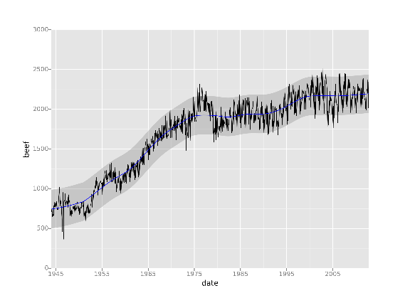
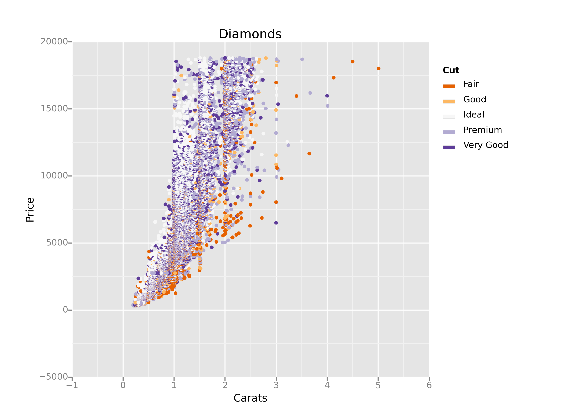
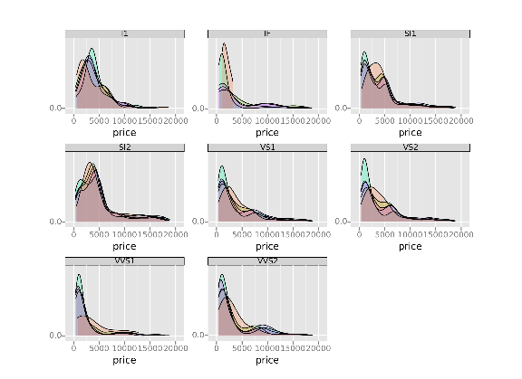

ggplot | Home

# ggplot from ŷhat

 [About](http://ggplot.yhathq.com/) | [Installation](http://ggplot.yhathq.com/install.html) | [How It Works](http://ggplot.yhathq.com/how-it-works.html) | [Docs](http://ggplot.yhathq.com/docs/index.html) | [Gallery](http://ggplot.yhathq.com/gallery.html)

* * *

`ggplot` is a plotting system for Python based on R's [`ggplot2`](http://ggplot2.org/) and the *[Grammar of Graphics](http://www.amazon.com/Grammar-Graphics-Statistics-Computing/dp/0387245448)*. It is built for making profressional looking, plots quickly with minimal code.

## `ggplot` is easy to learn

from ggplot import*
ggplot(aes(x='date', y='beef'), data=meat)+\
geom_line()+\
stat_smooth(colour='blue', span=0.2)

## `ggplot` is fun

ggplot(diamonds, aes(x='carat', y='price', color='cut'))+\
geom_point()+\
scale_color_brewer(type='diverging', palette=4)+\
xlab("Carats")+ ylab("Price")+ ggtitle("Diamonds")

## `ggplot` is powerful

ggplot(diamonds, aes(x='price', fill='cut'))+\
geom_density(alpha=0.25)+\
facet_wrap("clarity")

© 2014 [ŷhat](http://yhathq.com/)