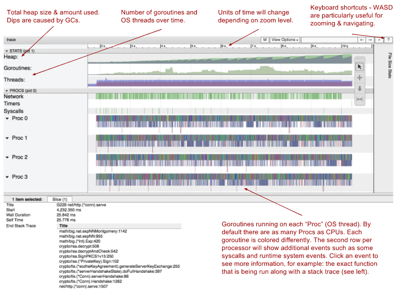
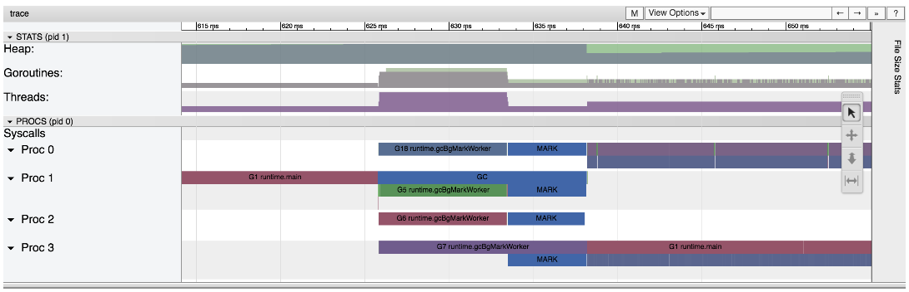
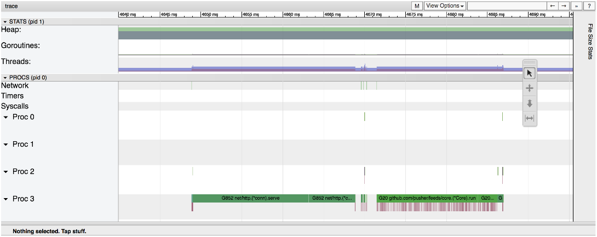
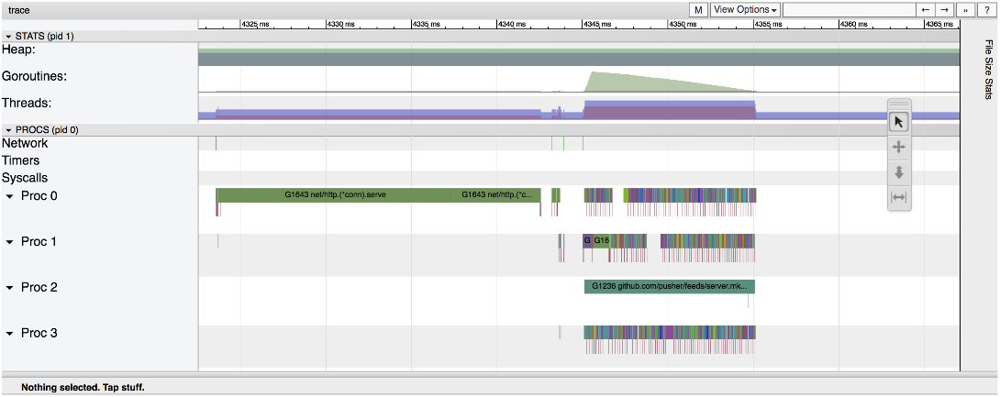

go tool trace

Do you want to know what your Go program is *really* doing?`go tool trace` can show you: it visualizes all the runtime events over a run of your Go program, in exquisite detail. This under-documented tool is one of the most useful tools in the Go ecosystem for diagnosing performance problems such as latency, poor parallelisation, and contention. In [my previous blog post](https://making.pusher.com/golangs-real-time-gc-in-theory-and-practice/) I mentioned that we used `go tool trace` at Pusher to track down long pause times in Go’s garbage collector. In this blog post, I’ll give you a deeper dive into `go tool trace`.

# Tour of the `go tool trace` interface

`go tool trace` displays a lot of information, so it is hard to know where to start. Let’s get a rough overview of the interface first, and then we’ll look at how you can investigate specific problems with it.

The `go tool trace` UI is a web app. Below, I’ve embedded a live example of this web app! This example visualizes a trace of [a parallel quicksort implementation](https://gist.github.com/WillSewell/3246161e67f897a530a8120db8917bee):

*Note: the viewier is only compatable with Chrome.*

Play around with the example! For help navigating the UI, click the “?” in the top right. Click any event on the screen to get more information below the trace. Quiz time! Here are some things you can find out from this trace:

- How long does this program run for? (Find the answer by looking at the timeline along the top.) Click to reveal the answer ...

- How many goroutines were running 872 microseconds into the run? (Find the answer by zooming until individual microseconds are visible, then clicking on the “Goroutines” section.) Click to reveal the answer ...

- When did the process first ramp up to using three OS threads? (You should browse the “Threads” section.) Click to reveal the answer ...

- When did `main` call `qSortPar`? (Expand the “PROCS” section, and look for “G1 runtime.main” in Proc 0. What happens after that event?) Click to reveal the answer ...

- What caused the additional procs (1, 2 and 3) to start doing work? (Under “View Options”, turn on “Flow events”. You can then see arrows which trace cause-and-effect between events.) Click to reveal the answer ...

- When did proc #2 stop? (Zoom in on the end of activity for proc #2. There’s an event called “proc stop”.) Click to reveal the answer ...

# Great! So how do I use `go tool trace` with my program?

You must instrument your program to emit runtime events to a binary file. This involves importing the [`runtime/trace`](https://golang.org/pkg/runtime/trace/)package from the standard library, and adding a few lines of boilerplate. This quick video walks you through it:

**X**
ADCHOICES IDENTIFIED

[Introduction to go tool trace](https://www.youtube.com/watch?v=Xq5HDH8y0CE)

Here’s the code to copy-paste to follow along:

	package main

	import (
		"os"
		"runtime/trace"
	)

	func main() {
		f, err := os.Create("trace.out")
		if err != nil {
			panic(err)
		}
		defer f.Close()

		err = trace.Start(f)
		if err != nil {
			panic(err)
		}
		defer trace.Stop()

	  *// Your program here*
	}

This will cause your program to emit events in a [binary format](https://docs.google.com/document/d/1FP5apqzBgr7ahCCgFO-yoVhk4YZrNIDNf9RybngBc14/edit#heading=h.h5l8z9xnjq7)to the file `trace.out`. You can then run `go tool trace trace.out`. This will parse the trace file and open a browser with the visualizer. It will start a server which will respond to the visualizer with the trace data. Once the initial page is loaded in the browser, click “View trace”. This will load a trace viewer like the one embedded above.

# What problems can I solve with `go tool trace`?

Let’s run through examples of how you would track down typical problems using this tool.

## Diagnosing latency problems

Latency problems can be introduced when a goroutine that is critical to completing an operation blocked from running. This can happen for a number of reasons: it is blocked on a syscall; it is blocked on a shared memory (channel/mutex etc); it is blocked on the runtime system (e.g. the GC), it’s even possible the scheduler is not running the critical goroutine as frequently as you would like.

All of these can be identified using `go tool trace`. You can track the problem down by looking at the PROCs timeline, and finding periods of time where a critical goroutine is being blocked for an unacceptably long period of time. Once you have identified this period of time, whatever is being run instead of the critical goroutine should give you a clue as to what the root cause is.

As an example of a latency issue, let’s see what a long GC pause looks like from [the previous blog post](https://making.pusher.com/golangs-real-time-gc-in-theory-and-practice/):

The red-colored events represent when the one and only program goroutine is running. The goroutines running in parallel on all four threads are the MARK phase of the garbage collector. This MARK phase blocks the main goroutine. Can you see how long it blocks the `runtime.main` goroutine for? Click to reveal the answer ...

I investigated this latency problem soon after[the Go team announced typical GC pause times of less than 100 *microseconds*](https://groups.google.com/forum/#!msg/golang-dev/Ab1sFeoZg_8/_DaL0E8fAwAJ). So the long pause times I was seeing with `go tool trace` looked odd, particularly because I could see they were occurring in the concurrent phase of the collector.[I mentioned this to the go-nuts mailing list](https://groups.google.com/d/msg/golang-nuts/nOD0fGmRp_g/4FEThB1bBQAJ), and it appears to be related to [this issue](https://github.com/golang/go/issues/16528), which is now fixed in Go 1.8. My benchmark also surfaced [another GC time pause problem](https://github.com/golang/go/issues/18155), which is actively being worked on at the time of writing. This investigative work would be impossible without `go tool trace`!

## Diagnosing poor parallelism

Let’s say you’ve written a program which you expect to be using all CPUs, but it runs slower than you expect it to. This could be because your program is not as parallel as you expect. This can be caused by running too much of the critical path in serial, when parts could be run asynchronously (and in parallel).

Example time! Say we have a pub/sub message bus that we want running in a single goroutine so that it can safely modify a `map` of subscribers without a mutex. Request handlers write incoming messages to the message bus queue. The bus reads messages off the queue, looks up in the map which subscribers to send them to, and writes the message to their sockets. Let’s see what this looks like in `go tool trace` for a single message:

The initial green-colored event is where the http handler reads the published message and writes it into the message bus event queue. After that, the message bus runs in a single thread – the second green-colored event – writing the message out to subscribers.

The red lines show where messages are written to subscriber’s sockets. How long does it take the process to write to all the subscribers?Click to reveal the answer ...

The problem is three out of four threads are sitting idle while this is going on. Is there a way we can make use of them? The answer is yes! We don’t need to synchronously write to each subscriber; these could be run concurrently in separate goroutines. Let’s see what happens if we visualize it with this change:

As you can see, the period of time where messages are being written to subscribers is now happening on all threads, in many different goroutines.

But is it faster? Click to reveal the answer ...

It’s interesting to see that the speedup is modest, given that we are using 4X as much CPU. This is because there is a lot more overhead in running code in parallel: starting and stopping goroutines; sharing memory; separate caches. There is also a theoretical limit on the speedup which prevents us from achieving a 4X reduction in latency: [Amdahl’s Law](https://en.wikipedia.org/wiki/Amdahl's_law).

In fact, it may often be less efficient to run code in parallel; particularly if the goroutines are very short lived, or there is a lot of contention between them. This is another reason to use this tool: try both approaches and check which works best for your use case.

# When is `go tool trace` not appropriate?

Of course, `go tool trace` can’t solve everything. It’s not appropriate if you want to track down slow functions, or generally find where your program is spending most of its CPU time. For that you should use [`go tool pprof`](https://blog.golang.org/profiling-go-programs), which shows the percentage of CPU time spent in each function.`go tool trace` is better suited at finding out what your program is doing *over time*, not in aggregate. Also, there are other visualizations offered by `go tool trace` alongside the “View Trace” link, and these are particularly useful to diagnose contention issues. There’s also no substitute to knowing your program’s performance in *theory* (with old-fashioned Big-O analysis).

# Conclusion

Hopefully this post has given you a taste of how useful `go tool trace` can be for diagnostics. Even if you don’t have a specific problem to solve, visualizing your program is a great way of checking that the runtime characteristics of your program match up with your intuition. I encourage you to fire up your Go program and give it a whirl. The examples I showed in this post were simple, but symptoms in your more complex programs should be surprisingly similar.

# Appendix (or, show me the code)

This blog post gave you an introduction to using `go tool trace`, but you may wish to dive deeper.[The official docs for `go tool trace`](https://golang.org/cmd/trace/) are currently quite sparse. There is a [Google Doc](https://docs.google.com/document/d/1FP5apqzBgr7ahCCgFO-yoVhk4YZrNIDNf9RybngBc14/edit?usp=sharing)that goes into more detail. Beyond that, I found it useful to refer to source code in order to figure out how `go tool trace` worked:

- [`go tool trace` source](https://github.com/golang/go/tree/master/src/cmd/trace)

- [Source of binary trace parser](https://github.com/golang/go/blob/master/src/internal/trace/parser.go)

- [Tracer source](https://github.com/golang/go/blob/master/src/runtime/trace.go)

- The web interface for `go tool trace` comes from the [trace viewer of the Catapult project](https://github.com/catapult-project/catapult/blob/master/tracing/README.md). This viewer can generate visualizations from a number of trace formats. `go tool trace` uses a JSON-based [Trace Event Format](https://docs.google.com/document/d/1CvAClvFfyA5R-PhYUmn5OOQtYMH4h6I0nSsKchNAySU/preview).

- [Rhys Hiltner’s talk on `go tool trace`](https://www.youtube.com/watch?v=mmqDlbWk_XA). He shows some other example problems that this tool can help track down.