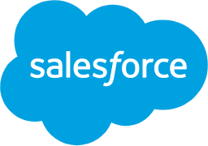

go.dev

# Build fast, reliable, and efficient software at scale

##  Go is an open source programming language supported by Google.

 [Get Started](https://go.dev/learn)  [Download Go](https://golang.org/dl)

 

## Companies using Go

- [ View case study](https://go.dev/solutions/paypal/)

- [   View case study](https://go.dev/solutions/americanexpress/)

- [ View case study](https://go.dev/solutions/mercadolibre/)

- [ View article *open_in_new*](https://www.zdnet.com/article/salesforce-why-we-ditched-python-for-googles-go-language-in-einstein-analytics/)

- [ View article *open_in_new*](https://medium.com/capital-one-tech/a-serverless-and-go-journey-credit-offers-api-74ef1f9fde7f)

- [ View article *open_in_new*](https://tech.target.com/infrastructure/2018/06/18/Recommending-GoLang-at-Target.html)

- [ View article *open_in_new*](https://blog.twitch.tv/en/2016/07/05/gos-march-to-low-latency-gc-a6fa96f06eb7/)

- [ View article *open_in_new*](https://medium.com/netflix-techblog/application-data-caching-using-ssds-5bf25df851ef)

- [ View article *open_in_new*](https://blog.twitter.com/engineering/en_us/a/2015/handling-five-billion-sessions-a-day-in-real-time.html)

- [ View article *open_in_new*](https://eng.uber.com/aresdb/)

- [ View article *open_in_new*](https://blogs.dropbox.com/tech/2014/07/open-sourcing-our-go-libraries/)

## Why choose Go

- 

### Easy to learn

“At the time, no single team member knew Go, but **within a month, everyone was writing in Go** and we were building out the endpoints. It was the flexibility, how easy it was to use, and the really cool concept behind Go (how Go handles native concurrency, garbage collection, and of course safety+speed.) that helped engage us during the build. Also, who can beat that cute mascot!”

- [Jaime Enrique Garcia Lopez, Senior Software Development Manager at CapitalOne](https://medium.com/capital-one-tech/a-serverless-and-go-journey-credit-offers-api-74ef1f9fde7f)

- 

### Efficient

 **"A small language that compiles fast makes for a happy developer.** The Go language is small, compiles really fast, and as a result it lets your mind focus on the actual problem and less on the tool you are using to solve it. Code, test, debug cycles are so quick that you forget you are not working with an interpreted language. Looking at our code, you see **less boilerplate and more business logic**."

- [Clayton Coleman, lead engineer, Open Shift at RedHat](https://blog.gopheracademy.com/birthday-bash-2014/openshift-3-old-dogs-new-tricks/)

- 

### Powerful

“**Go has excellent characteristics for scalability and services written using it typically have very small memory footprints**. Because code is compiled into a single static binary, services can also be containerised with ease, making it much simpler to build and deploy. These attributes make **Go an ideal choice for companies building microservices**, as you can easily deploy into a highly available and scalable environment such as Kubernetes.”

- [Matt Boyle, lead software engineer at Curve](https://www.computerweekly.com/blog/Open-Source-Insider/Golang-or-go-home-how-Curve-is-taking-Golang-to-new-heights)

 

## Designed for today's needs

 

### Cloud & Network Services

With a strong ecosystem of tools and APIs on major cloud providers, it is easier than ever to build services with Go.

 [Learn More >](https://go.dev/solutions/cloud/)

### Command-line Interfaces

With popular open source packages and a robust standard library, use Go to create fast and elegant CLIs.

 [Learn More >](https://go.dev/solutions/clis/)

### Web Development

With enhanced memory performance and support for several IDEs, Go powers fast and scalable web applications.

 [Learn More >](https://go.dev/solutions/webdev/)

 

### DevOps & Site Reliability

With fast build times, lean syntax, an automatic formatter and doc generator, Go is built to support both DevOps and SRE.

 [Learn More >](https://go.dev/solutions/devops/)

## Learn Go

“I started writing in Go when I was just out of college and couldn’t believe how quickly I picked it up, especially compared to other languages. I had spent months learning about how to build APIs in other languages (and mostly failing), but **after a week of writing Go, I had completed my first API**.”

- [Kaylyn Gibilterra, Senior Software Engineer, Capital One](https://medium.com/capital-one-tech/good-to-go-a-language-that-makes-it-easy-for-engineers-to-talk-to-each-other-17ad0f47f76c)

### Get started learning Go today

- [       Codecademy](https://www.codecademy.com/learn/learn-go?utm_source=customer_io&utm_campaign=oct_21_golaunch&utm_medium=email&utm_content=header_img)

- [       Exercism.io](https://exercism.io/tracks/go)

- [       Google Developers Codelabs](https://codelabs.developers.google.com/codelabs/cloud-functions-go-http/#0)

- [       Gophercises](https://gophercises.com/)

### Events

[View more events >](https://www.meetup.com/pro/go)

- 

Feb 1, 2020

Melbourne, Australia

####   [Introduction to Dragon Boat Racing: Free sport event](https://www.meetup.com/letsgo-melbourne/events/tkxdnrybcdbcb)

We run fun and interesting events.

If you want to organise events, let us know and we'll make you an event organizer.

NOTE: We were formally called "Melbourne Young Professionals", but since it doesn't represent who we are, the name has changed to "Let's Go"

[Learn more >](https://www.meetup.com/letsgo-melbourne/events/tkxdnrybcdbcb)

- 

Feb 4, 2020

Hannover, Germany

####   [Hannover Gophers - Vol. 17](https://www.meetup.com/Hannover-Gophers/events/268081899)

The place to meet Go(lang) enthusiasts from the Hannover region. Drop by if you are interested in Golang or back end stuff in general :-)

Find recently announced talks at [golang.wtf](http://www.golang.wtf/)!

[Learn more >](https://www.meetup.com/Hannover-Gophers/events/268081899)

- 

Feb 4, 2020

Baltimore, MD USA

####   [Baltimore Go Monthly Meeting](https://www.meetup.com/BaltimoreGolang/events/twgcdqybcdbgb)

If you're interested in the Go Programming Language (aka Golang), newbie, experienced or just curious, this is the meetup for you. We're an inclusive group that aims for diversity in our membership, the talks we select every month and your ideas for making this group thrive. Let's build an awesome Go community in the Baltimore Metro Area.

[Learn more >](https://www.meetup.com/BaltimoreGolang/events/twgcdqybcdbgb)