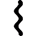

gpu.js - GPU Accelerated JavaScript

 [(L)](https://github.com/gpujs/gpu.js)

 
 gpu.js  GPU Accelerated JavaScript

 [** Download (develop branch)](http://gpu.rocks/js/dist/develop/gpu.js.zip)  [** Github Repo](https://github.com/gpujs/gpu.js)

 
Perform massively parallel GPGPU computations using WebGL.

 
Graceful pure JavaScript fallback when WebGL is not available.

## Demo

* * *



### Matrix Multiplication

	const gpu = new GPU();
	// Create the GPU accelerated function from a kernel
	// function that computes a single element in the
	// 512 x 512 matrix (2D array). The kernel function
	// is run in a parallel manner in the GPU resulting
	// in very fast computations! (...sometimes)
	const multiplyMatrix = gpu.createKernel(function(a, b) {
	  var sum = 0;
	  for (var i = 0; i < 512; i++) {
	    sum += a[this.thread.y][i] * b[i][this.thread.x];
	  }
	  return sum;
	}).setDimensions([512, 512]).setOutputToTexture(true);

	// Perform matrix multiplication on 2 matrices of size 512 x 512
	const c = multiplyMatrix(a, b);

#### Texture Mode (GPU only)

  Disabled (default)
  Enabled (This is where the REAL POWER IS!)

CPU: 0.539s ±2.2%

GPU: 0.072s ±4.3% *(7.46 times faster!)*

 *Benchmarks provided by [benchmark.js](https://github.com/bestiejs/benchmark.js)*

 [** Run Benchmark](http://gpu.rocks/#)

* * *

## Syntax Support

* * *



gpu.js relies on the assumption that the kernel function is using only a subset of legal JavaScript syntax:

- 1D, 2D, 3D array of numbers or just numbers as kernel input

- 1D, 2D, 3D array of numbers as kernel output

- Number variables

- Arithematic operations (`+`, `-`, `*`, `/`, `%`)

- Javascript Math operations (`Math.floor()` and etc.)

- Fixed sized `for` loops *(better performance)*

- Variable sized `for` loops *(with fixed upper bound for all loops)*

- `if` and `else` statements

- No variables captured by a closure

* * *

## Development Benchmarks

* * *



Here is a chart representing the performance of a 512x512 maltrix multiplication throughout our development (lower is better).

- **Hardware:** Macbook Pro Retina 2012

- **Operating System:** Mac OS X 10.12.5

- **Browser:** Firefox 54.0.1 (64-Bit)

Apr 2016Jul 2016Oct 2016Jan 2017Apr 2017Jul 20170.050.10.150.20.25

[Download plot as a png]()[Save and edit plot in cloud]()
[Zoom]()[Pan]()
[Zoom in]()[Zoom out]()[Autoscale]()[Reset axes]()
[Toggle Spike Lines]()[Show closest data on hover]()[Compare data on hover]()
[Produced with Plotly](https://plot.ly/)

- **Hardware:** i7-7700K + GTX1080

- **Operating System:** Windows 10 (Build 15063.483)

- **Browser:**

  Firefox 54.0.1 (32-Bit)

  Chrome 59.0.3071.115 (64-Bit)

  Edge 40.15063.0.0 (64-Bit)

Apr 2016Jul 2016Oct 2016Jan 2017Apr 2017Jul 201700.050.10.15

[Download plot as a png]()[Save and edit plot in cloud]()
[Zoom]()[Pan]()
[Zoom in]()[Zoom out]()[Autoscale]()[Reset axes]()
[Toggle Spike Lines]()[Show closest data on hover]()[Compare data on hover]()
[Produced with Plotly](https://plot.ly/)

 **Last Updated:** 2017-07-23

* * *

## Older Releases

* * *



# v0.0-alpha "Hackathon"

Tue Feb 28 2017

This is the legacy version for backward compatiblity with the demos made using the "hackathon" API.

 [** Download](http://gpu.rocks/js/dist/v0.0/gpu.min.js)

 **

### 2nd Place, Hack & Roll 2016

Made under 24 hours for a NUS Hackers hackathon, out of 68 competing projects.

Copyright © 2017 gpu.js Team. Licensed under MIT.

 [**  Star](https://github.com/gpujs/gpu.js)[******4,321](https://github.com/gpujs/gpu.js/stargazers)

[4 min to Spreed]()