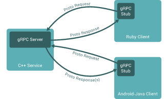

grpc / grpc.io

 

[Home](https://grpc.io/)

* * *

[About](https://grpc.io/about/)

* * *

[Docs](https://grpc.io/docs/)

 [(L)](https://grpc.io/docs)  [(L)](https://grpc.io/docs/quickstart)  [(L)](https://grpc.io/docs/guides)  [(L)](https://grpc.io/docs/tutorials)  [(L)](https://grpc.io/docs/reference)  [(L)](https://grpc.io/docs/samples)

* * *

[Blog](https://grpc.io/blog/)

* * *

[Community](https://grpc.io/community/)

* * *

[FAQ](https://grpc.io/faq/)

 

[Home](https://grpc.io/)

* * *

[About](https://grpc.io/about/)

* * *

[Docs](https://grpc.io/docs/)

 [(L)](https://grpc.io/docs)  [(L)](https://grpc.io/docs/quickstart)  [(L)](https://grpc.io/docs/guides)  [(L)](https://grpc.io/docs/tutorials)  [(L)](https://grpc.io/docs/reference)  [(L)](https://grpc.io/docs/samples)

* * *

[Blog](https://grpc.io/blog/)

* * *

[Community](https://grpc.io/community/)

* * *

[FAQ](https://grpc.io/faq/)

#

 [(L)](https://github.com/grpc/)

   

# A high performance, open-source universal RPC framework

 [(L)](https://grpc.io/docs)

### Simple service definition

Define your service using Protocol Buffers, a powerful binary serialization toolset and language

 [(L)](https://grpc.io/docs/guides/concepts.html#service-definition)

 

 

### Works across languages and platforms

Automatically generate idiomatic client and server stubs for your service in a variety of languages and platforms

 [(L)](https://grpc.io/about#osp)

### Start quickly and scale

Install runtime and dev environments with a single line and also scale to millions of RPCs per second with the framework

 [(L)](https://grpc.io/docs/quickstart)
 

 

### Bi-directional streaming and integrated auth

Bi-directional streaming and fully integrated pluggable authentication with http/2 based transport

 [(L)](https://grpc.io/docs/guides/auth.html)

* * *

## Want to learn more?

Get started by learning concepts and doing our hello world quickstart in language of your choice.

 [(L)](https://grpc.io/docs)

Or go straight to Quick Start in the language of your choice:

 [C++](https://grpc.io/docs/quickstart/cpp.html)  [Java](https://grpc.io/docs/quickstart/java.html)  [Python](https://grpc.io/docs/quickstart/python.html)

 [Go](https://grpc.io/docs/quickstart/go.html)  [Ruby](https://grpc.io/docs/quickstart/ruby.html)  [C#](https://grpc.io/docs/quickstart/csharp.html)

 [Node.js](https://grpc.io/docs/quickstart/node.html)  [Android Java](https://grpc.io/docs/quickstart/android.html)  [Objective-C](https://grpc.io/docs/quickstart/objective-c.html)

 [PHP](https://grpc.io/docs/quickstart/php.html)

©2015 gRPC | a high performance, open-source universal RPC framework

 Documentation

- [Overview](https://grpc.io/docs/)

- [Quick Start](https://grpc.io/docs/quickstart)

- [Guides](https://grpc.io/docs/guides)

- [Tutorials](https://grpc.io/docs/tutorials)

- [Reference APIs](https://grpc.io/docs/reference)

* * *

 Resources

- [About](https://grpc.io/about)

- [Blog](https://grpc.io/blog)

- [FAQ](https://grpc.io/faq)

* * *

 Community

- [Github](https://github.com/grpc/)

- [Twitter](https://twitter.com/grpcio)

- [Stack Overflow](http://stackoverflow.com/tags/grpc/)

- [YouTube](https://www.youtube.com/channel/UCrnk1HWelWnYtF78YZX80fg)

[(L)](http://www.grpc.io/#)Window size:  x
Viewport size:  x
