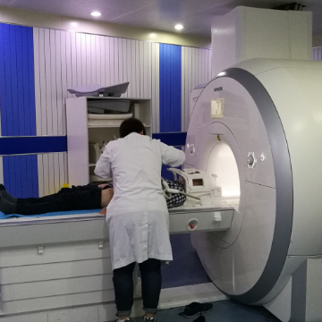

iPhones are Allergic to Helium

iPhones are Allergic to Helium

https://ifixit.org/blog/11986/iphones-are-allergic-to-helium/

This is the kind of tale that you don’t hear every day. During the installation of a new MRI machine, a technician started getting calls that iPhones weren’t working—but Androids were just fine.