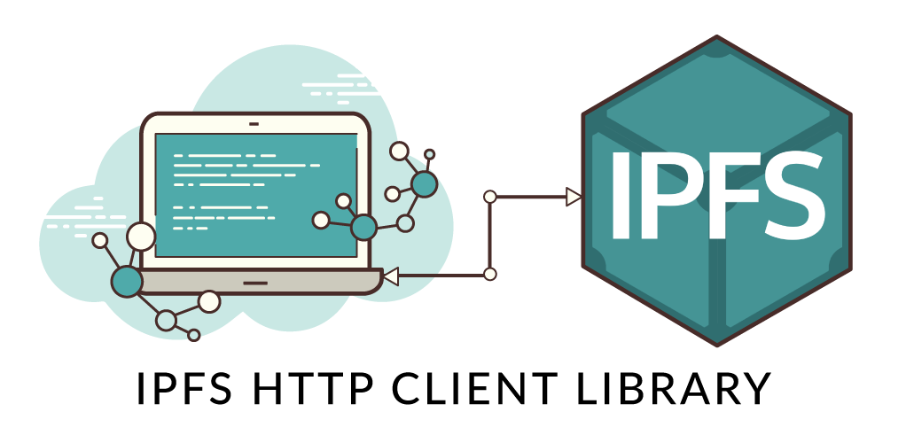

ipfs/ipfs

# IPFS is the Distributed Web

> A peer-to-peer hypermedia protocol to make the web faster, safer, and more open.

Welcome to IPFS! Why not [watch a video demo](https://www.youtube.com/watch?v=8CMxDNuuAiQ) to get started? Please post questions and ideas at [https://discuss.ipfs.io](https://discuss.ipfs.io/)

## Table of Contents

- [Overview](https://github.com/ipfs/ipfs/blob/master/README.md#overview)
    - [Quick Summary](https://github.com/ipfs/ipfs/blob/master/README.md#quick-summary)
- [How IPFS Works](https://github.com/ipfs/ipfs/blob/master/README.md#how-ipfs-works)
    - [IPFS Papers](https://github.com/ipfs/ipfs/blob/master/README.md#ipfs-papers)
    - [IPFS Talks](https://github.com/ipfs/ipfs/blob/master/README.md#ipfs-talks)
- [More About IPFS](https://github.com/ipfs/ipfs/blob/master/README.md#more-about-ipfs)
    - [Current State of IPFS](https://github.com/ipfs/ipfs/blob/master/README.md#current-state-of-ipfs)
    - [Alpha Distribution](https://github.com/ipfs/ipfs/blob/master/README.md#alpha-distribution)
    - [Security Issues and Disclosures](https://github.com/ipfs/ipfs/blob/master/README.md#security-issues-and-disclosures)
- [Project and Community](https://github.com/ipfs/ipfs/blob/master/README.md#project-and-community)
- [Project Links](https://github.com/ipfs/ipfs/blob/master/README.md#project-links)
    - [Protocol Implementations](https://github.com/ipfs/ipfs/blob/master/README.md#protocol-implementations)
    - [HTTP Client Libraries](https://github.com/ipfs/ipfs/blob/master/README.md#http-client-libraries)
    - [Project Directory](https://github.com/ipfs/ipfs/blob/master/README.md#project-directory)
    - [Other Community Resources](https://github.com/ipfs/ipfs/blob/master/README.md#other-community-resources)
- [License](https://github.com/ipfs/ipfs/blob/master/README.md#license)

## Overview

IPFS ([the InterPlanetary File System](https://github.com/ipfs/faq/issues/76)) is a new hypermedia distribution protocol, addressed by content and identities. IPFS enables the creation of completely distributed applications. It aims to make the web faster, safer, and more open.

IPFS is a distributed file system that seeks to connect all computing devices with the same system of files. In some ways, this is similar to the original aims of the Web, but IPFS is actually more similar to a single bittorrent swarm exchanging git objects. You can read more about its origins in the paper [IPFS - Content Addressed, Versioned, P2P File System](https://github.com/ipfs/ipfs/blob/master/papers/ipfs-cap2pfs/ipfs-p2p-file-system.pdf?raw=true).

IPFS is becoming a new major subsystem of the internet. If built right, it could complement or replace HTTP. It could complement or replace even more. It sounds crazy. It *is* crazy.

Want to see more? Check out Juan Benet's talk at Sourcegraph - [IPFS: The Permanent Web](https://www.youtube.com/watch?v=Fa4pckodM9g).

### Quick Summary

IPFS is a protocol:

- defines a content-addressed file system
- coordinates content delivery
- combines Kademlia + BitTorrent + Git

IPFS is a filesystem:

- has directories and files
- mountable filesystem (via FUSE)

IPFS is a web:

- can be used to view documents like the web
- files accessible via HTTP at `https://ipfs.io/<path>`
- browsers or extensions can learn to use the `ipfs://` URL or `dweb:/ipfs/` URI schemes directly
- hash-addressed content guarantees authenticity

IPFS is modular:

- connection layer over any network protocol
- routing layer
- uses a routing layer DHT (kademlia/coral)
- uses a path-based naming service
- uses bittorrent-inspired block exchange

IPFS uses crypto:

- cryptographic-hash content addressing
- block-level deduplication
- file integrity + versioning
- filesystem-level encryption + signing support

IPFS is p2p:

- worldwide peer-to-peer file transfers
- completely decentralized architecture
- **no** central point of failure

IPFS is a cdn:

- add a file to the filesystem locally, and it's now available to the world
- caching-friendly (content-hash naming)
- bittorrent-based bandwidth distribution

IPFS has a name service:

- IPNS, an SFS inspired name system
- global namespace based on PKI
- serves to build trust chains
- compatible with other NSes
- can map DNS, .onion, .bit, etc to IPNS

## How IPFS Works

To learn more about how IPFS works take a look at the [Papers](https://github.com/ipfs/ipfs/blob/master/README.md#ipfs-papers) or [Talks](https://github.com/ipfs/ipfs/blob/master/README.md#ipfs-talks). You can also explore the [Specs](https://github.com/ipfs/specs) in writing.

### IPFS Papers

- [IPFS - Content Addressed, Versioned, P2P File System (draft 3)](https://github.com/ipfs/ipfs/blob/master/papers/ipfs-cap2pfs/ipfs-p2p-file-system.pdf?raw=true)
- [Specifications](https://github.com/ipfs/specs) (work in progress)
- see also: https://github.com/ipfs/papers

### IPFS Talks

This is a short selection of introductory talks. In time we will collect more here.

- 2014-07-21 - [IPFS: The Permanent Web](https://www.youtube.com/watch?v=Fa4pckodM9g) at [Sourcegraph](https://sourcegraph.com/) (first public talk)
- 2015-02-20 - [IPFS Alpha Demo](https://www.youtube.com/watch?v=8CMxDNuuAiQ)
- 2015-06-03 - [IPFS Hands on Introduction](https://www.youtube.com/watch?v=h73bd9b5pPA) at Ethereum SV Meetup
- **2015-10-22 - [IPFS: The Distributed, Permanent Web](https://www.youtube.com/watch?v=HUVmypx9HGI) at Stanford Seminar (best overview of project)**
- 2016-09-14 - [Distributed Apps with IPFS](https://www.youtube.com/watch?v=jONZtXMu03w)
- 2016-10-22 - [The Decentralized Web, IPFS and Filecoin](https://www.youtube.com/watch?v=cU-n_m-snxQ)

See full list at [IPFS Media](https://ipfs.io/media/)

## More About IPFS

The IPFS project seeks to evolve the infrastructure of the Internet and the Web, with many things we've learned from successful systems, like [Git](https://git-scm.com/), [BitTorrent](http://bittorrent.org/), [Kademlia](https://en.wikipedia.org/wiki/Kademlia), [Bitcoin](https://bitcoin.org/), and many, many more. This is the sort of thing that would have come out of ARPA/DARPA/IETF/BellLabs in another age. IPFS is a Free Open Source project, with hundreds of contributors.

### Current State of IPFS

**IPFS is a work in progress!**

Please note that IPFS is a work in progress. It is an ambitious plan to make the internet more free, open, secure, and high performance. It builds on the good ideas of numerous battle-tested distributed systems.

Today, there is one main IPFS Protocol implementation (in [Go](https://github.com/ipfs/go-ipfs)) with [more on the way](https://github.com/ipfs/ipfs/blob/master/README.md#protocol-implementations) ([JavaScript](https://github.com/ipfs/js-ipfs), and [Python](https://github.com/ipfs/py-ipfs)).

### Alpha Distribution

In February of 2015, the [go-ipfs](https://github.com/ipfs/go-ipfs) implementation was released as an "Alpha Distribution". Since then, go-ipfs has been making regular releases on the road towards Beta. Both [js-ipfs](https://github.com/ipfs/js-ipfs) and [py-ipfs](https://github.com/ipfs/py-ipfs) are in progress.

- [Install IPFS Alpha Distribution](https://ipfs.io/docs/install)
- [Setup IPFS and Getting Started](https://ipfs.io/docs/getting-started/)
- [Going Online](https://ipfs.io/docs/getting-started/#going-online)
- [More Examples](https://ipfs.io/docs/examples/)

For an in-depth tutorial, see a [Hands on Introduction](https://www.youtube.com/watch?v=h73bd9b5pPA).

### Security Issues and Disclosures

The IPFS protocol and its implementations are still in heavy development. This means that there may be problems in our protocols, or there may be mistakes in our implementations. And -- though IPFS is not production-ready yet -- many people are already running nodes in their machines. So we take security vulnerabilities very seriously. If you discover a security issue, please bring it to our attention right away!

If you find a vulnerability that may affect live deployments -- for example, by exposing a remote execution exploit -- please send your report privately to [security@ipfs.io](https://github.com/ipfs/ipfs/blob/master/README.md#alpha-distributionmailto:security@ipfs.io). Please DO NOT file a public issue.

If the issue is a protocol weakness that cannot be immediately exploited or something not yet deployed, just discuss it openly.

## Project and Community

The IPFS Project is now very large, with hundreds of contributors in our community. You are invited to join it! Here are some links to our communication channels:

- [IPFS Community Forums for Discussion and Support](https://discuss.ipfs.io/)
- [Sprints and Project Management](https://github.com/ipfs/pm)
- [Contributing Guidelines](https://github.com/ipfs/community/blob/master/CONTRIBUTING.md)

You can also find our community on:

- IRC: [#ipfs on chat.freenode.net](https://webchat.freenode.net/?channels=ipfs) for live help and some dev discussions ([Logs](https://botbot.me/freenode/ipfs/))
- Google Group: [ipfs-users@groups.google.com](https://groups.google.com/forum/#!forum/ipfs-users) (low traffic)
- Twitter: [@IPFSbot](https://twitter.com/ipfsbot) for news.

## Project Links

The IPFS Project is big -- there are many subprojects and related efforts. We will document the core ones here, though you should look around. The space is exploding and lots of new projects are springing up all the time.

For a community-curated lists of awesome projects using IPFS, check out [awesome-ipfs](https://github.com/ipfs/awesome-ipfs)!

### Protocol Implementations

| Language | Project | Completeness |
| --- | --- | --- |
| Go  | https://github.com/ipfs/go-ipfs | **reference** |
| JavaScript | https://github.com/ipfs/js-ipfs | **alpha** |
| Python | https://github.com/ipfs/py-ipfs | starting |
| C   | https://github.com/Agorise/c-ipfs | starting |

If you would you like to start your own language implementation of IPFS, check out the [IPFS Implementation Guide](https://github.com/ipfs/specs/blob/master/overviews/implement-ipfs.md), and the [Specifications](https://github.com/ipfs/specs). The specs are still evolving, but the core formats are stable and can be built on. Make sure to post an issue if you would like to start an effort, as many people have expressed interest in contributing to new implementations.

### HTTP Client Libraries

| Language | Client Library | Completeness |
| --- | --- | --- |
| Go  | https://github.com/ipfs/go-ipfs-api | ??  |
| Java | https://github.com/ipfs/java-ipfs-api | ??  |
| JavaScript | https://github.com/ipfs/js-ipfs-api | 100% |
| Python | https://github.com/ipfs/py-ipfs-api | ??  |
| Scala | https://github.com/ipfs/scala-ipfs-api | ??  |
| Clojure | https://github.com/keorn/clj-ipfs-api | ??  |
| Clojurescript | https://github.com/district0x/cljs-ipfs-api | ??  |
| Haskell | https://github.com/davidar/hs-ipfs-api | ??  |
| Swift | https://github.com/ipfs/swift-ipfs-api | ??  |
| CommonLisp | https://github.com/WeMeetAgain/cl-ipfs-api | ??  |
| Rust | https://github.com/ferristseng/rust-ipfs-api | ??  |
|     | https://github.com/gkbrk/rust-ipfs-api | ??  |
|     | https://github.com/rmnoff/rust-ipfs-api | ??  |
|     | https://github.com/rschulman/rust-ipfs-api | ??  |
| Ruby | https://github.com/Fryie/ipfs-ruby | ??  |
| Mac Automator | https://github.com/NeoTeo/ipfs-osx-service | ??  |
| PHP | https://github.com/cloutier/php-ipfs-api | ??  |
|     | https://github.com/digitalkaoz/php-ipfs-api | ??  |
| C#  | https://github.com/jeremy-ellis-tech/net-ipfs-http-client | ??  |
|     | https://github.com/richardschneider/net-ipfs-api | ??  |
| C++ | https://github.com/vasild/cpp-ipfs-api | ??  |
| Erlang | https://github.com/hendry19901990/erlang-ipfs-http-client | ??  |
| Objective C | None yet | ??  |
| Julia | contact: [@rened](https://github.com/rened) | ??  |
| Lua | contact: [@seclorum](https://github.com/seclorum) | ??  |

Please help by contributing to one of the above client libraries. If you would like to create another, please see the [IPFS HTTP Client Implementation Guide](https://github.com/ipfs/go-ipfs/blob/master/docs/implement-api-bindings.md), and [tell us](https://github.com/ipfs/ipfs/issues/83) so we can help!

### Project Directory

This aims to be a directory of all the various repos in the [IPFS Github Organization](https://github.com/ipfs), and other closely related things.

We have a status board that checks all IPFS repositories for CI, Readmes, test coverage, and so on, here: http://project-repos.ipfs.io/

#### Project Organization

- [ipfs](https://github.com/ipfs/ipfs) - Master repo, intro, and news.
- [discourse](https://discuss.ipfs.io/) - Community discussions and support forum.
- [tm](https://github.com/ipfs/tm) - IPFS Team Planning and Management of the Project

#### Get Help!

The best place to seek help is on [the IPFS community forum](https://discuss.ipfs.io/) or on IRC (freenode) in the `#ipfs` channel.

There are two deprecated repositories containing [FAQ](https://github.com/ipfs/faq) and [support](https://github.com/ipfs/support). Use those as reference, but post any new questions or requests for help on [https://discuss.ipfs.io](https://discuss.ipfs.io/).

#### Documents

- [papers](https://github.com/ipfs/ipfs/blob/master/papers) - Academic papers on IPFS.
- [specs](https://github.com/ipfs/specs) - Specifications on the IPFS protocol.
- [notes](https://github.com/ipfs/notes) - Various relevant notes and discussions (that do not fit elsewhere).
- [reading-list](https://github.com/ipfs/reading-list) - Papers to read to understand IPFS.

#### Discussions

- [archives](https://github.com/ipfs/archives) - Coordinating archival efforts with IPFS.
- [archive-format](https://github.com/ipfs/archive-format) - A DAG Archive format.
- [research-bitswap](https://github.com/ipfs/research-bitswap) - Repo to discuss Bitswap research.
- [bitswap-ml](https://github.com/ipfs/bitswap-ml) - Bitswap and Machine Learning.
- [research-crdt](https://github.com/ipfs/research-crdt) - Repo to discuss crdt research.
- [research-pubsub](https://github.com/libp2p/research-pubsub) - Repo to discuss pubsub research.
- [blockchain-data](https://github.com/ipfs/blockchain-data) - Using IPFS for storing data for Blockchain apps.
- [POST](https://github.com/ipfs/POST) - A datastructure for human communication.

#### Protocol Implementations

- [go-ipfs](https://github.com/ipfs/go-ipfs) - Implementation in Go.
- [js-ipfs](https://github.com/ipfs/js-ipfs) - Implementation in Javascript.
- [py-ipfs](https://github.com/ipfs/py-ipfs) - Implementation in Python.

#### IPFS DSLs

- [fsharp-ipfs-dsl](https://github.com/cloveekprojeqt/fsharp-ipfs-dsl) - Embedded declarative F# DSL over [net-ipfs-api](https://github.com/richardschneider/net-ipfs-api)

#### IPFS GUIs

- [ipfs-companion](https://github.com/ipfs-shipyard/ipfs-companion) - The web browser extension.
- [ipfs-desktop](https://github.com/ipfs-shipyard/ipfs-desktop) - A menubar/tray desktop app.
- [ipfs-webui](https://github.com/ipfs/webui) - The IPFS WebUI app.
- [i18n](https://github.com/ipfs/i18n) - The IPFS Translation Project: crowdsourcing translations of IPFS GUIs and websites.
- [pm-ipfs-gui](https://github.com/ipfs-shipyard/pm-ipfs-gui) - Coordinating development and maintenance of GUI apps.

#### Apps on IPFS

You can find an ever growing list at [Awesome IPFS](https://awesome.ipfs.io/categories/apps/)

#### Community Infrastructure

- [blog](https://github.com/ipfs/blog) - The IPFS Blog.
- [community forum](https://discuss.ipfs.io/)
- [distributions](https://github.com/ipfs/distributions) - Scripts to build the /install html page.
- [newsletter](https://github.com/ipfs/newsletter) - Prepare and store IPFS Newsletter roundups.
- [infrastructure](https://github.com/ipfs/infrastructure) - Tools and systems for the community.
- [ops-requests](https://github.com/ipfs/ops-requests) - Requests about infrastructure operations.
- [project-repos](https://github.com/ipfs/project-repos) CI status and other health metrics.
- [website](https://github.com/ipfs/website) - The source to the IPFS community website at [http://ipfs.io](http://ipfs.io/).

#### Ref Lists

- [refs](https://github.com/ipfs/refs) - Tools for publishing lists of IPFS ref heads.
- [refs-denylists-dmca](https://github.com/ipfs/refs-denylists-dmca) - DMCA takedown notices for the IPFS Public Gateway.
- [refs-solarnet-storage](https://github.com/ipfs/refs-solarnet-storage) - Inventory of content archived on Solarnet storage hosts.

### Other Community Resources

- [examples](https://github.com/ipfs/examples) - Examples on how to use go-ipfs.
- [awesome-ipfs](https://github.com/ipfs/awesome-ipfs) - Useful resources for using IPFS and building things on top of it.
- [logo](https://github.com/ipfs/logo) - The logo for IPFS.

#### IPFS Meetups

There are plethora of IPFS Meetups all over the world now. Find yours at the [Community Repo](https://github.com/ipfs/community#events)

We encourage and support IPFS Meetups, please let us know if you would like to start one. Feel free to organize yourself through [the Community discussions](https://github.com/ipfs/community/issues) and [to advertise events in the main repository](https://github.com/ipfs/ipfs/issues).

#### Tools

Installing

- [install-go-ipfs](https://github.com/ipfs/go-ipfs#install) - Install go-ipfs shell script.
- [install-js-ipfs](https://github.com/ipfs/js-ipfs#install) - Install js-ipfs through npm or a script tag.
- [ipfs-update](https://github.com/ipfs/ipfs-update) - An updater tool for IPFS.
- [fs-repo-migrations](https://github.com/ipfs/fs-repo-migrations) - These are migrations for [IPFS fs-repo](https://github.com/ipfs/specs/tree/399c907b214a24dc82ca010af6884227cb2829cf/repo/fs-repo) versions.
- [npm-go-ipfs](https://github.com/ipfs/npm-go-ipfs) - Install go-ipfs from npm.

Other

- [connections-globe](https://github.com/ipfs/connections-globe) - An interactive globe to view all your IPFS peers.
- [dataviz](https://github.com/ipfs/dataviz) - IPFS data visualizations.
- [dir-index-html](https://github.com/ipfs/dir-index-html) - Directory listing html.
- [dnslink-deploy](https://github.com/ipfs/dnslink-deploy) - Automatically set DNS records on Digital Ocean.
- [file-browser](https://github.com/ipfs/file-browser) - Generic IPFS file browser UI
- [fs-stress-test](https://github.com/ipfs/fs-stress-test) - Stress testing IPFS filesystem capabilities.
- [js-ipfsd-ctl](https://github.com/ipfs/js-ipfsd-ctl) - Control IPFS daemons from JavaScript.
- [ipfs-hubot](https://github.com/ipfs/ipfs-hubot) - Hubot for IPFS uses.
- [ipfs-blob-store](https://github.com/ipfs/ipfs-blob-store) - A place to buy blobs.
- [Find an ever growing list on Awesome IPFS](https://awesome.ipfs.io/categories/tools/)

## License

MIT