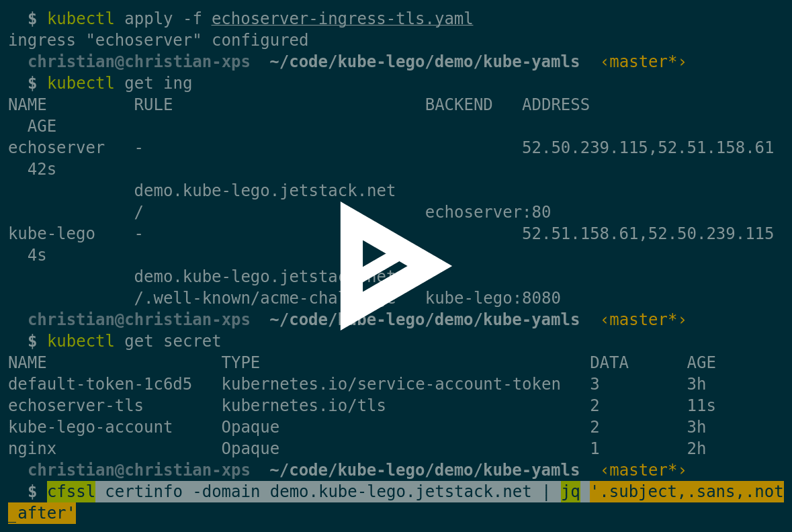

jetstack/kube-lego

###    README.md

# [(L)](https://github.com/jetstack/kube-lego#kube-lego)kube-lego

*kube-lego* automatically requests certificates for Kubernetes Ingress resources from Let's Encrypt

[[Build Status](../_resources/af3359b6a330e8be6d21e0274c77bc30.bin)](https://travis-ci.org/jetstack/kube-lego)[[68747470733a2f2f696d616765732e6d6963726f6261646765722e636f6d2f6261646765732f76657273696f6e2f6a6574737461636b2f6b7562652d6c65676f2e737667](../_resources/07bd651ffed425d9afaedfc8f336b15d.bin)](http://microbadger.com/#/images/jetstack/kube-lego)

## [(L)](https://github.com/jetstack/kube-lego#screencast)Screencast

## [(L)](https://github.com/jetstack/kube-lego#features)Features

- Recognizes the need of a new certificate for this cases:
    - No certificate existing
    - Existing certificate is not containing all domain names
    - Existing certificate is expired or near to its expiry date (cf. option ` LEGO_MINIMUM_VALIDITY `)
    - Existing certificate is unparseable, invalid or not matching the secret key
- Creates a user account (incl. private key) for Let's Encrypt and stores it in Kubernetes secrets (secret name is configurable via ` LEGO_SECRET_NAME `)
- Obtains the missing certificates from Let's Encrypt and authorizes the request with the ` HTTP-01 ` challenge
- Makes sure that the specific Kubernetes objects (Services, Ingress) contain the rights configuration for the ` HTTP-01 ` challenge to succeed
- Official Kubernetes Helm [chart](https://github.com/kubernetes/charts/tree/master/stable/kube-lego) for simplistic deployment.

## [(L)](https://github.com/jetstack/kube-lego#requirements)Requirements

- Kubernetes 1.2+
- Compatible ingress controller (nginx or GCE see [here](https://github.com/jetstack/kube-lego#ingress))
- Non-production use case 😆

## [(L)](https://github.com/jetstack/kube-lego#usage)Usage

### [(L)](https://github.com/jetstack/kube-lego#run-kube-lego)run kube-lego

- [deployment](https://github.com/jetstack/kube-lego/blob/master/examples/gce/lego/deployment.yaml) for *kube-lego*
    - don't forget to configure
        - ` LEGO_EMAIL ` with your mail address
        - ` LEGO_POD_IP ` with the pod IP address using the downward API
    - the default value of ` LEGO_URL ` is the Let's Encrypt **staging environment**. If you want to get "real" certificates you have to configure their production env.

### [(L)](https://github.com/jetstack/kube-lego#how-kube-lego-works)how kube-lego works

As soon as the kube-lego daemon is running, it will create a user account with LetsEncrypt, make a service resource, and look for ingress resources that have this annotation:

metadata: annotations: kubernetes.io/tls-acme: "true"

Every ingress resource that has this annotation will be monitored by *kube-lego* (cluster-wide in all namespaces). The only part that is watched is the list ` spec.tls `. Every element will get its own certificate through Let's Encrypt.

Let's take a look at this ingress resource:
spec: tls:

- secretName: mysql-tls  hosts:
- phpmyadmin.example.com - mysql.example.com - secretName: postgres-tls  hosts:
- postgres.example.com

On finding the above resource, the following happens:

1. An ingress resource is created coordinating where to send acme challenges for the said domains.

2. *kube-lego* will then perform its own check for i.e. ` http://mysql.example.com/.well-known/acme-challenge/_selftest ` to ensure all is well before reaching out to letsencrypt.

3. *kube-lego* will obtain two certificates (one with phpmyadmin.example.com and mysql.example.com, the other with postgres.example.com).

Please note:

- The ` secretName ` statements have to be unique per namespace
- ` secretName ` is required (even if no secret exists with that name, as it will be created by *kube-lego*)
- Setups which utilize 1:1 NAT need to ensure internal resources can reach gateway controlled public addresses.
- Additionally, your domain must point to your externally available Load Balancer (either directly or via 1:1 NAT)

## [(L)](https://github.com/jetstack/kube-lego#ingress-controllers)Ingress controllers

### [(L)](https://github.com/jetstack/kube-lego#nginx-ingress-controller)[Nginx Ingress Controller](https://github.com/kubernetes/ingress/tree/master/controllers/nginx)

- available through image ` gcr.io/google_containers/nginx-ingress-controller `
- fully supports kube-lego from version 0.8 onwards

### [(L)](https://github.com/jetstack/kube-lego#gce-loadbalancers)[GCE Loadbalancers](https://github.com/kubernetes/ingress/tree/master/controllers/gce)

- you don't have to maintain the ingress controller yourself, you pay GCE to do that for you
- every ingress resource creates one GCE load balancer
- all service that you want to expose, have to be ` Type=NodePort `

## [(L)](https://github.com/jetstack/kube-lego#environment-variables)Environment variables

Name
Required
Default
Description
[object Object]
y
[object Object]
E-Mail address for the ACME account, used to recover from lost secrets
[object Object]
y
[object Object]

Pod IP address (use the [downward API](http://kubernetes.io/docs/user-guide/downward-api/))

[object Object]
n
[object Object]
Namespace where kube-lego is running in
[object Object]
n
[object Object]

URL for the ACME server. To get "real" certificates set to the production API of Let's Encrypt: [object Object]

[object Object]
n
[object Object]
Name of the secret in the same namespace that contains ACME account secret
[object Object]
n
[object Object]
Service name for NGINX ingress
[object Object]
n
[object Object]
Service name for GCE ingress
[object Object]
n
[object Object]
Specify the supported ingress class
[object Object]
n
[object Object]
Ingress name which contains the routing for HTTP verification for nginx ingress
[object Object]
n
[object Object]
Port where this daemon is listening for verifcation calls (HTTP method)
[object Object]
n
[object Object]
Interval for periodically certificate checks (to find expired certs)
[object Object]
n
[object Object] (30 days)

Request a renewal when the remaining certificate validitiy falls below that value

[object Object]
n
[object Object]
Default ingress class for resources without specification
[object Object]
n
[object Object]
API server URL
[object Object]
n
[object Object]
Set log level ([object Object])
[object Object]
n
[object Object]

Set the ingress annotation used by this instance of kube-lego to get certificate for from Let's Encrypt. Allows you to run kube-lego against staging and production LE

## [(L)](https://github.com/jetstack/kube-lego#full-deployment-examples)Full deployment examples

- [Nginx Ingress Controller](https://github.com/jetstack/kube-lego/blob/master/examples/nginx)
- [GCE Load Balancers](https://github.com/jetstack/kube-lego/blob/master/examples/gce)

## [(L)](https://github.com/jetstack/kube-lego#troubleshooting)Troubleshooting

When interacting with *kube-lego*, its a good idea to run with ` LEGO_LOG_LEVEL=debug ` for more verbose details. Additionally, be aware of the automatically created resources (see environment variables) when cleaning up or testing.

Possible resources for *help*:

> These are not official support channels for *> kube-lego*>  but rather general kubernetes discussion channels.

- ` #coreos ` on freenode
- Slack channels like ` #kubernetes-users ` or ` #kubernetes-novice ` on ` kubernetes.slack.com `
- If you absolutely just can't figure out your problem, file an issue.

## [(L)](https://github.com/jetstack/kube-lego#authors)Authors

Christian Simon for [Jetstack Ltd](http://www.jetstack.io/)