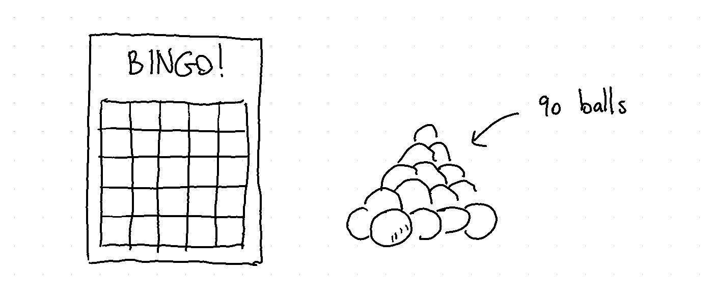
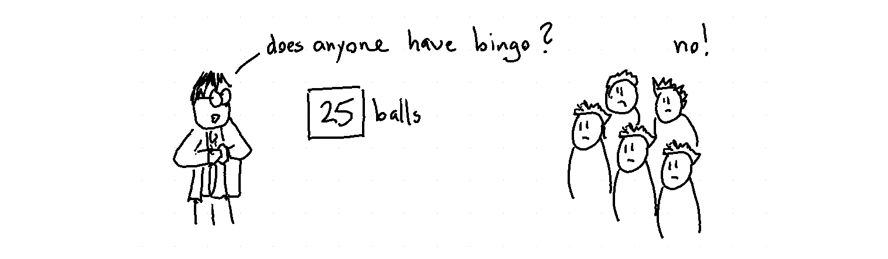
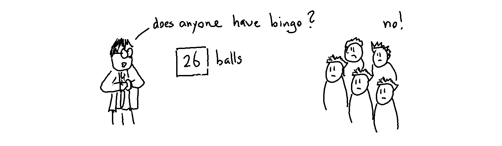
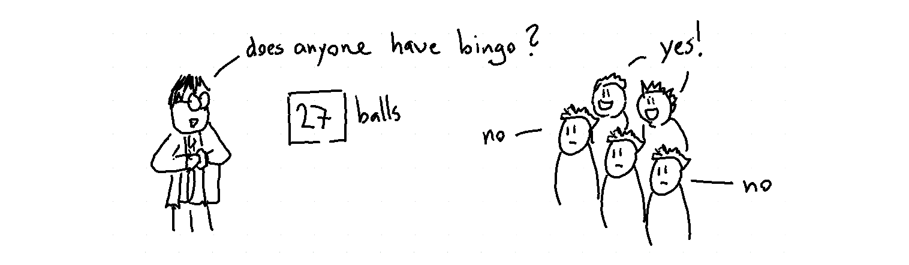
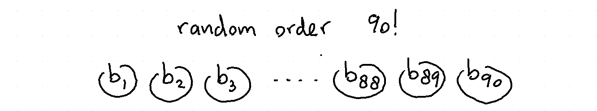
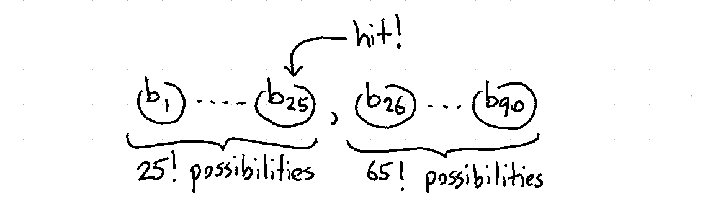
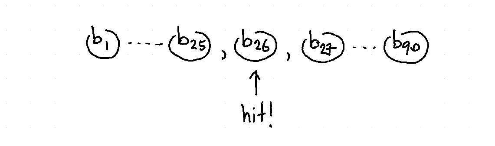
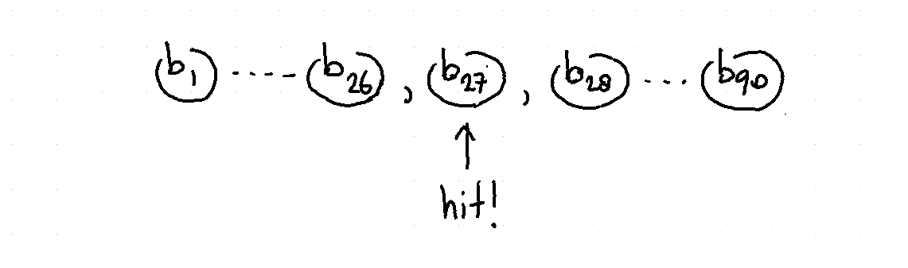
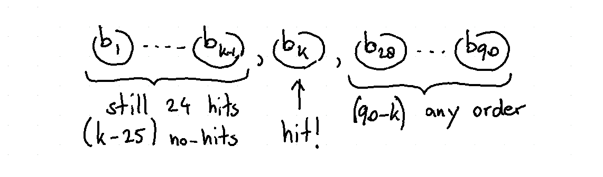
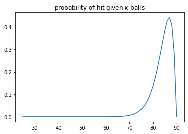

koaning.io: Bingo Ball Pit

# Bingo Ball Pit

An Exercise in Systemic Counting

### Author

### Affiliation

 [Vincent Warmerdam](http://koaning.io/posts/bingo-ball-pit/koaning.io)

 [ ]()

### Published

June 24, 2019

### DOI

I heard a story about an UnnamedCasino[tm] has been attempting to calculate the probability of winning in one of their proposed lotteries. They were so occopied with this problem that they hired UnnamedConsultancy[tm] to deal with the problem. Turns out that even these unnamed, albeit suit wearing, consultany folks have trouble with the maths, despite their suits, and resorted to simulation.

Simulation certainly isn’t a bad idea (if only as a checking mechanism) but after some a discussion over beers I came to the conclusion that you might also be able to calculate the probability by systematic counting.

The exercise is a bit theoretical in nature but I hope it serves as a fun example for practitioners (or suit wearing consultants) who don’t mind reading an example of harder counting problems.

## The Problem

The casino has a lottery like bingo. People get a sheet with 25 random numbers between 1-90 on it. Next, the lottery man will draw 25 balls at random. You win if the numbers on your sheet are pulled.

If nobody in the room has won then that’s fine, they will draw a new ball.

They will keep drawing balls until there actually is a winner.

The more balls are being pulled the larger the probability that multiple people win at the same time. The casino people (remember, these are the people in the casino that *are* risk averse) would like to know the odds of two or more people winning at the same time.

## Thinking About It

This problem can get way out of hand if you aren’t structuring it. Let us first worry about the order of the balls and the number of possible combinations, we’ll worry about the number of people later.

There are 90!=1×2×...×89×9090!=1×2×...×89×90 different combinations possible for the first 90 balls.

#### After 25 balls

Suppose now that 25 balls have been pulled. It is possible that I have a fully marked sheet after the first 25 balls have been pulled. The first 25 balls can be in any order and the latter 65 balls cal also be in any order.

This image helps me come to this formula:

Prob(hit after 25 balls)=Count(hits)Count(misses)Count(total)=25!×65!90!Prob(hit after 25 balls)=Count(hits)Count(misses)Count(total)=25!×65!90!

In this case the formula was pretty easy to derive. Let’s check if we can still do that when the number of balls increase.

#### After 26 balls

If I don’t have a hit then it is possible that the next hit will be. This is **only** possible if out of the previous 25 balls one was a miss. This means we have to draw the picture a bit differently.

Since the picture is different the formula also needs to be adapted.

Prob(hit after 26 balls)=Count(hit 24 out of 25, #26 is hit, other 64 any order)Count(grab 26 from 90)Prob(hit after 26 balls)=Count(hit 24 out of 25, #26 is hit, other 64 any order)Count(grab 26 from 90)

Before we worry about the details, let’s check if the same pattern emerges when we increase the number of balls.

#### After 27 balls

The same argument as before can be made!

Prob(hit after 27 balls)=Count(hit 24 out of 26, #27 is hit, other 63 any order)Count(grab 27 from 90)Prob(hit after 27 balls)=Count(hit 24 out of 26, #27 is hit, other 63 any order)Count(grab 27 from 90)

With this drawing I feel like we might be able to turn this into something general.

#### After k≥25k≥25 balls

Let’s look for something general.

Prob(hit after k balls)=Count(hit 24 out of (k−1),k is hit, other (90−k) any order)Count(grab k from 90)Prob(hit after k balls)=Count(hit 24 out of (k−1),k is hit, other (90−k) any order)Count(grab k from 90)

Turns out that this formula can be translated into a variant of the [hypergeometric distribution](https://en.wikipedia.org/wiki/Hypergeometric_distribution). But beware the slight twist! When we draw, say, 28 balls then I know that in the first 27 balls we did not get 25.

It’s allmost hypergeometric though. If I ignore the final ball kk that causes the bingo then it is fully geometric. This suggests that if I just keep in mind that the probability of getting this ball is 190−k190−k. These two facts can be glued together to get the probability density that we’re interested in.

Prob(hit after k balls)=(2524)(65k−24)(90k)×190−kProb(hit after k balls)=(2524)(65k−24)(90k)×190−k

We can also write this up in python to confirm that we have a distribution that sums to one.

from scipy.special import comb def prob(b=25): return comb(25, 24) * comb(65, b-24) / comb(90, b)

sum([prob(i)/(90-i) for i in range(25, 90)]) # equals 1

Again, the trick here lies in understand that if I pull 50 balls that we **must** account for the fact that there were 24 hits in the 49 before. No more, no less. If I was not able to state this then our formula would be false.

### Final Note

It might just be me, but maybe if you want to solve these sorts of problems it helps to make drawings instead of formulas. It is easier for other people to follow along but it is also easier to understand/explore the problem that you’re facing.

  Share:   [**](https://twitter.com/share?text=Bingo%20Ball%20Pit&url=http%3A%2F%2Fkoaning.io%2Fposts%2Fbingo-ball-pit%2F)  [**](https://www.linkedin.com/shareArticle?mini=true&url=http%3A%2F%2Fkoaning.io%2Fposts%2Fbingo-ball-pit%2F&title=Bingo%20Ball%20Pit)