koaning.io: More Descent, Less Gradient

# More Descent, Less Gradient

Your regression may only need one gradient step. Really.

### Author

### Affiliation

 [Vincent Warmerdam](https://koaning.io/posts/more-descent-less-gradient/koaning.io)

 [ ]()

### Published

April 9, 2020

### Citation

[Warmerdam, 2020](https://koaning.io/posts/more-descent-less-gradient/#citation)

I’ve been rethinking gradient descent over the weekend. It struck me that calculating the gradient is typically *way* more expensive than taking the step that follows it. I ran the numbers and found that about 80% of the training loop is spent calculating a gradient.

This led me to some fun hacking and I want to demonstrate the findings in this document. In particular I would like to highlight some ideas that had insightful results;

1. You can apply calculus to estimate the stepsize you need for the current iteration. If you do this in a principled way then my results suggests that for linear regression you may only need *one* gradient calculation.

2. You can also consider just stepping more before you re-calculate a gradient. Especially early on in SGD the direction won’t change too much so how about we just keep on stepping in a direction until the performance becomes worse? The idea is pretty blunt, but seems to beat SGD and it even gets close to Adam at times.

These results are done on artifical data, so the results deserve to be taken with a grain of salt, but the ideas are intertraining nonetheless.

## Calculus

Suppose that I want to optimise a function, say f(x)f(x). You could calculate the gradient and take a step but after taking this step you’d need to calculate the gradient again.

Figure 1: Gradient Descent 101.

It would work, but it may take a while. Especially if calculating the gradient is expensive (it usually is). So how about we do some extra work to do a calculated step instead.

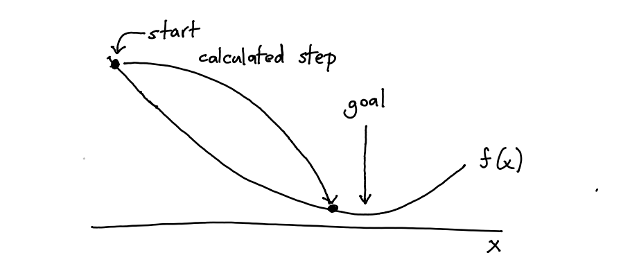
Figure 2: Can’t we do this?

A calculated step might be more expensive to calculate, but this is offset by all the small steps we would otherwise do.

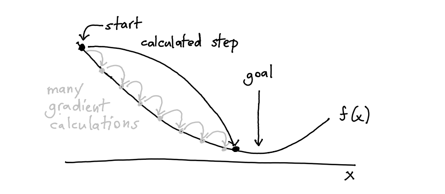
Figure 3: We may be on to something here.

This is where calculus can help us. In particular, taylor series! Suppose that we have some value xx and we’d like to estimate what f(x+t)f(x+t) is then we can approximate this by;

f(x+t)≈f(x)+f′(x)t+12f′′(x)t2f(x+t)≈f(x)+f′(x)t+12f′′(x)t2

If I know the derivatives of the function ff then I can approximate what f(x+t)f(x+t) might be. But we can go a step further. Suppose now that I am interested in finding a minimum for this function. Then we can rewrite the expression to represent iteration.

f(xk+tk)≈f(xk)+f′(xk)tk+12f′′(xk)t2kf(xk+tk)≈f(xk)+f′(xk)tk+12f′′(xk)tk2

Here xkxk represents xx at iteration time kk and the next value xk+1xk+1 will be xk+tkxk+tk. The question now becomes; how can I choose tktk such that travel to the minimum as fast as possible? It turns out to be;

xk+1=xk+tk=xk−f′(xk)f′′(xk)xk+1=xk+tk=xk−f′(xk)f′′(xk)

This formula can be used for functions with a single parameter, but with some linear algebra tricks we can also extend it to functions with many inputs using a [hessian matrix](https://en.wikipedia.org/wiki/Hessian_matrix).

**Derivation.**

If the second derivative is positive, the quadratic approximation is a convex function of tt, and its minimum can be found by setting the derivative to zero. Note that;

0=ddtk(f(xk)+f′(xk)tk+12f′′(xk)t2k)=f′(xk)+f′′(xk)tk0=ddtk(f(xk)+f′(xk)tk+12f′′(xk)tk2)=f′(xk)+f′′(xk)tk

Thus the minimum is achieved for tk=−f′(xk)f′′(xk)tk=−f′(xk)f′′(xk)
Putting everything together, Newton’s method performs the iteration;
xk+1=xk+t=xk−f′(xk)f′′(xk)xk+1=xk+t=xk−f′(xk)f′′(xk)

Now, this formula works for single parameter functions, but we can also express this result in linear algebra terms.

xk+1=xk+t=xk−[f′′(xk)]−1f′(xk)xk+1=xk+t=xk−[f′′(xk)]−1f′(xk)

Here xkxk is a vector, [f′′(xk)]−1[f′′(xk)]−1 is the Hessian matrix and f′(xk)f′(xk) is the gradient vector.

### Enter Jax

This, to me, was a great excuse to play with [jax](https://github.com/google/jax). It has a couple of like-able features but a main one is that it is an autograd library that also features a hessian. You can just-in-time compile derivate functions and it will also run on GPU’s and TPU’s.

This is how you might implement a linear regression;
import jax.numpy as np from jax import grad, jit
def predict(params, inputs): return inputs @ params

def mse(params, inputs, targets): preds = predict(params, inputs) return np.mean((preds - targets)**2)

grad_fun = jit(grad(mse)) # compiled gradient evaluation function

The `grad_fun` is now a compiled gradient function that has two input parameters left; `inputs` and `targets` and it will return the gradiet of the `mse` function. That means that I can use it in a learning loop. So here’s an implementation of linear regression;

import tqdm import numpy as np import matplotlib.pylab as plt

# generate random regression data n, k = 1_000_000, 10 both = [np.ones((n, 1)), np.random.normal(0, 1, (n, k))] X = np.concatenate(both, axis=1) true_w = np.random.normal(0, 5, (k + 1,)) y = X @ true_w np.random.seed(42) W = np.random.normal(0, 1, (k + 1,))

stepsize = 0.02 n_step = 100 hist_gd = np.zeros((n_step,)) for i in tqdm.tqdm(range(n_step)): hist_gd[i] = mse(W, inputs=X, targets=y) dW = grad_fun(W, inputs=X, targets=y) W -= dW*stepsize

This is what the mean squared error looks like over the epochs.
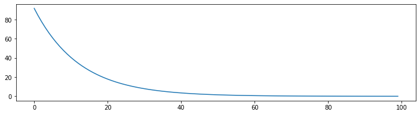
Figure 4: Looks converging.
Let’s now do the same thing, but use the calculus trick.
from jax import hessian

# use same data, but reset the found weights np.random.seed(42) W = np.random.normal(0, 1, (k + 1,))

n_step = 100 hist_hess = np.zeros((n_step,)) for i in tqdm.tqdm(range(n_step)): hist_hess[i] = mse(W, inputs=X, targets=y) inv_hessian = np.linalg.inv(hessian(mse)(W, X, y)) dW = inv_hessian @ grad_fun(W, inputs=X, targets=y) W -= dW

Want to see something cool? This is the new result.

[Try the notebook](https://koaning.io/posts/more-descent-less-gradient/hessian-trick.ipynb).

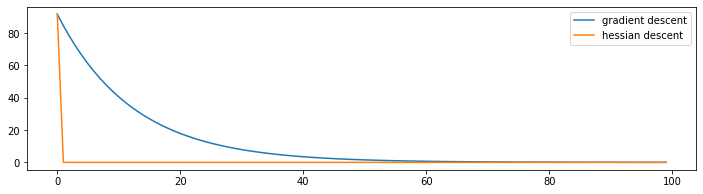
Figure 5: You barely need the second epoch.

The shocking thing is that this graph always has the same shape, no matter the rows or columns. When I first ran this I could barely believe it. By using the hessian trick we predict how big of a step we need to make and it hits bullseye.

There’s reason for this bullseye but it is a bit mathematical.

**Derivation of Mathematical Bullseye.**

Let’s rewrite the loss for linear regression in matrix terms.
L(β)=(y−Xβ)T(y−Xβ)L(β)=(y−Xβ)T(y−Xβ)
If we simply differentiate then the gradient vector is;
∇L(β)=−XT(y−Xβ)∇L(β)=−XT(y−Xβ)
And the Hessian matrix is;
∇2L(β)=XTX∇2L(β)=XTX
Let’s remind ourselves of newtons method.
xk+1=xk+t=xk−f′(xk)f′′(xk)xk+1=xk+t=xk−f′(xk)f′′(xk)
That means that our stepsize (see earlier derivation) needs to be;

t=−[∇2L(β)]−1∇L(β)=−(XTX)−1XT(y−Xβ)=−(XTX)−1XTy+(XTX)−1XTXβ=β−(XTX)−1XTyt=−[∇2L(β)]−1∇L(β)=−(XTX)−1XT(y−Xβ)=−(XTX)−1XTy+(XTX)−1XTXβ=β−(XTX)−1XTy

When we start our regression we start with βkβk and then the update rule becomes;

βk+1=βk−t=βk−βk+(XTX)−1XTy=(XTX)−1XTyβk+1=βk−t=βk−βk+(XTX)−1XTy=(XTX)−1XTy

And this is a bit of a coincidence, but (XTX)−1XTy(XTX)−1XTy is the closed form solution for linear regression. This means that using newtons method for a single iteration on standard linear regression is equivalent to using the close form method.

This does *not* mean that this is the fastest way to perform linear regression. You can benchmark it yourself, scikit-learn is faster.

We should not expect something similar to happen with neural networks though.

1. A linear regression is nice because it does not have a lot of parameters. In this example we have 10 parameters so we’d have a Hessian matrix of 100 elements. If we had a neural network with 2K numbers then we’d suddenly have a matrix with 4 million parameters.

2. We’re typically not interested in the best performance on a training set, we’re more interested in something that generalizes well. Even if this approach would work perfectly in a neural setting, we may not be that interested in it because of the overfitting risk.

## Towards Networks

This made me wonder, can we do something similar in spirit for neural networks? Well, maybe we should go for the other extreme. Instead of doing few steps, let’s do many!

Consider what we usually do.
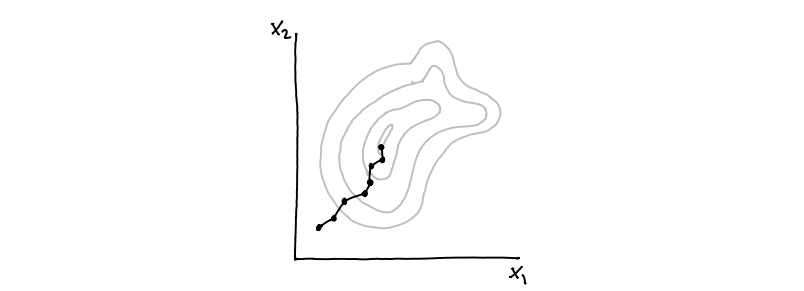
Figure 6: This is base SGD.

If we briefly ignore the details of adam/momentum then the gradient descent idea does the two things calculating a gradient (thick dot) and moving a step (line). But what if we don’t stop stepping?

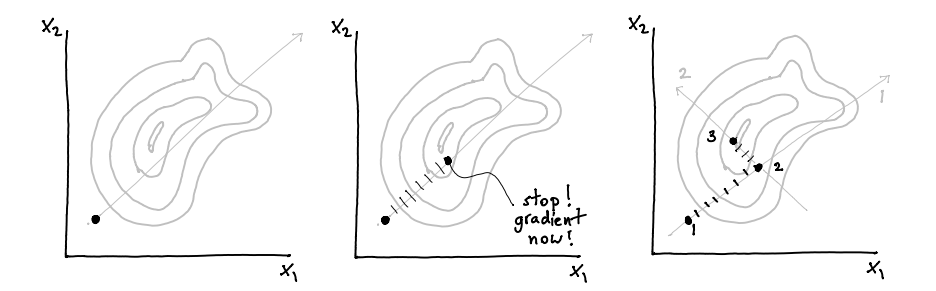

Figure 7: First determine the direction. Then keep walking until results get worse. Only then do another gradient. Repeat.

A dash here represents moving forward without re-evaluating the gradient. Once we notice that a step makes the score worse, we stop and check the gradient again.

It is well possible that the general direction that you’re moving in is a good one, do you really need to stop moving? Do we really need to calculate a gradient? Or can we just keep on stepping? Checking if the next step is making it worse is a forward pass, not a backward one. If a gradient calculation is about 80% of the compute power for training then this might be a neat idea.

There are two hyperparameters to this idea;

- maybe we want to make sure that every `n` steps we check for another gradient
- maybe we get impatient and we’re ok with increasing the stepsize after a few steps

To check the merits of this idea I figured it’d be fun to write my own optimiser for pytorch.

**Implementation of `KeepStepping` Optimizer**

import torch from torch.optim.optimizer import Optimizer, required

class KeepStepping(Optimizer): """ KeepStepping - PyTorch Optimizer Inputs: lr = learning rate, ie. the minimum stepsize max_steps = the maximum number of steps that will be performed before calculating another gradient scale_i = to what degree do we scale our impatience """ def __init__(self, params, lr=required, max_steps=20, scale_i=0): if lr is not required and lr < 0.0: raise ValueError("Invalid learning rate: {}".format(lr)) defaults = dict(lr=lr) super().__init__(params, defaults) self.max_steps = max_steps self.lr_orig = lr self.scale_i = scale_i

def mini_step(self, i): for group in self.param_groups: for p in group['params']: if p.grad is None: continue d_p = p.grad.data scale = - group['lr'] * self.scale_i * np.sqrt(i) p.data.add_(-group['lr'] - scale, d_p) def step(self, closure): """Performs a single optimization step.""" old_loss = closure() i = 0 self.mini_step(i) new_loss = closure() while (new_loss < old_loss) & (i < self.max_steps): self.mini_step(i) old_loss = new_loss new_loss = closure() i += 1 return new_loss

### One Step Further

Before testing this, I consdering taking the previous idea and combining it with the idea before. I am doing less gradients, sure, but I am still taking lots of steps. Can I instead perhaps calculate how big the stepsize should be? There might be something adaptive that we can do here?

Given a direction that we’re supposed to move in, you could consider that we’re back in a one dimensional domain again and that we merely need to find the right stepsize.

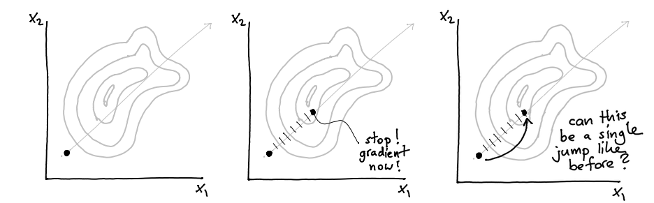

Figure 8: Note that as far as the stepsize is concerned, we merely need to move in one direction. So it’s back to one dimensional-land.

So I made an implementation that takes this direction, numerical estimates of f′(xdirection)f′(xdirection) and f″(xdirection)f″(xdirection) and tries to adaptively estimate an appropriate stepsize.

**Implementation of `KeepVaulting` Optimizer**

import torch from torch.optim.optimizer import Optimizer, required

class KeepVaulting(Optimizer): """ KeepVaulting - PyTorch Optimizer Inputs: lr = learning rate, ie. the minimum stepsize max_steps = the maximum number of steps that will be performed before calculating another gradient """ def __init__(self, params, lr=required, max_steps=20): if lr is not required and lr < 0.0: raise ValueError("Invalid learning rate: {}".format(lr)) defaults = dict(lr=lr) super().__init__(params, defaults) self.max_steps = max_steps self.lr_orig = lr

def mini_step(self, jumpsize=1): for group in self.param_groups: for p in group['params']: if p.grad is None: continue d_p = p.grad.data p.data.add_(-(group['lr'] * float(jumpsize)), d_p) def step(self, closure): """Performs a single optimization step.""" old_loss = closure() i = 0 self.mini_step() new_loss = closure() losses = [old_loss.item(), new_loss.item()] while (new_loss < old_loss) & (i < self.max_steps): # we're using the secant method here to # approximate the second order derivative # http://acme.byu.edu/wp-content/uploads/2019/08/1dOptimization19.pdf first_order_grad1 = (losses[-1] - losses[-2])/self.lr_orig second_order_grad = (losses[-1] - first_order_grad1)/self.lr_orig stepsize = -second_order_grad/first_order_grad1 * self.lr_orig self.mini_step(stepsize) old_loss = new_loss new_loss = closure() losses.append(new_loss.item()) i += 1 return new_loss

## Results

A meaningful benchmark was hard to come up with so I just generated an artificial regression task with some deep layers. I don’t want to suggest that the following counts as “general performance” but they are interesting to think about. I’ll list a few results below.

**Implementation of `generate_new_dataset`**

def generate_new_dataset(n_row, dim_in, dim_hidden, n_layers): torch.manual_seed(0) x = torch.randn(n_row, dim_in) y = x.sum(axis=1).reshape(-1, 1)

model = torch.nn.Sequential( torch.nn.Linear(dim_in, dim_hidden), *[torch.nn.Linear(dim_hidden, dim_hidden) for _ in range(n_layers)], torch.nn.Linear(dim_hidden, 1), ) loss_fn = torch.nn.MSELoss(reduction='mean') def loss_closure(): y_pred = model(x) return loss_fn(y_pred, y)

return model, loss_fn, loss_closure, x, y

**Implementation of Data Collection**

results = {} learning_rate = 1e-3 optimisers = { 'KS_50_0': lambda p: KeepStepping(p, lr=learning_rate, max_steps=50, scale_i=0), 'KS_50_2': lambda p: KeepStepping(p, lr=learning_rate, max_steps=50, scale_i=2), 'KS_10_0': lambda p: KeepStepping(p, lr=learning_rate, max_steps=10, scale_i=0), 'KS_10_2': lambda p: KeepStepping(p, lr=learning_rate, max_steps=10, scale_i=2), 'KV_10': lambda p: KeepVaulting(p, lr=learning_rate, max_steps=10), 'KV_50': lambda p: KeepVaulting(p, lr=learning_rate, max_steps=50), 'SGD': lambda p: torch.optim.SGD(p, lr=learning_rate), 'ADAM': lambda p: torch.optim.Adam(p, lr=learning_rate), }

for name, alg in optimisers.items(): model, loss_fn, loss_closure, x, y = generate_new_dataset() n_steps = 1000 if not 'K' in name else 100 results[name] = np.zeros((n_steps, 2))

optimizer = alg(model.parameters()) tic = time() for t in tqdm.tqdm(range(n_steps)): y_pred = model(x) loss = loss_fn(y_pred, y) optimizer.zero_grad() loss.backward() optimizer.step(loss_closure) results[name][t, :] = [loss.item(), time() - tic]

plt.figure(figsize=(16, 4)) for name, hist in results.items(): score, times = hist[:, 0], hist[:, 1] plt.plot(times, score, label=name) plt.xlabel("time (s)") plt.ylabel("mean squared error") plt.legend();

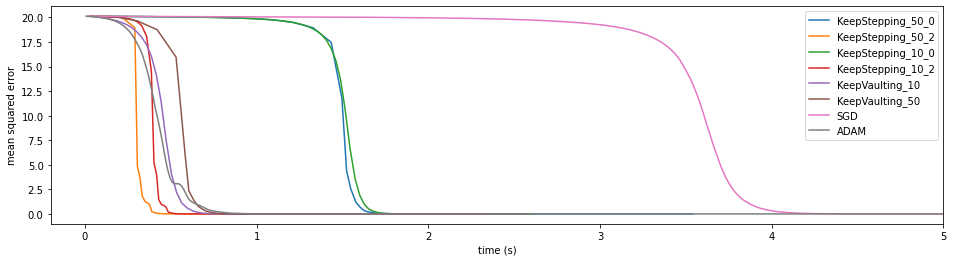

Figure 9: This run contained 10K datapoints with 20 columns as input while the network had 5 layers with 10 hidden units. The initial learning rate was 1e-3.

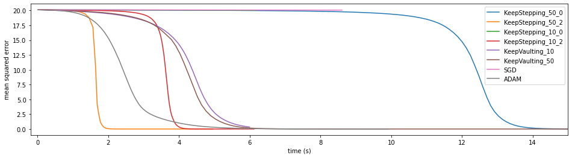

Figure 10: This run contained 10K datapoints with 20 columns as input while the network had 5 layers with 10 hidden units. The initial learning rate was 1e-4. This run was the same as the previous one but has a much smaller initial stepsize. Everything looks a loot smoother, but also becomes a lot slower.

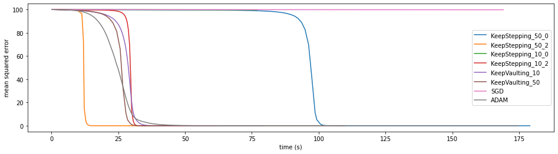

Figure 11: This run contained 100K datapoints with 100 columns as input while the network had 5 layers with 20 hidden units. The initial learning rate was 1e-4. In this run we increased the number of columns.

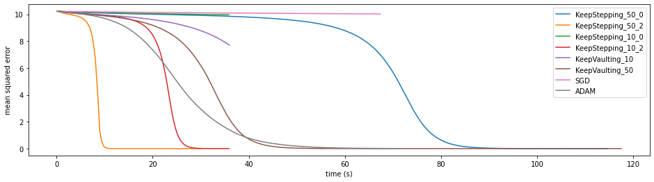

Figure 12: This run contained 100K datapoints with 10 columns as input while the network had 3 hidden layers with 10 units each. We also added Relu layers here. The initial learning rate was 1e-4.

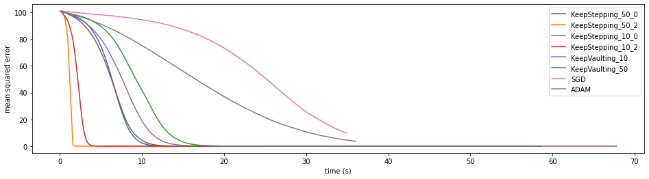

Figure 13: This run contained 100K datapoints with 100 columns as input while the network had zero hidden layers The initial learning rate was 1e-4.

It seems the impatient approach with a max step of 50 is beating Adam when it comes to convergence speed. The idea of vaulting is not performing as well as I had hoped but this may be due to numerical sensitivity. The idea seems to have merit to it but this work should not be seen as a proper benchmark.

Also … that last run is just a linear regression. The fastest way to optimise that is to use the hessian trick that we started with.

## Reflection

So what does all of this mean?

Well … it suggests that there may be a valid trade off between doing more work such that you need to do less gradient evaluations. Either you spend more time preparing a step such that you reduce the number of steps needed (like the hessian approach for the linear regression) or you just do a whole lot more of them without checking the gradient all the time.

### Appendix

I’d be interested in hearing stories from folks who benchmark this, so feel free to try it out and let me know if it does (or does not) work on your dataset.

  Share:   [**](https://twitter.com/share?text=More%20Descent%2C%20Less%20Gradient&url=https%3A%2F%2Fkoaning.io%2Fposts%2Fmore-descent-less-gradient%2F)  [**](https://www.linkedin.com/shareArticle?mini=true&url=https%3A%2F%2Fkoaning.io%2Fposts%2Fmore-descent-less-gradient%2F&title=More%20Descent%2C%20Less%20Gradient)

### Citation

For attribution, please cite this work as

Warmerdam (2020, April 10). koaning.io: More Descent, Less Gradient. Retrieved from https://koaning.io/posts/more-descent-less-gradient/

BibTeX citation

@misc{warmerdam2020more,
author = {Warmerdam, Vincent},
title = {koaning.io: More Descent, Less Gradient},
url = {https://koaning.io/posts/more-descent-less-gradient/},
year = {2020}
}