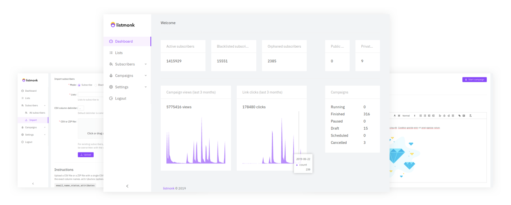

listmonk - Free and open source self-hosted newsletter and mailing list manager

[Docs](https://listmonk.app/docs)[GitHub](https://github.com/knadh/listmonk)

# Self-hosted newsletter + mailing list manager

### Performance and features packed into a single binary

**Download** (v0.2.0-alpha, 21 Jul 2019)[Darwin](https://github.com/knadh/listmonk/releases/download/v0.2.0-alpha/listmonk_0.2.0-alpha_darwin_amd64.tar.gz)[Linux](https://github.com/knadh/listmonk/releases/download/v0.2.0-alpha/listmonk_0.2.0-alpha_linux_amd64.tar.gz)[Windows](https://github.com/knadh/listmonk/releases/download/v0.2.0-alpha/listmonk_0.2.0-alpha_windows_amd64.tar.gz)[Docker](https://github.com/knadh/listmonk#running-on-docker)

listmonk is alpha software under active development and may change and break. Use with caution.

## Multiple lists

Create multiple mailing lists with millions of subscribers with custom attributes for each subscriber.

## Segmentation

Write ad-hoc SQL queries to query subscribers on their attributes to segment and send ad-hoc campaigns.

## Templating

In addition to the WYSIWYG editor, create powerful, dynamic e-mail templates with Go templating.

## Admin

Easy to use admin dashboard for end-to-end management and reporting and analytics.

## APIs

REST-like HTTP/JSON APIs to automate everything, including bulk import and synchronisation of subscribers from external applications.

## High performance

Multi-threaded, high throughput multi-SMTP e-mail queues for super fast campaign delivery.

## Getting started

- Download the listmonk binary for your platform
- Run `./listmonk --new-config` to generate a sample config.toml and add your configuration (SMTP and Postgres DB credentials primarily).
- Run `./listmonk --install` to setup the DB.
- Visit `http://localhost:9000`
- Since there is no user auth yet, it's best to put listmonk behind a proxy like Nginx and setup basicauth on all endpoints except for the few endpoints that need to be public. Here is a[sample nginx config](https://github.com/knadh/listmonk/wiki/Production-Nginx-config)for production use.

## Developers

listmonk is free, open source software licensed under AGPLv3. There are several essential features such as user auth/management and bounce tracking that are currently missing. Contributions are welcome.

The backend is written in Go and the frontend is in React with Ant Design for UI. See[developer setup](https://github.com/knadh/listmonk/wiki/Developer-setup)to get started.

listmonk © 2019. All rights reserved – [Kailash Nadh](https://nadh.in/)