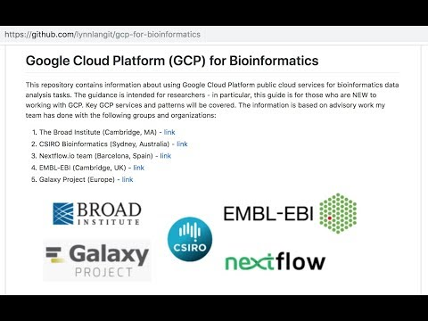

lynnlangit/gcp-for-bioinformatics

# Google Cloud Platform (GCP) for Bioinformatics

This repository covers using ☁️Google Cloud Platform public cloud services for bioinformatics data analysis tasks. The guidance is intended for researchers - in particular, this guide is for those who are **NEW to working with GCP**. The info is based on advisory work my team has done with the groups shown below:

* * *

### Why would I choose to use a public cloud vendor for bioinformatics?

- ⭐️Top Reasons:
    - **Save Money** - run scaled analysis jobs exactly & only when you need to run them
    - **Save Time** - use vendor-managed infrastructure & best-practice patterns for repeatable research -> get analysis results faster
- READ the [FAQ for GCP bioinformatics](https://github.com/lynnlangit/gcp-for-bioinformatics/blob/master/FAQ.md) for this Repo
- READ Nature magazine: ["Cloud computing for genomic data analysis and collaboration"](https://www.nature.com/articles/nrg.2017.113)
- READ the top 4 most [common use cases](https://github.com/lynnlangit/gcp-for-bioinformatics/blob/master/USING.md) for using the public cloud for bioinformatics researchers

* * *

### Click below to WATCH 'Lynn's Welcome Video' (4 min)

Read about, watch demo or try out **EACH ☁️GCP service**, ordered by topic in this Repo:

1. READ - one page explaining why, what & how to use for each service
2. WATCH - short, linked screencast showing how to use for most services
3. TRY - run Jupyter notebook example using for some services

4.  TRY - use code examples from linked GitHub Repos

5. EXPAND - go to linked resources to learn about advanced aspects of each service

* * *

### To Understand the Scope of Services covered in this Repo

1. SCAN - a list of [all topics](https://github.com/lynnlangit/gcp-for-bioinformatics/blob/master/TOPICS.md) covered in this Repo

2. SCAN - a diagram showing a [GCP Genomics Pipeline](https://github.com/lynnlangit/gcp-for-bioinformatics/blob/master/ARCHITECTURE.md) reference architecture

* * *