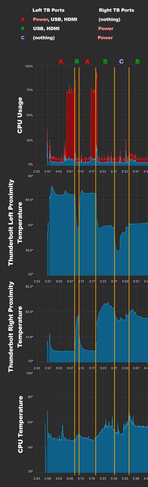

macos - How to find cause of high kernel_task cpu usage? - Ask Different

### TLDR; If your MacBook Pro runs hot or shows a high % CPU for the kernel task, try charging on the right and not on the left.

* * *

High `kernel_task` CPU Usage is due to **high chassis temperature caused by charging**. In particular **Left** Thunderbolt port usage.

Solutions include:

- Move charging from the left to the right side. If you have a second charger then plug it in on the right side. Avoid plugging everything on the right side (see last paragraph below).
- Unplug something from the left side. Either power or another accessory until the battery is full.
- Force fans to max before plugging in. iStatMenus has an easy Sensors -> Fans menu item to do so. This only helps in marginal conditions.
- Move to a cooler room.

**Proof:**

Actual CPU temperature or application CPU usage is uncorrelated with `kernel_task`. A hot CPU is throttled by reducing its clock speed, not by scheduling fake no-op load.

The graphs below are from iStatMenus. The machine had been used on battery then plugged in.

***State A*** a USB-C hub (a mouse and keyboard, plus power) and a USB-C HDMI 2.0 adapter, both on the left side. You can see the ***Thunderbolt Left Proximity*** temperature sensor rise quickly. About 3-4 minutes later the dreaded `kernel_task` high CPU usage starts.

***State B*** cures the `kernel_task` problem by moving power from the left ports to the right. The left side temperature drops and the `kernel_task` goes away within about 15 seconds.

This is causal. Moving power back to the left side, restoring ***State A***, quickly restores the temperatures and `kernel_task` again comes back after 3-4 minutes. Again moving power back to the right side, restoring ***State B***, resolves the problem immediately.

***State C*** shows that simply having stuff plugged in to TB ports raises their temperature significantly. Both the hub (mouse and keyboard ONLY) and HDMI adapter individually raise the temperature about 10 degrees, and 15 degrees together.

(all other temperatures were both low and flat. Under 55 degrees.)

Note that high temperature on the right side appears to be ignored by the OS. Plugging everything into the two right ports instead of the left raised the Right temperatures to over 100 degrees, without the fans coming on. No `kernel_task` either, but the machine becomes unusable from ***something*** throttling.

Ergo, **high CPU usage by `kernel_task` is caused by high ***Thunderbolt Left Proximity*** temperature, which is caused by charging and having normal peripherals plugged in at the same time.**

2017 15" Macbook Pro, MacOS 10.14.5

* * *

To actually answer the question:
>
> How can I find out what this process is doing?

The only way to actually ask the kernel what it's doing is to attach a kernel debugger. That means getting a debug kernel from Apple, rebooting, then using ***a second Mac*** to attach to the debugged machine. You can then examine stack traces and guess what they mean.

Otherwise guessing and testing is the only way. Of course that leads to false conclusions more often than not.