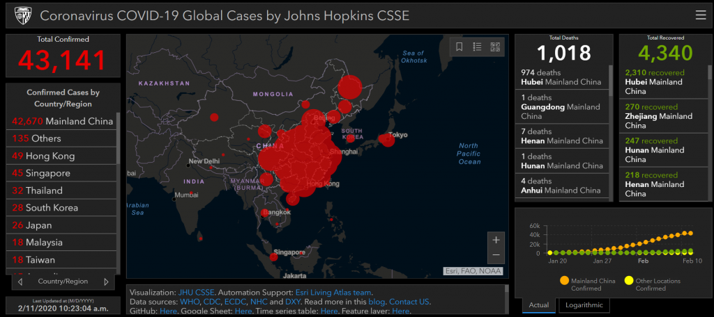

ncov – CSSE

##### public health

## Mapping 2019-nCoV

#### By Lauren Gardner, January 23, 2020

**Reference: **Dong E, Du H, Gardner L. An interactive web-based dashboard to track COVID-19 in real time. ***Lancet Infect Dis***; published online Feb 19. [https://doi.org/10.1016/S1473-3099(20)30120-1](https://doi.org/10.1016/S1473-3099(20)30120-1).

#### Background

On December 31, 2019, the World Health Organization ([**WHO**](https://www.who.int/health-topics/coronavirus)) was informed of an outbreak of “pneumonia of unknown cause” detected in Wuhan City, Hubei Province, China – the seventh-largest city in China with 11 million residents. As of January 23, there are over **[800 cases](https://twitter.com/Echinanews/status/1220507165737144320)** of 2019-nCoV confirmed globally, including cases in at least 20 regions in China and nine countries/territories. The first reported infected individuals, some of whom showed symptoms as early as [**December 8**](http://www.cidrap.umn.edu/news-perspective/2020/01/report-thailands-coronavirus-patient-didnt-visit-outbreak-market), were discovered to be among stallholders from the Wuhan South China Seafood Market. Subsequently, the wet market was closed on Jan 1. The virus causing the outbreak was quickly determined to be a **[novel coronavirus](https://www.who.int/china/news/detail/09-01-2020-who-statement-regarding-cluster-of-pneumonia-cases-in-wuhan-china)**. On January 10, gene sequencing further determined it to be the new Wuhan coronavirus, namely **[2019-nCoV](https://www.who.int/health-topics/coronavirus)**, a betacoronavirus, related to the Middle Eastern Respiratory Syndrome virus (MERS-CoV) and the Severe Acute Respiratory Syndrome virus (SARSCoV). However, the mortality and transmissibility of 2019-nCoV are still unknown, and likely to vary from those of the prior referenced coronaviruses.

Infected travelers (primarily air) are known to be responsible for introductions of the virus outside Wuhan. On Jan 13 **[Thailand](https://www.who.int/csr/don/14-january-2020-novel-coronavirus-thailand-ex-china/en/)  **reported the first international case outside China, while the **[first cases within China, but outside of Wuhan](https://www.reuters.com/article/us-china-health-pneumonia/as-virus-spreads-to-more-chinese-cities-who-calls-emergency-meeting-idUSKBN1ZJ001)** were reported on January 19, in Guangdong and Beijing. On January 20, China’s National Health Commission (NHC) confirmed that the coronavirus can be **[transmitted between humans](http://www.cidrap.umn.edu/news-perspective/2020/01/who-eyes-possible-sustained-ncov-spread-china)**. On the same day human infections with 2019-nCoV had also been confirmed in **[Japan](https://www.who.int/csr/don/16-january-2020-novel-coronavirus-japan-ex-china/en/)  **and **[South Korea](https://www.reuters.com/article/us-china-health-pneumonia-south-korea/south-korea-confirms-first-case-of-new-coronavirus-in-chinese-visitor-idUSKBN1ZJ0C4)**, and the following day cases in the [**U.S.**](https://www.cdc.gov/media/releases/2020/p0121-novel-coronavirus-travel-case.html) and [**Taiwan**](https://www.cdc.gov.tw/Bulletin/Detail/6oHuoqzW9e_onW0AaMEemg?typeid=9)were detected in travelers returning from Wuhan. On January 21 multiple provinces in China were also reporting new cases and infection was confirmed in **[15 healthcare workers](http://www.cidrap.umn.edu/news-perspective/2020/01/who-eyes-possible-sustained-ncov-spread-china)**, with six fatalities reported. Additional travel cases have now been confirmed in [Hong Kong](https://www.info.gov.hk/gia/general/202001/23/P2020012300914.htm), **[Macau](http://www.cidrap.umn.edu/news-perspective/2020/01/who-decision-ncov-emergency-delayed-cases-spike)**, Singapore and Vietnam. On Jan 22, a WHO emergency committee convened to discuss whether the outbreak should be classified as a **[public health emergency of international concern](https://en.wikipedia.org/wiki/Public_health_emergency_of_international_concern)** (**[PHEIC](https://en.wikipedia.org/wiki/PHEIC)**) under **[International Health Regulations](https://en.wikipedia.org/wiki/International_Health_Regulations)**, but were initially [**undecided**](http://www.cidrap.umn.edu/news-perspective/2020/01/who-decision-ncov-emergency-delayed-cases-spike)due to lack of information, before deciding [***against ***](https://www.vox.com/2020/1/23/21077246/coronavirus-outbreak-wuhan-pneumonia)the declaration.

Of immediate concern is the risk of further transmission resulting from high travel volumes and mass gatherings in celebration of**[the Chinese New Year](https://en.wikipedia.org/wiki/Chunyun)** on January 24. In attempts to mitigate local transmission within China, unprecedented outbreak control strategies were implemented in (initially) three cities. On 23 January 2020, Wuhan suspended  all public transport and air travel (in and out of the city), placing all 11 million city residents under **[quarantine](https://twitter.com/ChinaDaily/status/1220052882596286465)**. On Jan 24, **[Huanggang and Ezhou](http://www.hkcna.hk/content/2020/0123/805512.shtml)**, cities adjacent to Wuhan, will also be placed under a similar quarantine, with more cities in China now following suit. Further, many cities have canceled Chinese New Year celebrations.

As Wuhan is a major air transportation hub in central China, various measures have been taken on a global scale to mitigate international spread. Targeted airport screening of passengers traveling from Wuhan was initiated as early as January 1 in Hong Kong and Macau. Taiwan, Singapore and Thailand starting to screen arriving passengers on January 3. In the U.S., the **[CDC began entry screening of passengers](https://www.cdc.gov/media/releases/2020/p0117-coronavirus-screening.html)** on direct and connecting flights from Wuhan to the three main ports of entry on January 17, 2020, with Atlanta and Chicago soon to be added. On January 23 the U.S. CDC raised its travel notice for Wuhan, China, to the highest of three levels. Additional Pacific and Asian countries including Malaysia, Sri Lanka, Bangladesh and India are now also conducting targeted passenger screening at airports.

#### **GIS Dashboard  ****(Updated February 11, 2020)**

In response to this ongoing public health emergency, we developed an **[interactive web-based dashboard](https://www.arcgis.com/apps/opsdashboard/index.html#/bda7594740fd40299423467b48e9ecf6)** (static snapshot shown above) hosted by the Center for Systems Science and Engineering (CSSE) at Johns Hopkins University, to visualize and track reported cases in real-time. The dashboard, first shared publicly on January 22, illustrates the location and number of confirmed COVID-19 cases, deaths and recoveries for all affected countries. It was developed to provide researchers, public health authorities and the general public with a user-friendly tool to track the outbreak as it unfolds. Further, all the data collected and displayed is made freely available, initially as google sheets, now in a **[GitHub repository](https://github.com/CSSEGISandData/COVID-19)**, along with the feature layers of the dashboard, which are now included in the ESRI Living Atlas.

The dashboard reports cases at the province level in China, city level in the US, Australia and Canada, and at the country level otherwise. From January 22-31 the entire data collection and processing was managed manually. During this period the number of updates were typically conducted twice a day, both morning and night (Eastern Time). As the outbreak evolved, the manual reporting process became unsustainable, and on February 1, we adopted a semi-automated living data stream strategy. Our primary data source is **[DXY](http://3g.dxy.cn/newh5/view/pneumonia)**, an online platform run by members of the Chinese medical community, which aggregates local media and government reports to provide COVID-19 cumulative case totals in near real-time at the province level in China and country level otherwise. Every 15 minutes, the cumulative case counts are updated from DXY for all provinces in China and affected countries and regions. For countries and regions outside mainland China (including Hong Kong, Macau and Taiwan), we found DXY cumulative case counts to frequently lag other sources; we therefore manually update these case numbers throughout the day when new cases are identified. To identify new cases, we monitor various twitter feeds, online news services, and direct communication sent through the dashboard. Before manually updating the dashboard, we confirm the case numbers using regional and local health departments, namely the China CDC ([**CCDC**](http://weekly.chinacdc.cn/news/TrackingtheEpidemic.htm)), [**Hong Kong Department of Health**](https://www.chp.gov.hk/en/features/102465.html), [**Macau Government**](https://www.ssm.gov.mo/portal/), [**Taiwan CDC**](https://sites.google.com/cdc.gov.tw/2019ncov/taiwan?authuser=0), European CDC ([**ECDC**](https://www.ecdc.europa.eu/en/geographical-distribution-2019-ncov-cases)), the World Health Organization ([**WHO**](https://www.who.int/emergencies/diseases/novel-coronavirus-2019/situation-reports)), as well as city and state level health authorities. For city level case reports in the U.S., Australia, and Canada, which we began reporting on February 1, we rely on the US [**CDC**](https://www.cdc.gov/coronavirus/2019-ncov/index.html), [**Government of Canada**](https://www.canada.ca/en/public-health/services/diseases/coronavirus.html), [**Australia Government Department of Health**](https://www.health.gov.au/news/coronavirus-update-at-a-glance) and various [state or territory health authorities](https://www.health.gov.au/about-us/contact-us/local-state-and-territory-health-departments). All manual updates (outside mainland China) are coordinated by a team at JHU.

We are currently in the process of conducting additional modeling of this emerging outbreak, and will update this blog post with the results soon.