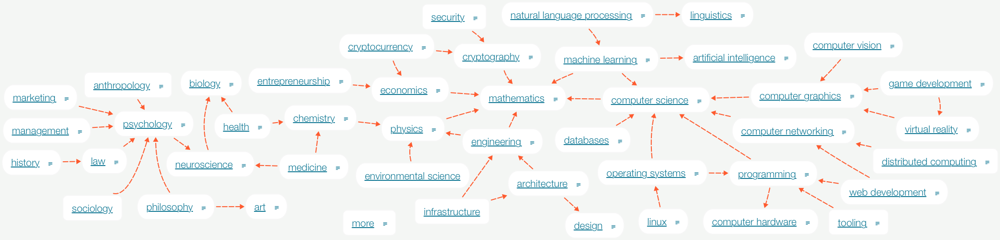
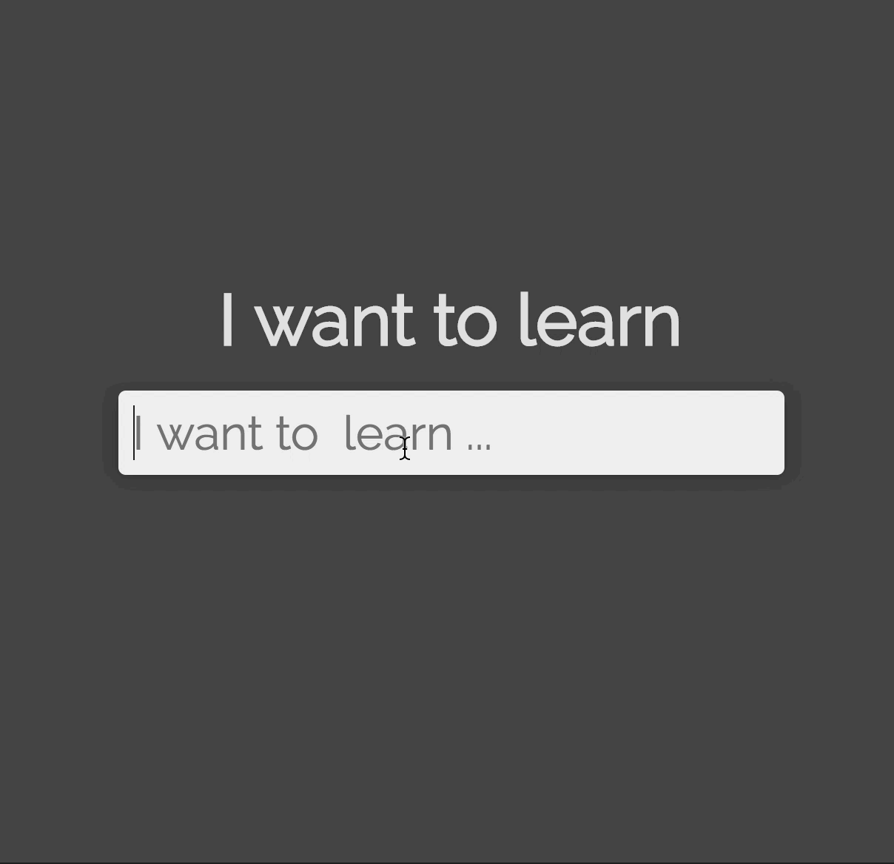

nikitavoloboev/knowledge-map

# [(L)](https://github.com/nikitavoloboev/knowledge-map#you-can-learn-anything-)[You can learn anything 📚](https://my.mindnode.com/KdeMPbxs8KPixsa5YUq5cphqJnQg81vpHaXcDX2i#-48.5,-680.3,0)

[[Slack](../_resources/9ec3dc343cca9efc7da10276ee85ba05.bin)](https://knowledge-map.slack.com/)[[Newsletter](../_resources/799c71d728d5cde720b04db9133d6374.bin)](http://twitter.us13.list-manage2.com/subscribe?u=b7f276d58f5c5f7136eff955d&id=12378547f7)[[license](../_resources/e03e55dfaddf40cd2857dc037f9f332f.bin)](https://github.com/nikitavoloboev/knowledge-map/blob/master/LICENSE)[[Patreon](../_resources/247d21242cc3f51984721e9ded69b680.bin)](https://www.patreon.com/nikitavoloboev)

The image above is an [interactive mind map that can be viewed and explored](https://my.mindnode.com/KdeMPbxs8KPixsa5YUq5cphqJnQg81vpHaXcDX2i#-48.5,-680.3,0).

When you click on any of the nodes in it, it will show you the best step by step guides you can use to learn the subject in depth.

If you think that there is a better way one can learn the subject or you wish something was added or you found a mistake, [please say it](https://github.com/nikitavoloboev/knowledge-map#contributing-). 💙

# [(L)](https://github.com/nikitavoloboev/knowledge-map#search-engine-)[Search Engine 🔎](http://learn-anything.xyz/)

There is also a [search engine](http://learn-anything.xyz/) available that will jump to any point in this mind map. It is [fully open source](https://github.com/nikitavoloboev/knowledge-map-search-engine) and new queries are being added every day.

Both this project and the search engine is in active development. If you want to help improve this project in any way or want to join an ever growing community of learners, you can join our active [slack group](https://knowledge-map.slack.com/shared_invite/MTgxNTYzMjIzNjM5LTE0OTQzMzA4MDAtYzY1YWY0ZDc0NQ).

# [(L)](https://github.com/nikitavoloboev/knowledge-map#documentation-)Documentation 📘

There are many layers to this mind map and underlied nodes are hyperlinks. You may see emojis attached to some nodes. Here is what they mean :

| emoji | meaning |
| --- | --- |
| 🗺  | it is another mind map |
| 📝  | it is a course |
| 📖  | it is a free book |
| 📕  | it is not a free book (and you either have to search online or buy it) |
| 📄  | it is a research paper |
| 👀  | it is a video or a talk |
| 🖋️ | it is an article |
| 🗃️ | it is a blog |
| 🌐  | it is a wiki article |
| 🐙  | it is a github page |
| 👾  | it is interactive (can be a tutorial or some presentation) |
| 🎙️ | it is a podcast |
| 📮  | it is a newsletter |
| 🗣️ | it is a chat	(either a slack channel, discord server or similar) |
| 🎥  | it is a youtube channel |
| 🤖  | it is a reddit thread or comment |

The arrows often represent relations. So if 'physics' has an arrow pointing to 'mathematics', it means that physics is related to it. Other times, arrows show direction and are used as a guide as can be seen [here](https://my.mindnode.com/zRGj6Bjd1T31sVhsJz4HcNbCCz7ZMgKNqJSWSjyt#392.4,-184.2,2).

Certain nodes have a number attached to them which represent the order in which the material should ideally be covered. If nodes have the same number, then choose any as all may be good for learning at this level.

Certain nodes may have a numeric prefix like '17: ' which stands for the year in which the article/research paper was written or published in. '17: ' means that it was written in 2017. I abbreviate it for visual clarity.

The contents of the mind map can also be [viewed in text if you prefer that](https://github.com/nikitavoloboev/knowledge-map/tree/master/study-plans) although they may not always be up-to-date.

# [(L)](https://github.com/nikitavoloboev/knowledge-map#part-of-a-bigger-picture-️)[Part of a bigger picture 🗺️](https://my.mindnode.com/YyJtZap3S6BLzLq8FvBqcDM1fpzom5JfeXripa9w#149.7,-355.4,2)

In the mind map above, you will find a [little node](https://my.mindnode.com/YyJtZap3S6BLzLq8FvBqcDM1fpzom5JfeXripa9w#149.7,-355.4,2) named 'more' which acts as a gateway to all the research I do.

It contains :

- [all the interesting books you can read](http://nikitavoloboev.xyz/knowledge-map/research/books/)
    - where if a book is free, a link will be provided
- [interesting courses one can take](http://nikitavoloboev.xyz/knowledge-map/research/courses/)
- [research papers on various topics](http://nikitavoloboev.xyz/knowledge-map/research/research-papers/)
- [interesting humans who ever lived](http://nikitavoloboev.xyz/knowledge-map/research/humans/)
- [inventions and historical events](http://nikitavoloboev.xyz/knowledge-map/research/history/)
- [interesting images](https://my.mindnode.com/mTasm9Ay8VtFs7fHRPDUSdEMqHExtjpcgwjBeUTC#108.8,-1795.2,-2)
- [interesting websites](http://nikitavoloboev.xyz/knowledge-map/research/websites/)
- and [more](https://my.mindnode.com/YyJtZap3S6BLzLq8FvBqcDM1fpzom5JfeXripa9w#0.3,-513.6,2)

All together there is currently [~ 3000 mind maps](http://i.imgur.com/Mb0tpVw.png). For easier discovery I plan to create a [search engine for them](https://github.com/nikitavoloboev/knowledge-map-search-engine). You can already install [my alfred workflow](https://github.com/nikitavoloboev/alfred-knowledge-map) that allows you to search through these mind maps at [insane speeds](http://quick.as/b1gwsneao).

As I learn more and more topics, I also make [flash cards](https://github.com/nikitavoloboev/research/tree/master/anki) that I use to consolidate this knowledge.

This project started off as a [single mind map](https://www.dropbox.com/s/3bsw537ggy7u0zf/original.png?dl=1) but it grew too big.

# [(L)](https://github.com/nikitavoloboev/knowledge-map#contributing-)Contributing 👬

If you want to help make this dream of visualising all of world's knowledge in this way a reality, you can help in many ways.

## [(L)](https://github.com/nikitavoloboev/knowledge-map#help-with-main-study-guides-)Help with Main Study Guides 📚

1. Take some time to explore [the mind map](https://my.mindnode.com/KdeMPbxs8KPixsa5YUq5cphqJnQg81vpHaXcDX2i#-48.5,-680.3,0) or look at the study plans [in text](https://github.com/nikitavoloboev/knowledge-map/tree/master/study-plans).

- Do you think some topic from it can be covered in a more efficient way?
- Or perhaps something can be added to deepen the understanding of the topic?
- Or the order with how material should be tackled should be different?
- Or you wish some other topic was covered that is not currently included?

There are 43 nodes in the [main mind map](https://my.mindnode.com/KdeMPbxs8KPixsa5YUq5cphqJnQg81vpHaXcDX2i#-48.5,-680.3,0), each representing a topic of research.

Each topic has a [dedicated issue page](https://github.com/nikitavoloboev/knowledge-map/issues?q=is%3Aopen+is%3Aissue+label%3A%22main+study+plan%22) which you can help improve.

If for example, you think that [computer science mind map](https://my.mindnode.com/QKWtVCHyuwbZnuxdtzZhXxs4wp8St7GeiLbKMzQU#680.4,-273.5,2) should use a different resource for learning the subject, you can [say it here](https://github.com/nikitavoloboev/knowledge-map/issues/430).

Take a look and see how and where you can help. 💙

## [(L)](https://github.com/nikitavoloboev/knowledge-map#help-with-study-guides-inside-)Help with Study Guides inside 📚

Inside these 43 main mind maps, there are multiple more mind maps for each topic that can be improved.

Similar to above, there is an issue for every topic that can be improved. It will have a ['study plan' label](https://github.com/nikitavoloboev/knowledge-map/issues?q=is%3Aopen+is%3Aissue+label%3A%22study+plan%22) attached to it as well as a label of where in the mind map this topic lies.

For example, there is a mind map for [front end development](https://my.mindnode.com/zRGj6Bjd1T31sVhsJz4HcNbCCz7ZMgKNqJSWSjyt#392.4,-184.2,2), that is located in [web development](https://my.mindnode.com/85uh2iN4GPhBJpuyyuWks5a6niyypQA5TPBCGnAN#457.7,-285.4,2). If you want to propose a change to it and think that something should be added or removed, you can do so [here](https://github.com/nikitavoloboev/knowledge-map/issues/431). Since this mind map is in ['web development' branch](http://i.imgur.com/ZdS8xwZ.png), a label of 'web development' is attached to it.

[Here](https://github.com/nikitavoloboev/knowledge-map/labels) is a list of all labels available. You can also make a search for the topic you are looking for [here](http://i.imgur.com/yC4N14B.png). If it is not found, just [open a new issue](https://github.com/nikitavoloboev/knowledge-map/issues/new) and say what you wish was added or changed and where.

## [(L)](https://github.com/nikitavoloboev/knowledge-map#help-with-visualising-and-sorting-all-of-worlds-knowledge-️)Help with visualising and sorting all of world's knowledge 🗺️

1. Take a look at [this mind map](https://my.mindnode.com/YyJtZap3S6BLzLq8FvBqcDM1fpzom5JfeXripa9w#-27.9,-478.0,2).

There are a few interesting mind maps in there that can be improved further. Most notably, [books](http://nikitavoloboev.xyz/knowledge-map/research/books/), [courses](http://nikitavoloboev.xyz/knowledge-map/research/courses/) and [research papers](http://nikitavoloboev.xyz/knowledge-map/research/research-papers/).

Take a look at either the web pages of all the books, courses or research papers or the mind maps of them. I want to visualise and organise all the interesting books one can read, courses one can take and influential research papers one can read.

There is a lot included already but there's always something that will be missing.

If you have a favourite book or a course or research paper that you don't see included in these lists, please say what it is. 💙

Aside from books, courses and research papers, you can help improve many other mind maps. Here are some of them :

- [influential humans](http://nikitavoloboev.xyz/knowledge-map/research/humans/)
- [inventions](http://nikitavoloboev.xyz/knowledge-map/research/history/)
- [interesting websites](https://my.mindnode.com/BxoJyqgsfvB2J9rrpm1zwzjuKxPGUrYn6YDpSGbH#160.9,199.1,2)
- [images](https://my.mindnode.com/mTasm9Ay8VtFs7fHRPDUSdEMqHExtjpcgwjBeUTC#108.8,-1795.2,-2)
- and [more](https://my.mindnode.com/YyJtZap3S6BLzLq8FvBqcDM1fpzom5JfeXripa9w#-23.7,-489.6,2)

Just add what you think is interesting and valuable and is appropriate to the topic. I cannot do this alone, but if we do it together, imagine what this could become. 🌍

# [(L)](https://github.com/nikitavoloboev/knowledge-map#fast-searching-)Fast searching 🔎

I want to reduce the amount of time it takes to find the information you need. Before [the search engine](https://github.com/nikitavoloboev/knowledge-map-search-engine) is complete and working, the fastest ways you can get to the mind map that you want is the [alfred workflow](https://github.com/nikitavoloboev/alfred-knowledge-map). You can also :

1. Bookmark [this page](https://github.com/nikitavoloboev/knowledge-map) or [or the mind map itself](http://bit.ly/learning-mindmaps). It takes ~ 2 sec to open it. Everything is structured well so there should be no problem of finding what you are looking for.

2. If you want to quickly find a book to read or a course to take or find a research paper you can read on some topic, [this list](https://github.com/nikitavoloboev/knowledge-map#part-of-a-bigger-picture-%EF%B8%8F) offers really fast rendered web pages you can use. Just open the one you need and search for a book/course there.

# [(L)](https://github.com/nikitavoloboev/knowledge-map#future-)Future 🚀

I want to develop a [web interface search engine](https://github.com/nikitavoloboev/knowledge-map-search-engine) for all these mind maps where users can search and be presented with an interactive mind map of links and resources instead of a static set of links. If you want to help me make it, please do, I wrote [some issues](https://github.com/nikitavoloboev/knowledge-map-search-engine/issues) on how I plan to make it.

I also want to [create visualisations in code](https://github.com/nikitavoloboev/knowledge-map-code) for each of the topics as visualisations and playing around are the keys to understanding and comprehension.

The end goal is to make an interactive mind map of all of world's knowledge that all can explore.

# [(L)](https://github.com/nikitavoloboev/knowledge-map#keep-this-project-going-)[Keep this project going 🎊](https://www.patreon.com/nikitavoloboev)

This project is still in its early stages but I am certain as it gets traction and people actually start both using and contributing content to it, the popularity will grow. As more people visit and spend time exploring these mind maps, the cost of maintaining and hosting thousands of these mind maps will grow. I would hate to shut down this project for these reasons.

I also don't want to put any advertisements or any 'sponsored' content in there that I don't think brings value. I want these study plans to present the most efficient ways one can learn any subject one may want to learn in a guided way.

If you do love using these mind maps, I have started a [Patreon page](https://www.patreon.com/nikitavoloboev) where you can support this work, if you wish. There are also some really cool rewards that come with your support. 💚

# [(L)](https://github.com/nikitavoloboev/knowledge-map#stay-in-touch-)Stay in touch 📮

Aside from the [active slack group](https://knowledge-map.slack.com/shared_invite/MTgxNTYzMjIzNjM5LTE0OTQzMzA4MDAtYzY1YWY0ZDc0NQ), there is also a small [newsletter](http://twitter.us13.list-manage2.com/subscribe?u=b7f276d58f5c5f7136eff955d&id=12378547f7) that you can sign up for to get short emails with updates on this project.

## [(L)](https://github.com/nikitavoloboev/knowledge-map#my-personal-articles-)[My Personal Articles 📖](https://my.mindnode.com/aMjDG6PmWaH8zKmTmxoTzLvXSgysdi1nBiRYuVnd#231.9,-490.8,0)

I love writing. I find the act of writing really enjoyable as I try to condense information in a way that another person can understand.

## [(L)](https://github.com/nikitavoloboev/knowledge-map#my-github-repositories-)[My GitHub Repositories 👾](https://my.mindnode.com/47Fqmxya1dst3tfubcxAFoFmepQuxpsKCXPemds8#-11.3,-979.7,1)

I really love programming, building and sharing the things I have built.

# [(L)](https://github.com/nikitavoloboev/knowledge-map#ask-)Ask 💬

If you have some specific questions about this project or about myself, my interests and my personal workflow. I would love to hear them and you can ask them either in the [slack group](https://knowledge-map.slack.com/shared_invite/MTgxNTYzMjIzNjM5LTE0OTQzMzA4MDAtYzY1YWY0ZDc0NQ) or [in my github ama](https://github.com/nikitavoloboev/ama/issues/new). You can also view [past questions](https://github.com/nikitavoloboev/ama/issues?q=is%3Aissue+is%3Aclosed) that I have answered.

# [(L)](https://github.com/nikitavoloboev/knowledge-map#thank-you-)Thank you 💙

- to [MindNode](https://mindnode.com/) who created [the application](https://itunes.apple.com/app/id992076693?mt=12&ign-mpt=uo%3D4) that makes this all possible and for providing the [incredible web service](https://my.mindnode.com/) to share these mind maps
- to all the people who contributed to this project