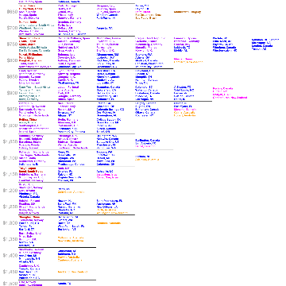

r/dataisbeautiful - Average Monthly Rent Comparison - 540 Cities - Expanded [OC]

r/dataisbeautiful - Average Monthly Rent Comparison - 540 Cities - Expanded [OC]

https://www.reddit.com/r/dataisbeautiful/comments/8vh4du/average_monthly_rent_comparison_540_cities/

29,038 votes and 4,002 comments so far on Reddit