reMarkable

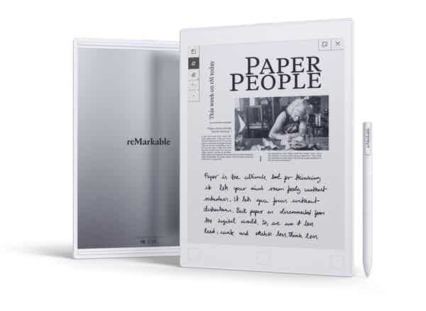
Convert
handwritten notes to typed text

# Organise your thoughts with ease

Meet reMarkable, the paper tablet

After playing with it I can tell you that it is real and also wonderful
Eric Limer, Popular Mechanics

reMarkable - the only digital device that **feels like paper.** A tool for note-taking, reading and reviewing documents.

No social media, e-mail or notifications. **No distractions**, just you and your thoughts.

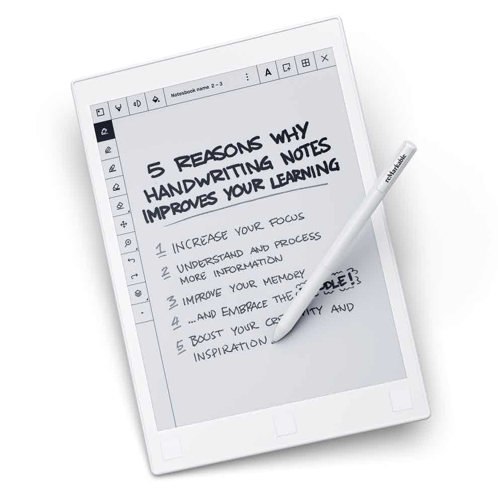

![](data:image/svg+xml,%3csvg xmlns='http://www.w3.org/2000/svg' height='236.50000000000003' width='263.9560000000001' rotate='138' class='SvgPointer__Svg-jVhVkJ hkzjXj js-evernote-checked' data-evernote-id='257'%3e%3cdefs data-evernote-id='258' class='js-evernote-checked'%3e%3cfilter id='f1' x='0' y='0' width='200%25' height='200%25' data-evernote-id='259' class='js-evernote-checked'%3e%3cfeDropShadow dx='5' dy='5' stdDeviation='2' flood-color='grey' flood-opacity='1' data-evernote-id='260' class='js-evernote-checked'%3e%3c/feDropShadow%3e%3c/filter%3e%3c/defs%3e%3cpath id='wQrIA2Nvb' d='M6 6 Q119.98000000000002 0%2c 235.96000000000004 211' stroke='%23CB7428' fill='transparent' speed='0.16666666666666666' filter='' class='SvgPointer__Curve-hRJhkU grAbVY js-evernote-checked' data-evernote-id='261'%3e%3c/path%3e%3cg color='%23CB7428' class='SvgPointer__G-gMugwB laoqID js-evernote-checked' data-evernote-id='262'%3e%3ccircle id='ulfx8Vcsw9' cx='6' cy='6' r='6' filter='' class='SvgPointer__Circle-eqrnSJ jfhjNO js-evernote-checked' data-evernote-id='263'%3e%3c/circle%3e%3ccircle id='8vKuI7gvhI' cx='235.96000000000004' cy='211' r='4' filter='' class='SvgPointer__Circle-eqrnSJ jfhjNO js-evernote-checked' data-evernote-id='264'%3e%3c/circle%3e%3c/g%3e%3c/svg%3e)

reMarkable is the first digital device that gives you a **pen-to-paper note-taking** experience.

A **note-taking system** that makes it easy to organize your notes and notebooks.

# Digital notes. Paper feel.

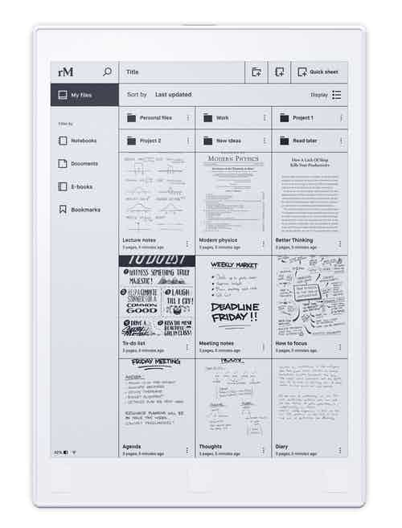

![](data:image/svg+xml,%3csvg xmlns='http://www.w3.org/2000/svg' height='73.37' width='297.22' rotate=' 0' class='SvgPointer__Svg-jVhVkJ hkzjXj js-evernote-checked' data-evernote-id='280'%3e%3cdefs data-evernote-id='281' class='js-evernote-checked'%3e%3cfilter id='f1' x='0' y='0' width='200%25' height='200%25' data-evernote-id='282' class='js-evernote-checked'%3e%3cfeDropShadow dx='5' dy='5' stdDeviation='2' flood-color='grey' flood-opacity='1' data-evernote-id='283' class='js-evernote-checked'%3e%3c/feDropShadow%3e%3c/filter%3e%3c/defs%3e%3cpath id='hl4khMAhU' d='M4 4 Q135.1 0%2c 264.2 60.7' stroke='%23CB7428' fill='transparent' speed='0.16666666666666666' filter='' class='SvgPointer__Curve-hRJhkU grAbVY js-evernote-checked' data-evernote-id='284'%3e%3c/path%3e%3cg color='%23CB7428' class='SvgPointer__G-gMugwB laoqID js-evernote-checked' data-evernote-id='285'%3e%3ccircle id='uX1fR74a' cx='4' cy='4' r='4' filter='' class='SvgPointer__Circle-eqrnSJ jfhjNO js-evernote-checked' data-evernote-id='286'%3e%3c/circle%3e%3ccircle id='qQqbAGoi7Y' cx='264.2' cy='60.7' r='6' filter='' class='SvgPointer__Circle-eqrnSJ jfhjNO js-evernote-checked' data-evernote-id='287'%3e%3c/circle%3e%3c/g%3e%3c/svg%3e)

# Convert handwritten notes to typed text

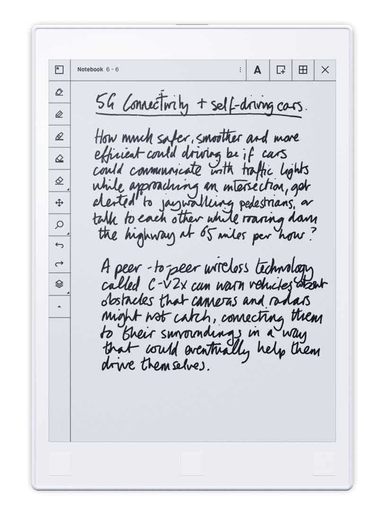
NEW
FEATURE!

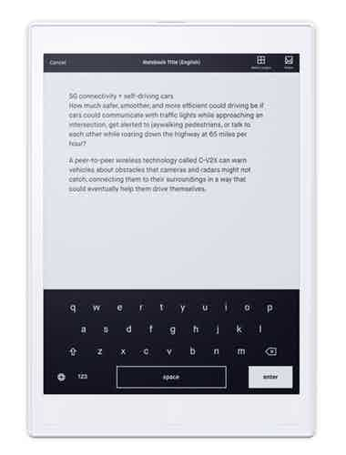

![](data:image/svg+xml,%3csvg xmlns='http://www.w3.org/2000/svg' height='88.70400000000001' width='158.4' rotate='-50' class='SvgPointer__Svg-jVhVkJ hkzjXj js-evernote-checked' data-evernote-id='320'%3e%3cdefs data-evernote-id='321' class='js-evernote-checked'%3e%3cfilter id='f1' x='0' y='0' width='200%25' height='200%25' data-evernote-id='322' class='js-evernote-checked'%3e%3cfeDropShadow dx='5' dy='5' stdDeviation='2' flood-color='grey' flood-opacity='1' data-evernote-id='323' class='js-evernote-checked'%3e%3c/feDropShadow%3e%3c/filter%3e%3c/defs%3e%3cpath id='pAhupQbhnm' d='M6 6 Q72 0%2c 140 76.64' stroke='%23CB7428' fill='transparent' speed='0.16666666666666666' filter='' class='SvgPointer__Curve-hRJhkU grAbVY js-evernote-checked' data-evernote-id='324'%3e%3c/path%3e%3cg color='%23CB7428' class='SvgPointer__G-gMugwB laoqID js-evernote-checked' data-evernote-id='325'%3e%3ccircle id='VkRFrqXynE' cx='6' cy='6' r='6' filter='' class='SvgPointer__Circle-eqrnSJ jfhjNO js-evernote-checked' data-evernote-id='326'%3e%3c/circle%3e%3ccircle id='bfDLNX2BZe' cx='140' cy='76.64' r='4' filter='' class='SvgPointer__Circle-eqrnSJ jfhjNO js-evernote-checked' data-evernote-id='327'%3e%3c/circle%3e%3c/g%3e%3c/svg%3e)

![](data:image/svg+xml,%3csvg xmlns='http://www.w3.org/2000/svg' height='83.16' width='158.4' rotate='0' class='SvgPointer__Svg-jVhVkJ hkzjXj js-evernote-checked' data-evernote-id='329'%3e%3cdefs data-evernote-id='330' class='js-evernote-checked'%3e%3cfilter id='f1' x='0' y='0' width='200%25' height='200%25' data-evernote-id='331' class='js-evernote-checked'%3e%3cfeDropShadow dx='5' dy='5' stdDeviation='2' flood-color='grey' flood-opacity='1' data-evernote-id='332' class='js-evernote-checked'%3e%3c/feDropShadow%3e%3c/filter%3e%3c/defs%3e%3cpath id='oHfbUZWRd' d='M4 4 Q72 0%2c 138 69.6' stroke='%23CB7428' fill='transparent' speed='0.16666666666666666' filter='' class='SvgPointer__Curve-hRJhkU grAbVY js-evernote-checked' data-evernote-id='333'%3e%3c/path%3e%3cg color='%23CB7428' class='SvgPointer__G-gMugwB laoqID js-evernote-checked' data-evernote-id='334'%3e%3ccircle id='azk0cixgiJ' cx='4' cy='4' r='4' filter='' class='SvgPointer__Circle-eqrnSJ jfhjNO js-evernote-checked' data-evernote-id='335'%3e%3c/circle%3e%3ccircle id='I2RsC77grQ' cx='138' cy='69.6' r='6' filter='' class='SvgPointer__Circle-eqrnSJ jfhjNO js-evernote-checked' data-evernote-id='336'%3e%3c/circle%3e%3c/g%3e%3c/svg%3e)

reMarkable converts your **handwritten notes to typed text**, making them easy to refine and share.

reMarkable reviews from verified customers

   

   4.5 star rating     614 Reviews

   5 star rating

Great product

I have had my remarkable for a little over a week - i was able to start using its basic features right away without going through ...

Read More

Mary-Elise S.

   5 star rating

The BEST business tool I've ever purchased

To be honest I really HATE new technology because it always lets you down, breaks or doesn't live up to expectations, yet I'm alwa...

Read More

Lori P.

   5 star rating

Best Tech gadget purchase ever

I have quite the affinity for office supplies, especially notebooks. I go through 1-3 notebooks a month. I have a huge stack of no...

Read More

Elizabeth H.

   5 star rating

Love it!

It’s nearly perfect. I much prefer writing to typing, but I need typed pages so often. The Remarkable tablet allows me to write an...

Read More

Beverly W.

   5 star rating

Great product

I have had my remarkable for a little over a week - i was able to start using its basic features right away without going through ...

Read More

Mary-Elise S.

   5 star rating

The BEST business tool I've ever purchased

To be honest I really HATE new technology because it always lets you down, breaks or doesn't live up to expectations, yet I'm alwa...

Read More

Lori P.

   5 star rating

Best Tech gadget purchase ever

I have quite the affinity for office supplies, especially notebooks. I go through 1-3 notebooks a month. I have a huge stack of no...

Read More

Elizabeth H.

   5 star rating

Love it!

It’s nearly perfect. I much prefer writing to typing, but I need typed pages so often. The Remarkable tablet allows me to write an...

Read More

Beverly W.

 [ Powered by    ](http://my.yotpo.com/landing_page?redirect=https%3A%2F%2Fwww.yotpo.com%2Fpowered-by-yotpo%2F&utm_campaign=branding_link_reviews_widget_v2&utm_medium=widget&utm_source=remarkable.com)

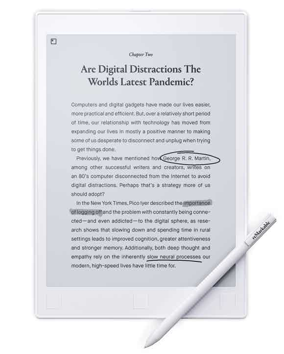

![](data:image/svg+xml,%3csvg xmlns='http://www.w3.org/2000/svg' height='90.2' width='167.948' rotate='-8' class='SvgPointer__Svg-jVhVkJ hkzjXj js-evernote-checked' data-evernote-id='736'%3e%3cdefs data-evernote-id='737' class='js-evernote-checked'%3e%3cfilter id='f1' x='0' y='0' width='200%25' height='200%25' data-evernote-id='738' class='js-evernote-checked'%3e%3cfeDropShadow dx='5' dy='5' stdDeviation='2' flood-color='grey' flood-opacity='1' data-evernote-id='739' class='js-evernote-checked'%3e%3c/feDropShadow%3e%3c/filter%3e%3c/defs%3e%3cpath id='n1x1CRagz' d='M4 4 Q76.34 0%2c 146.68 76' stroke='%23CB7428' fill='transparent' speed='0.16666666666666666' filter='' class='SvgPointer__Curve-hRJhkU grAbVY js-evernote-checked' data-evernote-id='740'%3e%3c/path%3e%3cg color='%23CB7428' class='SvgPointer__G-gMugwB laoqID js-evernote-checked' data-evernote-id='741'%3e%3ccircle id='BSkXIeF10' cx='4' cy='4' r='4' filter='' class='SvgPointer__Circle-eqrnSJ jfhjNO js-evernote-checked' data-evernote-id='742'%3e%3c/circle%3e%3ccircle id='KcApBlmMaq' cx='146.68' cy='76' r='6' filter='' class='SvgPointer__Circle-eqrnSJ jfhjNO js-evernote-checked' data-evernote-id='743'%3e%3c/circle%3e%3c/g%3e%3c/svg%3e)

![](data:image/svg+xml,%3csvg xmlns='http://www.w3.org/2000/svg' height='90.2' width='282.45799999999997' rotate='-24' class='SvgPointer__Svg-jVhVkJ hkzjXj js-evernote-checked' data-evernote-id='745'%3e%3cdefs data-evernote-id='746' class='js-evernote-checked'%3e%3cfilter id='f1' x='0' y='0' width='200%25' height='200%25' data-evernote-id='747' class='js-evernote-checked'%3e%3cfeDropShadow dx='5' dy='5' stdDeviation='2' flood-color='grey' flood-opacity='1' data-evernote-id='748' class='js-evernote-checked'%3e%3c/feDropShadow%3e%3c/filter%3e%3c/defs%3e%3cpath id='vzcKAgtlhS' d='M6 6 Q128.39 0%2c 252.77999999999997 78' stroke='%23CB7428' fill='transparent' speed='0.16666666666666666' filter='' class='SvgPointer__Curve-hRJhkU grAbVY js-evernote-checked' data-evernote-id='749'%3e%3c/path%3e%3cg color='%23CB7428' class='SvgPointer__G-gMugwB laoqID js-evernote-checked' data-evernote-id='750'%3e%3ccircle id='yD1AtAG7sH' cx='6' cy='6' r='6' filter='' class='SvgPointer__Circle-eqrnSJ jfhjNO js-evernote-checked' data-evernote-id='751'%3e%3c/circle%3e%3ccircle id='8Y6dQ0w65Y' cx='252.77999999999997' cy='78' r='4' filter='' class='SvgPointer__Circle-eqrnSJ jfhjNO js-evernote-checked' data-evernote-id='752'%3e%3c/circle%3e%3c/g%3e%3c/svg%3e)

# Read comfortably. Annotate directly.

With no backlight or glare, reMarkable offers a **paper-like reading** experience you won't find on any LCD display. **Annotate** on your documents just like you would on paper - no printouts, no hassle.

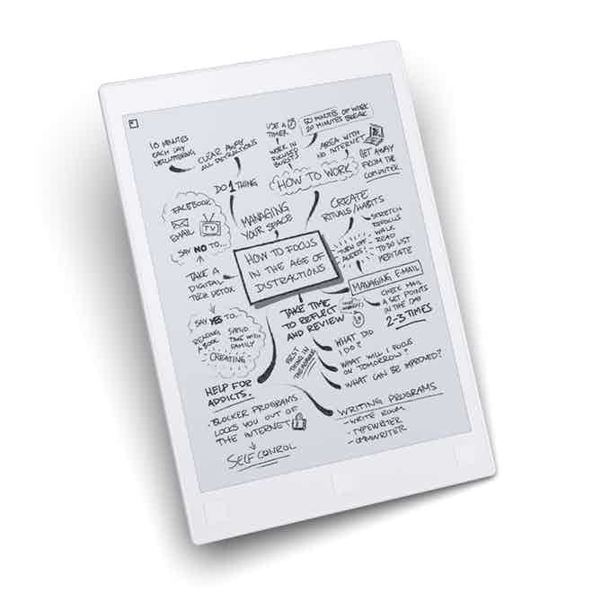

![](data:image/svg+xml,%3csvg xmlns='http://www.w3.org/2000/svg' height='82.28' width='315.81' rotate='-16' class='SvgPointer__Svg-jVhVkJ hkzjXj js-evernote-checked' data-evernote-id='776'%3e%3cdefs data-evernote-id='777' class='js-evernote-checked'%3e%3cfilter id='f1' x='0' y='0' width='200%25' height='200%25' data-evernote-id='778' class='js-evernote-checked'%3e%3cfeDropShadow dx='5' dy='5' stdDeviation='2' flood-color='grey' flood-opacity='1' data-evernote-id='779' class='js-evernote-checked'%3e%3c/feDropShadow%3e%3c/filter%3e%3c/defs%3e%3cpath id='nXN4GiCEfe' d='M6 6 Q143.54999999999998 0%2c 283.09999999999997 70.8' stroke='%23CB7428' fill='transparent' speed='0.16666666666666666' filter='' class='SvgPointer__Curve-hRJhkU grAbVY js-evernote-checked' data-evernote-id='780'%3e%3c/path%3e%3cg color='%23CB7428' class='SvgPointer__G-gMugwB laoqID js-evernote-checked' data-evernote-id='781'%3e%3ccircle id='Qw3VoYDcv' cx='6' cy='6' r='6' filter='' class='SvgPointer__Circle-eqrnSJ jfhjNO js-evernote-checked' data-evernote-id='782'%3e%3c/circle%3e%3ccircle id='Ju7k635jYl' cx='283.09999999999997' cy='70.8' r='4' filter='' class='SvgPointer__Circle-eqrnSJ jfhjNO js-evernote-checked' data-evernote-id='783'%3e%3c/circle%3e%3c/g%3e%3c/svg%3e)

# A visualization powertool

Pen and paper is great for complex problem-solving. With digital tools like undo, erase, move, and many more, reMarkable is even better.

## The only tablet that helps you focus.

The noise of digital distractions is making it difficult to stay focused.

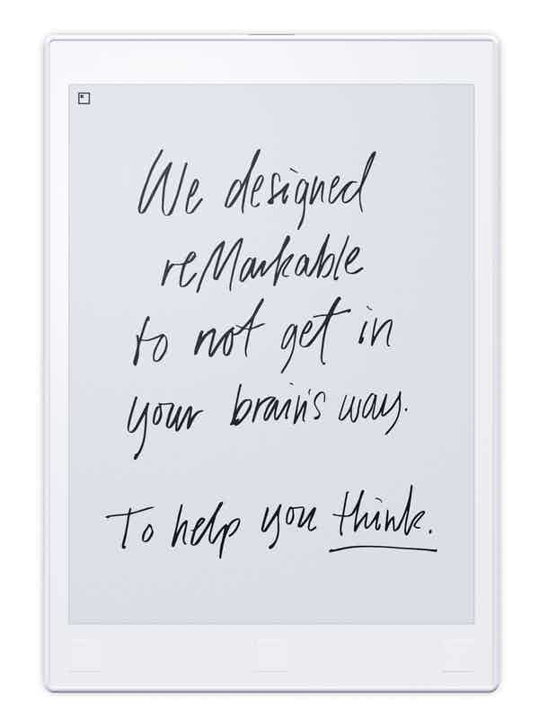

# Access your work everywhere

' fill='black' data-evernote-id='826' class='js-evernote-checked'%3e%3cdefs data-evernote-id='827' class='js-evernote-checked'%3e%3cfilter id='f3' x='0' y='0' width='200%25' height='200%25' data-evernote-id='828' class='js-evernote-checked'%3e%3cfeDropShadow dx='5' dy='5' stdDeviation='2' flood-color='grey' flood-opacity='1' data-evernote-id='829' class='js-evernote-checked'%3e%3c/feDropShadow%3e%3c/filter%3e%3c/defs%3e%3cg color='black' class='SvgDots__G-kcOzh gsHKnV js-evernote-checked' data-evernote-id='830'%3e%3ccircle id='UUBWvQU9Gg' cx='50%25' cy='25%25' r='1' filter='' class='SvgDots__Circle-hMskfy fZhFiA js-evernote-checked' data-evernote-id='831'%3e%3canimate id='yHzhy4J92k_0' href='%23UUBWvQU9Gg' attributeName='r' values='1%3b 2%3b1' dur='1.5s' begin='0s%3byHzhy4J92k_2.end' repeatCount='1' fill='freeze' data-evernote-id='832' class='js-evernote-checked'%3e%3c/animate%3e%3c/circle%3e%3ccircle id='Y-zKvdfzx2' cx='50%25' cy='50%25' r='2.16642' filter='' class='SvgDots__Circle-hMskfy fZhFiA js-evernote-checked' data-evernote-id='833'%3e%3canimate id='yHzhy4J92k_1' href='%23Y-zKvdfzx2' attributeName='r' values='2%3b 4%3b2' dur='1.5s' begin='yHzhy4J92k_0.end' repeatCount='1' fill='freeze' data-evernote-id='834' class='js-evernote-checked'%3e%3c/animate%3e%3c/circle%3e%3ccircle id='bcshunCBwW' cx='50%25' cy='75%25' r='1' filter='' class='SvgDots__Circle-hMskfy fZhFiA js-evernote-checked' data-evernote-id='835'%3e%3canimate id='yHzhy4J92k_2' href='%23bcshunCBwW' attributeName='r' values='1%3b 2%3b1' dur='1.5s' begin='yHzhy4J92k_1.end' repeatCount='1' fill='freeze' data-evernote-id='836' class='js-evernote-checked'%3e%3c/animate%3e%3c/circle%3e%3c/g%3e%3c/svg%3e)

' fill='black' data-evernote-id='844' class='js-evernote-checked'%3e%3cdefs data-evernote-id='845' class='js-evernote-checked'%3e%3cfilter id='f3' x='0' y='0' width='200%25' height='200%25' data-evernote-id='846' class='js-evernote-checked'%3e%3cfeDropShadow dx='5' dy='5' stdDeviation='2' flood-color='grey' flood-opacity='1' data-evernote-id='847' class='js-evernote-checked'%3e%3c/feDropShadow%3e%3c/filter%3e%3c/defs%3e%3cg color='black' class='SvgDots__G-kcOzh gsHKnV js-evernote-checked' data-evernote-id='848'%3e%3ccircle id='ZKF3KsvJluS' cx='50%25' cy='25%25' r='1' filter='' class='SvgDots__Circle-hMskfy fZhFiA js-evernote-checked' data-evernote-id='849'%3e%3canimate id='Gb98VLkgrTC_0' href='%23ZKF3KsvJluS' attributeName='r' values='1%3b 2%3b1' dur='1.5s' begin='0s%3bGb98VLkgrTC_2.end' repeatCount='1' fill='freeze' data-evernote-id='850' class='js-evernote-checked'%3e%3c/animate%3e%3c/circle%3e%3ccircle id='yg6FIBf0Ikh' cx='50%25' cy='50%25' r='2.16642' filter='' class='SvgDots__Circle-hMskfy fZhFiA js-evernote-checked' data-evernote-id='851'%3e%3canimate id='Gb98VLkgrTC_1' href='%23yg6FIBf0Ikh' attributeName='r' values='2%3b 4%3b2' dur='1.5s' begin='Gb98VLkgrTC_0.end' repeatCount='1' fill='freeze' data-evernote-id='852' class='js-evernote-checked'%3e%3c/animate%3e%3c/circle%3e%3ccircle id='azTFb170W9j' cx='50%25' cy='75%25' r='1' filter='' class='SvgDots__Circle-hMskfy fZhFiA js-evernote-checked' data-evernote-id='853'%3e%3canimate id='Gb98VLkgrTC_2' href='%23azTFb170W9j' attributeName='r' values='1%3b 2%3b1' dur='1.5s' begin='Gb98VLkgrTC_1.end' repeatCount='1' fill='freeze' data-evernote-id='854' class='js-evernote-checked'%3e%3c/animate%3e%3c/circle%3e%3c/g%3e%3c/svg%3e)

' fill='black' data-evernote-id='856' class='js-evernote-checked'%3e%3cdefs data-evernote-id='857' class='js-evernote-checked'%3e%3cfilter id='f3' x='0' y='0' width='200%25' height='200%25' data-evernote-id='858' class='js-evernote-checked'%3e%3cfeDropShadow dx='5' dy='5' stdDeviation='2' flood-color='grey' flood-opacity='1' data-evernote-id='859' class='js-evernote-checked'%3e%3c/feDropShadow%3e%3c/filter%3e%3c/defs%3e%3cg color='black' class='SvgDots__G-kcOzh gsHKnV js-evernote-checked' data-evernote-id='860'%3e%3ccircle id='CT4Ama9Yqsn' cx='50%25' cy='25%25' r='1' filter='' class='SvgDots__Circle-hMskfy fZhFiA js-evernote-checked' data-evernote-id='861'%3e%3canimate id='4QK2vIth20x_0' href='%23CT4Ama9Yqsn' attributeName='r' values='1%3b 2%3b1' dur='1.5s' begin='0s%3b4QK2vIth20x_2.end' repeatCount='1' fill='freeze' data-evernote-id='862' class='js-evernote-checked'%3e%3c/animate%3e%3c/circle%3e%3ccircle id='IQ0tWq8qyzm' cx='50%25' cy='50%25' r='2.16642' filter='' class='SvgDots__Circle-hMskfy fZhFiA js-evernote-checked' data-evernote-id='863'%3e%3canimate id='4QK2vIth20x_1' href='%23IQ0tWq8qyzm' attributeName='r' values='2%3b 4%3b2' dur='1.5s' begin='4QK2vIth20x_0.end' repeatCount='1' fill='freeze' data-evernote-id='864' class='js-evernote-checked'%3e%3c/animate%3e%3c/circle%3e%3ccircle id='GOhVW57A8I_' cx='50%25' cy='75%25' r='1' filter='' class='SvgDots__Circle-hMskfy fZhFiA js-evernote-checked' data-evernote-id='865'%3e%3canimate id='4QK2vIth20x_2' href='%23GOhVW57A8I_' attributeName='r' values='1%3b 2%3b1' dur='1.5s' begin='4QK2vIth20x_1.end' repeatCount='1' fill='freeze' data-evernote-id='866' class='js-evernote-checked'%3e%3c/animate%3e%3c/circle%3e%3c/g%3e%3c/svg%3e)

reMarkable helps you stay **organised** with access to all your notes and documents **on all devices.**

Apps available for macOS, iOS, Windows 8 / 10 and Android.

## Tablet of the Year Award winner

December 2017

"It recreates the pen-and-paper experience to an impressive degree"

## Like ink on paper.

Unlike any other digital device.

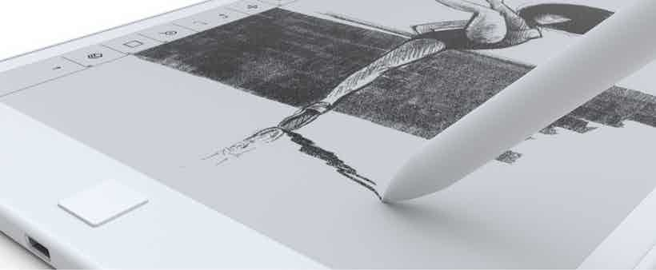

We've spent four years developing technology that mimics the tactility and immediate response of paper. The very qualities that make paper so simple to use, yet at the same time, our most powerful tool of creation. The result is our **CANVAS display.**

# A breakthrough technology

## the CANVAS display

Years of development and attention to the subtlest nuances of the handwriting experience has made reMarkable as paper-like as it gets. Our patented CANVAS display gives you a true paper feel.

Looks and feels like paper with just the right friction. By combining cutting edge E Ink Carta technology with ultra-thin high-friction surface materials, the CANVAS display is purebred paper experience.

Ink that responds to pressure and feels natural. The CANVAS display actually transfers physical ink particles to the surface when you write, and the Marker supports over 2048 levels of pressure detection.

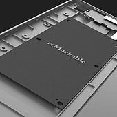

Fast and precise pen strokes for high precision interaction. The CANVAS display's patent-pending low latency technology took over three years to develop and makes reMarkable feel fast and precise.

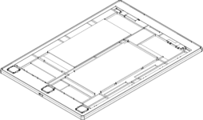

# reMarkable is not like other tablets

Display
Paper feel

Glass surface
No glare or light, sunlight readable

Backlit and reflective surface
Functionality
Writing, reading and sketching only

Everything your computer does
No distractions

Social media, email, notifications
Sync notes and documents via Wifi

Access to the whole Internet all the time
Purpose
Thinking

Entertainment and productivity

# Here is what Macworld thinks about the reMarkable paper feel

(June, 2019)

## See how people use reMarkable

#remarkablepaper

 

 [remarkable](https://www.instagram.com/remarkable/?utm_source=ig_embed)
  65.9k followers

 [View Profile](https://www.instagram.com/remarkable/?utm_source=ig_embed)

 [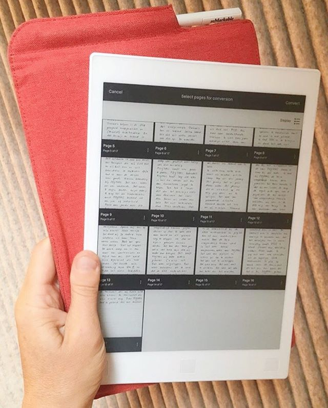](https://www.instagram.com/p/B2RZcZPijiy/?utm_source=ig_embed)

 [         remarkable         212 posts · 65.9k followers                 ](https://www.instagram.com/remarkable/?utm_source=ig_embed)

 [View More on Instagram](https://www.instagram.com/remarkable/?utm_source=ig_embed)

 [  Like](https://www.instagram.com/p/B2RZcZPijiy/?utm_source=ig_embed)  [ Comment](https://www.instagram.com/p/B2RZcZPijiy/?utm_source=ig_embed)  [ Share]()  [ Save](https://www.instagram.com/p/B2RZcZPijiy/?utm_source=ig_embed)

 [665 likes](https://www.instagram.com/p/B2RZcZPijiy/?utm_source=ig_embed)

 [remarkable](https://www.instagram.com/remarkable/?utm_source=ig_embed)

When one page just isn’t enough for all your thoughts... by [@stinie_](https://www.instagram.com/stinie_/?utm_source=ig_embed)

 [view all 30 comments](https://www.instagram.com/p/B2RZcZPijiy/?utm_source=ig_embed)

 [Add a comment...](https://www.instagram.com/p/B2RZcZPijiy/?utm_source=ig_embed)  [Instagram](https://www.instagram.com/p/B2RZcZPijiy/?utm_source=ig_embed)

 

 [remarkable](https://www.instagram.com/remarkable/?utm_source=ig_embed)
  65.9k followers

 [View Profile](https://www.instagram.com/remarkable/?utm_source=ig_embed)

 [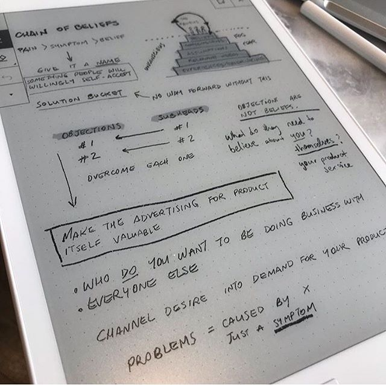](https://www.instagram.com/p/B1WKsNviCWL/?utm_source=ig_embed)

 [         remarkable         212 posts · 65.9k followers                 ](https://www.instagram.com/remarkable/?utm_source=ig_embed)

 [View More on Instagram](https://www.instagram.com/remarkable/?utm_source=ig_embed)

 [  Like](https://www.instagram.com/p/B1WKsNviCWL/?utm_source=ig_embed)  [ Comment](https://www.instagram.com/p/B1WKsNviCWL/?utm_source=ig_embed)  [ Share]()  [ Save](https://www.instagram.com/p/B1WKsNviCWL/?utm_source=ig_embed)

 [803 likes](https://www.instagram.com/p/B1WKsNviCWL/?utm_source=ig_embed)

 [remarkable](https://www.instagram.com/remarkable/?utm_source=ig_embed)

Inspiring and well organized note structure by [@mariepoulin](https://www.instagram.com/mariepoulin/?utm_source=ig_embed)

 [view all 37 comments](https://www.instagram.com/p/B1WKsNviCWL/?utm_source=ig_embed)

 [Add a comment...](https://www.instagram.com/p/B1WKsNviCWL/?utm_source=ig_embed)  [Instagram](https://www.instagram.com/p/B1WKsNviCWL/?utm_source=ig_embed)

 

 [skylightstudies](https://www.instagram.com/skylightstudies/?utm_source=ig_embed)

  25 followers

 [View Profile](https://www.instagram.com/skylightstudies/?utm_source=ig_embed)

 [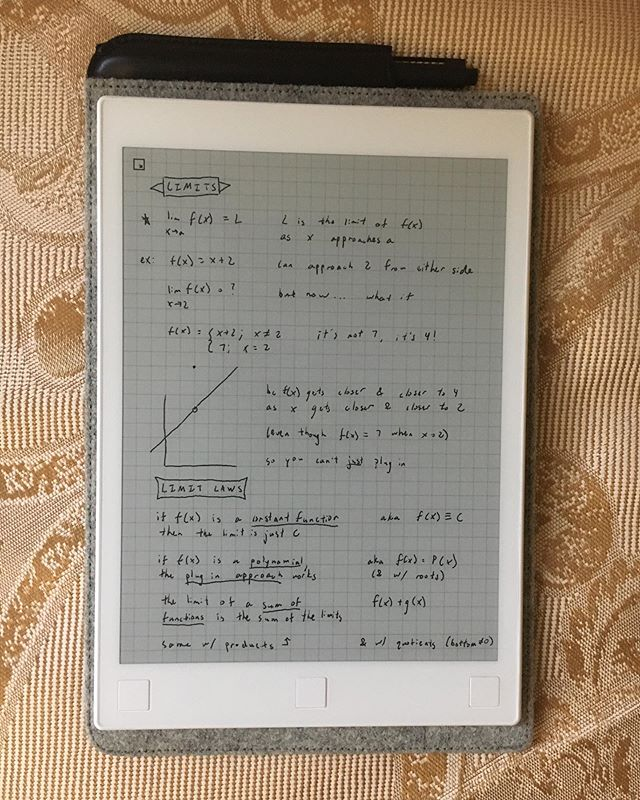](https://www.instagram.com/p/B1rxxCwBBYN/?utm_source=ig_embed)

 [         skylightstudies         32 posts · 25 followers               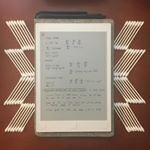  ](https://www.instagram.com/skylightstudies/?utm_source=ig_embed)

 [View More on Instagram](https://www.instagram.com/skylightstudies/?utm_source=ig_embed)

 [  Like](https://www.instagram.com/p/B1rxxCwBBYN/?utm_source=ig_embed)  [ Comment](https://www.instagram.com/p/B1rxxCwBBYN/?utm_source=ig_embed)  [ Share]()  [ Save](https://www.instagram.com/p/B1rxxCwBBYN/?utm_source=ig_embed)

 [20 likes](https://www.instagram.com/p/B1rxxCwBBYN/?utm_source=ig_embed)

 [skylightstudies](https://www.instagram.com/skylightstudies/?utm_source=ig_embed)

My calculus class is just starting to pick up... School has only just started but I already feel like I'm swamped in work. Recently, I have been trying to play basketball a few times a week to stay active, and that really cuts into the time I have to do work. -

-
-
-

[#studygram](https://www.instagram.com/explore/tags/studygram/?utm_source=ig_embed)  [#remarkablepaper](https://www.instagram.com/explore/tags/remarkablepaper/?utm_source=ig_embed)  [#notes](https://www.instagram.com/explore/tags/notes/?utm_source=ig_embed)  [#digitalnotes](https://www.instagram.com/explore/tags/digitalnotes/?utm_source=ig_embed)  [#math](https://www.instagram.com/explore/tags/math/?utm_source=ig_embed)  [#calculus](https://www.instagram.com/explore/tags/calculus/?utm_source=ig_embed)

 [Add a comment...](https://www.instagram.com/p/B1rxxCwBBYN/?utm_source=ig_embed)  [Instagram](https://www.instagram.com/p/B1rxxCwBBYN/?utm_source=ig_embed)

 

 [norain.norainbow.nrs](https://www.instagram.com/norain.norainbow.nrs/?utm_source=ig_embed)

  367 followers

 [View Profile](https://www.instagram.com/norain.norainbow.nrs/?utm_source=ig_embed)

 [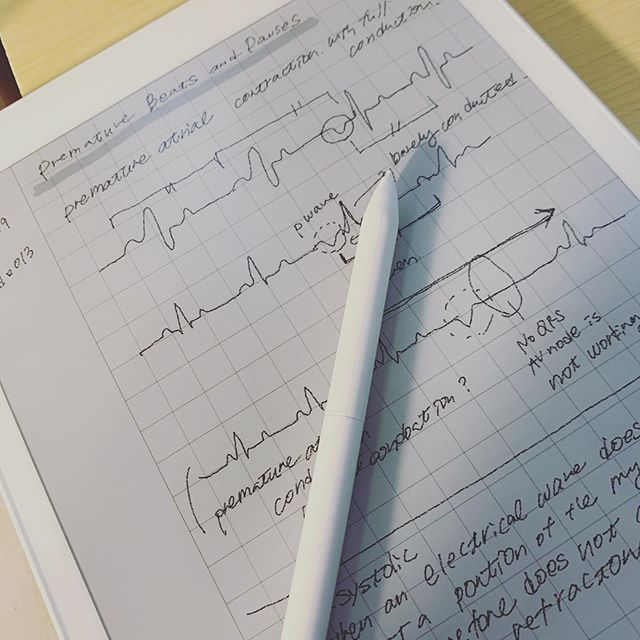](https://www.instagram.com/p/B12EbTBHL_O/?utm_source=ig_embed)

 [         norain.norainbow.nrs         172 posts · 367 followers               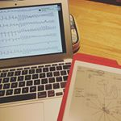  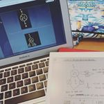](https://www.instagram.com/norain.norainbow.nrs/?utm_source=ig_embed)

 [View More on Instagram](https://www.instagram.com/norain.norainbow.nrs/?utm_source=ig_embed)

 [  Like](https://www.instagram.com/p/B12EbTBHL_O/?utm_source=ig_embed)  [ Comment](https://www.instagram.com/p/B12EbTBHL_O/?utm_source=ig_embed)  [ Share]()  [ Save](https://www.instagram.com/p/B12EbTBHL_O/?utm_source=ig_embed)

 [37 likes](https://www.instagram.com/p/B12EbTBHL_O/?utm_source=ig_embed)

 [norain.norainbow.nrs](https://www.instagram.com/norain.norainbow.nrs/?utm_source=ig_embed)

今日で8月も終わり。今月はECGの勉強にコンスタントに取り組めたことと、TOEFLの勉強を友達と定期的にやり始めたのが良かったかなあ〜。TOEFLを10月頃に受験しようと思うけど違う島に行かなあかん。笑 田舎の子みたい。笑

Today is the last day of August. I'm glad that I can keep studying for ECG and started a study cession for TOEFL with my friends. I'm planning to take TOEFL in October, but I need to go other island to take itStruggle living in

a country side... [#看護師の勉強垢](https://www.instagram.com/explore/tags/%E7%9C%8B%E8%AD%B7%E5%B8%AB%E3%81%AE%E5%8B%89%E5%BC%B7%E5%9E%A2/?utm_source=ig_embed)

[#英語の勉強垢](https://www.instagram.com/explore/tags/%E8%8B%B1%E8%AA%9E%E3%81%AE%E5%8B%89%E5%BC%B7%E5%9E%A2/?utm_source=ig_embed)

[#海外生活](https://www.instagram.com/explore/tags/%E6%B5%B7%E5%A4%96%E7%94%9F%E6%B4%BB/?utm_source=ig_embed)

[#TOEFL勉強](https://www.instagram.com/explore/tags/TOEFL%E5%8B%89%E5%BC%B7/?utm_source=ig_embed)

[#remarkablepaper](https://www.instagram.com/explore/tags/remarkablepaper/?utm_source=ig_embed)

 [Add a comment...](https://www.instagram.com/p/B12EbTBHL_O/?utm_source=ig_embed)  [Instagram](https://www.instagram.com/p/B12EbTBHL_O/?utm_source=ig_embed)

 

 [gensplanner](https://www.instagram.com/gensplanner/?utm_source=ig_embed)
  191 followers

 [View Profile](https://www.instagram.com/gensplanner/?utm_source=ig_embed)

 [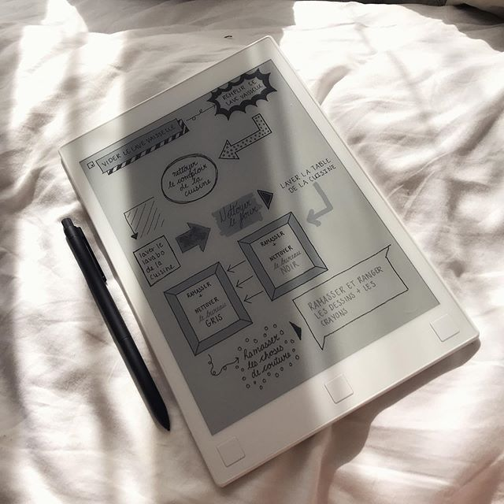](https://www.instagram.com/p/B1q6uERFm36/?utm_source=ig_embed)

 [         gensplanner         74 posts · 191 followers               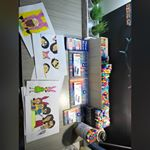  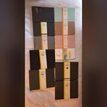](https://www.instagram.com/gensplanner/?utm_source=ig_embed)

 [View More on Instagram](https://www.instagram.com/gensplanner/?utm_source=ig_embed)

 [  Like](https://www.instagram.com/p/B1q6uERFm36/?utm_source=ig_embed)  [ Comment](https://www.instagram.com/p/B1q6uERFm36/?utm_source=ig_embed)  [ Share]()  [ Save](https://www.instagram.com/p/B1q6uERFm36/?utm_source=ig_embed)

 [23 likes](https://www.instagram.com/p/B1q6uERFm36/?utm_source=ig_embed)

 [gensplanner](https://www.instagram.com/gensplanner/?utm_source=ig_embed)

When you need motivation to clean your house, you do a super list [@remarkable](https://www.instagram.com/remarkable/?utm_source=ig_embed)  [#remarkable](https://www.instagram.com/explore/tags/remarkable/?utm_source=ig_embed)  [#remarkablepaper](https://www.instagram.com/explore/tags/remarkablepaper/?utm_source=ig_embed)  [#remarkablepapertablet](https://www.instagram.com/explore/tags/remarkablepapertablet/?utm_source=ig_embed)

 [view all comments](https://www.instagram.com/p/B1q6uERFm36/?utm_source=ig_embed)

 [Add a comment...](https://www.instagram.com/p/B1q6uERFm36/?utm_source=ig_embed)  [Instagram](https://www.instagram.com/p/B1q6uERFm36/?utm_source=ig_embed)

 

 [elliott.maguire](https://www.instagram.com/elliott.maguire/?utm_source=ig_embed)

  1,782 followers

 [View Profile](https://www.instagram.com/elliott.maguire/?utm_source=ig_embed)

 [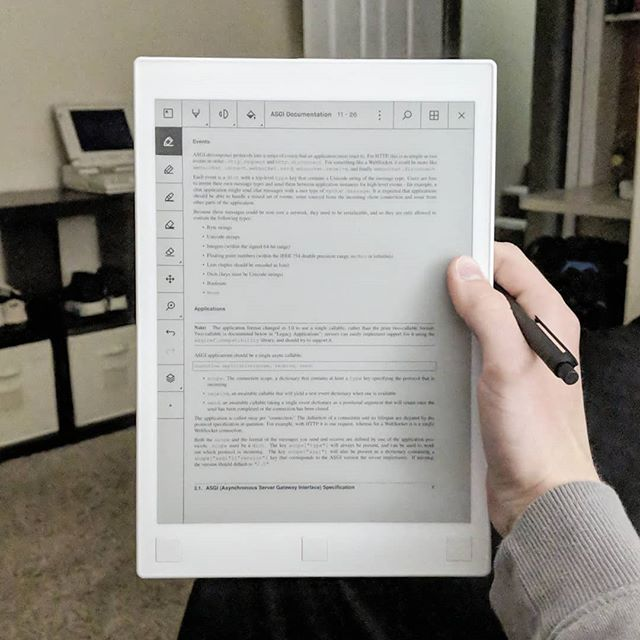](https://www.instagram.com/p/B1ITyKYg68I/?utm_source=ig_embed)

 [         elliott.maguire         193 posts · 1,782 followers               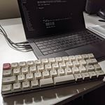  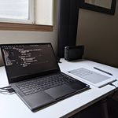](https://www.instagram.com/elliott.maguire/?utm_source=ig_embed)

 [View More on Instagram](https://www.instagram.com/elliott.maguire/?utm_source=ig_embed)

 [  Like](https://www.instagram.com/p/B1ITyKYg68I/?utm_source=ig_embed)  [ Comment](https://www.instagram.com/p/B1ITyKYg68I/?utm_source=ig_embed)  [ Share]()  [ Save](https://www.instagram.com/p/B1ITyKYg68I/?utm_source=ig_embed)

 [204 likes](https://www.instagram.com/p/B1ITyKYg68I/?utm_source=ig_embed)

 [elliott.maguire](https://www.instagram.com/elliott.maguire/?utm_source=ig_embed)

I've been studying software design philosophy lately, and here are some things I've learned about an effective development process:

Learn to understand, design, and then implement.

Start by evaluating the problem and it's attributes, and keep a close record. If you don't fully understand the problem, and get to a point where you understand it fully.

Once you've understood the problem, design around it. And be thorough; "tech debt" becomes a problem when you don't account for it, so and evaluate your whole design before moving forward.

Now that you've got a deep design, it's time to implement. Every single line of code matters, and should be treated with care. Your design is sturdy, and so should your implementation, so and ensure that every part of the implementation fits the design like a glove.

The moral of the story is: ! When working on a solution to a problem, it is of the utmost importance to and carry out the initial steps properly, so you can iterate on it easily and effectively.

 [view all 22 comments](https://www.instagram.com/p/B1ITyKYg68I/?utm_source=ig_embed)

 [Add a comment...](https://www.instagram.com/p/B1ITyKYg68I/?utm_source=ig_embed)  [Instagram](https://www.instagram.com/p/B1ITyKYg68I/?utm_source=ig_embed)

 

 [cnholmberg](https://www.instagram.com/cnholmberg/?utm_source=ig_embed)
  3,610 followers

 [View Profile](https://www.instagram.com/cnholmberg/?utm_source=ig_embed)

 [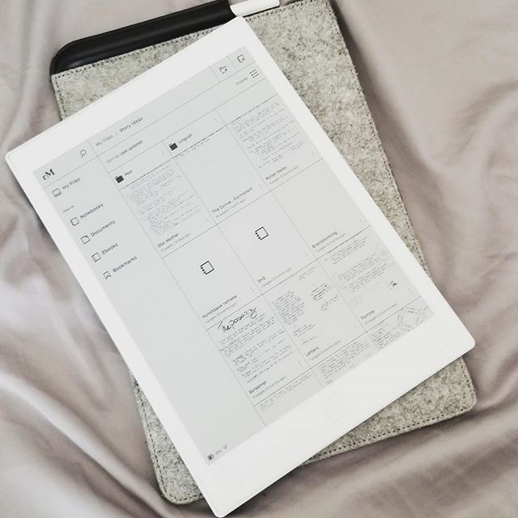](https://www.instagram.com/p/B1ZZDe_gNX_/?utm_source=ig_embed)

 [         cnholmberg         1,380 posts · 3,610 followers                 ](https://www.instagram.com/cnholmberg/?utm_source=ig_embed)

 [View More on Instagram](https://www.instagram.com/cnholmberg/?utm_source=ig_embed)

 [  Like](https://www.instagram.com/p/B1ZZDe_gNX_/?utm_source=ig_embed)  [ Comment](https://www.instagram.com/p/B1ZZDe_gNX_/?utm_source=ig_embed)  [ Share]()  [ Save](https://www.instagram.com/p/B1ZZDe_gNX_/?utm_source=ig_embed)

 [104 likes](https://www.instagram.com/p/B1ZZDe_gNX_/?utm_source=ig_embed)

 [cnholmberg](https://www.instagram.com/cnholmberg/?utm_source=ig_embed)

Snapshot from my Story Ideas folder on my Remarkable tablet. Most of these have been scrapped or put on a backburner, like Screamer, my horror standalone, or Famine, my otherworld four-horsemen tale. I have perhaps 15,000 words written of Whispers in the Silver, a book that started as a Cinderella twist and became something much different*, and 7,500 words of Star Mother, a standalone romantic fantasy that occasionally distracts me from my progress on SPELLMAKER. Among these is a high (possibly epic) fantasy trilogy I will hopefully pen soon, though I haven't worked on the outline in over a month. Sometimes a project takes me by the horns, sometimes it simmers in the background, other times it screams for attention only to turn around and take a nap (yes, books ARE like toddlers, aren't they?)

What stories are you dying to read, even if they're not yet written? (On my list is this "Woodsywip" of [@gamwyn](https://www.instagram.com/gamwyn/?utm_source=ig_embed)'s)

*this is actually the book I was working on when I got the call from my agent (while on vacation) that she and my editor really wanted me to write another series. Later that week, the Numina Trilogy was born :)

 [view all 20 comments](https://www.instagram.com/p/B1ZZDe_gNX_/?utm_source=ig_embed)

 [Add a comment...](https://www.instagram.com/p/B1ZZDe_gNX_/?utm_source=ig_embed)  [Instagram](https://www.instagram.com/p/B1ZZDe_gNX_/?utm_source=ig_embed)

 

 [remarkable](https://www.instagram.com/remarkable/?utm_source=ig_embed)
  65.9k followers

 [View Profile](https://www.instagram.com/remarkable/?utm_source=ig_embed)

 [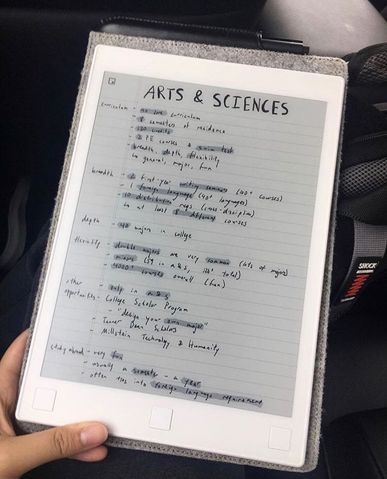](https://www.instagram.com/p/B1bYMXGi6N8/?utm_source=ig_embed)

 [         remarkable         212 posts · 65.9k followers                 ](https://www.instagram.com/remarkable/?utm_source=ig_embed)

 [View More on Instagram](https://www.instagram.com/remarkable/?utm_source=ig_embed)

 [  Like](https://www.instagram.com/p/B1bYMXGi6N8/?utm_source=ig_embed)  [ Comment](https://www.instagram.com/p/B1bYMXGi6N8/?utm_source=ig_embed)  [ Share]()  [ Save](https://www.instagram.com/p/B1bYMXGi6N8/?utm_source=ig_embed)

 [638 likes](https://www.instagram.com/p/B1bYMXGi6N8/?utm_source=ig_embed)

 [remarkable](https://www.instagram.com/remarkable/?utm_source=ig_embed)

Keep your documents organized with all your notes in one place. Photo by [@skylightstudies](https://www.instagram.com/skylightstudies/?utm_source=ig_embed)

 [view all 25 comments](https://www.instagram.com/p/B1bYMXGi6N8/?utm_source=ig_embed)

 [Add a comment...](https://www.instagram.com/p/B1bYMXGi6N8/?utm_source=ig_embed)  [Instagram](https://www.instagram.com/p/B1bYMXGi6N8/?utm_source=ig_embed)

## Marker

Responsive. Precise. Hassle-free.

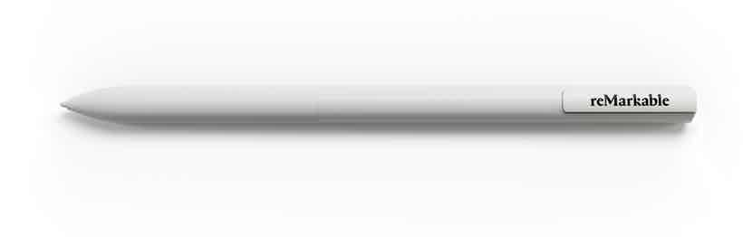

The Marker is essential for the paper-like experience. It's designed to deliver just the right friction and puts digital ink on the reMarkable with **incredibly low lag**. A super precise tool, down to the smallest details. The Marker is included with each purchase of a reMarkable device.

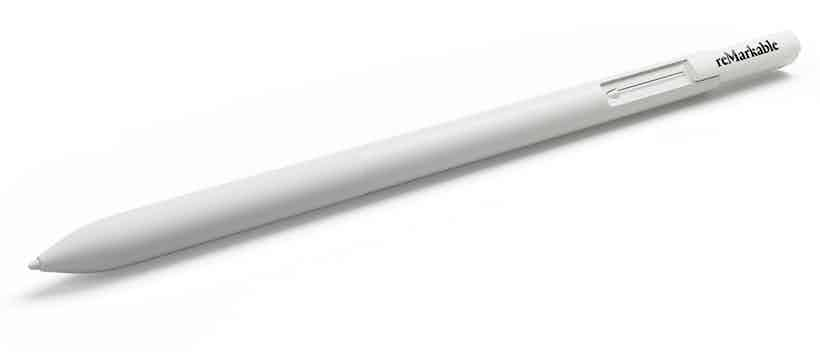

![](data:image/svg+xml,%3csvg xmlns='http://www.w3.org/2000/svg' height='70.68599999999999' width='90.2' rotate='244' class='SvgPointer__Svg-jVhVkJ hkzjXj js-evernote-checked' data-evernote-id='1162'%3e%3cdefs data-evernote-id='1163' class='js-evernote-checked'%3e%3cfilter id='f1' x='0' y='0' width='200%25' height='200%25' data-evernote-id='1164' class='js-evernote-checked'%3e%3cfeDropShadow dx='5' dy='5' stdDeviation='2' flood-color='grey' flood-opacity='1' data-evernote-id='1165' class='js-evernote-checked'%3e%3c/feDropShadow%3e%3c/filter%3e%3c/defs%3e%3cpath id='VsngA71GdoG' d='M4 4 Q41 0%2c 76 58.25999999999999' stroke='%23CB7428' fill='transparent' speed='0.16666666666666666' filter='' class='SvgPointer__Curve-hRJhkU grAbVY js-evernote-checked' data-evernote-id='1166'%3e%3c/path%3e%3cg color='%23CB7428' class='SvgPointer__G-gMugwB laoqID js-evernote-checked' data-evernote-id='1167'%3e%3ccircle id='X3X7TsuUAwe' cx='4' cy='4' r='4' filter='' class='SvgPointer__Circle-eqrnSJ jfhjNO js-evernote-checked' data-evernote-id='1168'%3e%3c/circle%3e%3ccircle id='MqMPKujzrwb' cx='76' cy='58.25999999999999' r='6' filter='' class='SvgPointer__Circle-eqrnSJ jfhjNO js-evernote-checked' data-evernote-id='1169'%3e%3c/circle%3e%3c/g%3e%3c/svg%3e)

## Marker Signature

Our finest Marker yet

Marker Signature is our finest Marker yet. Precision-machined from aluminium and anodized for a pristine matte black finish. Weighted for a balanced, authentic writing experience. We’ve even added a clicker because, well… it’s fun to click and think. The Marker Signature is available in our webshop.

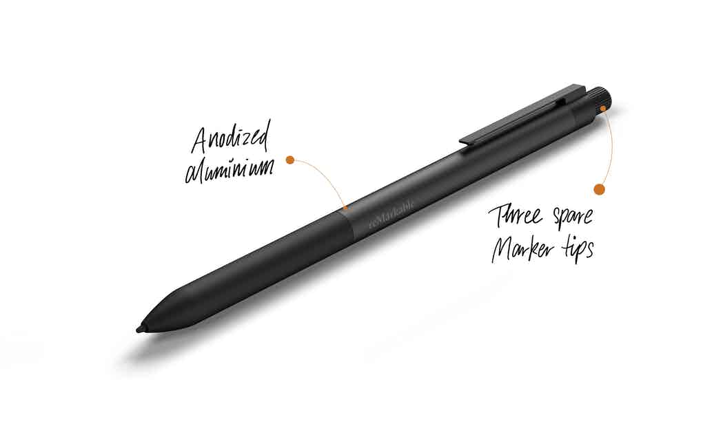

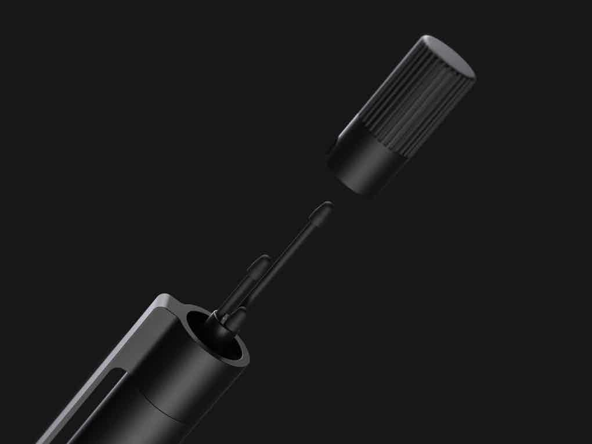
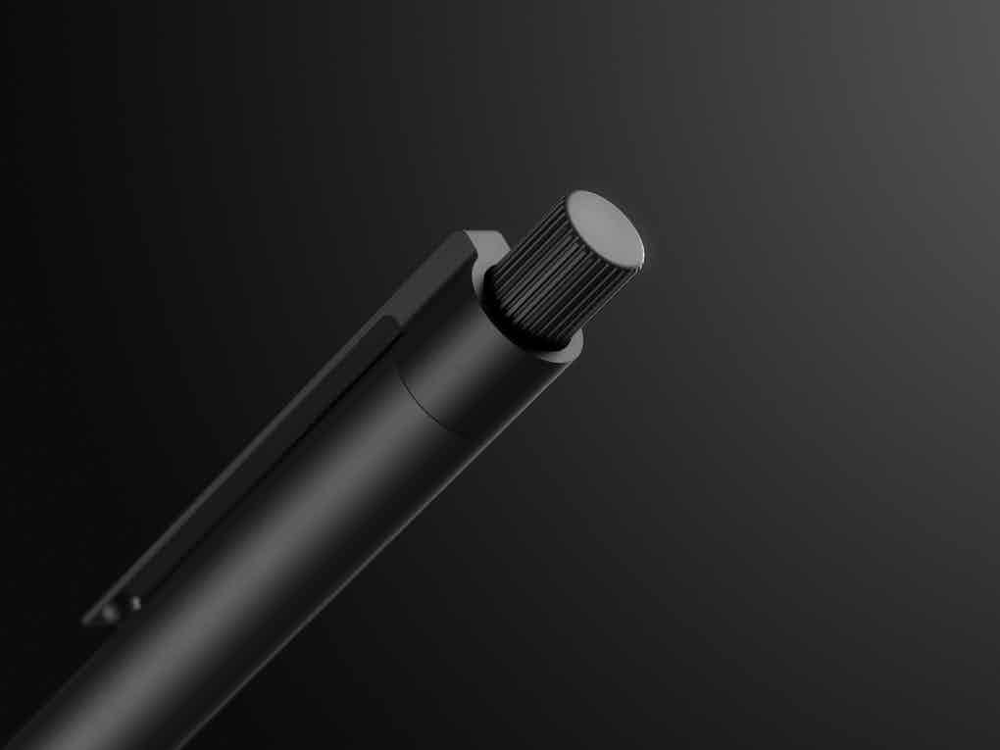
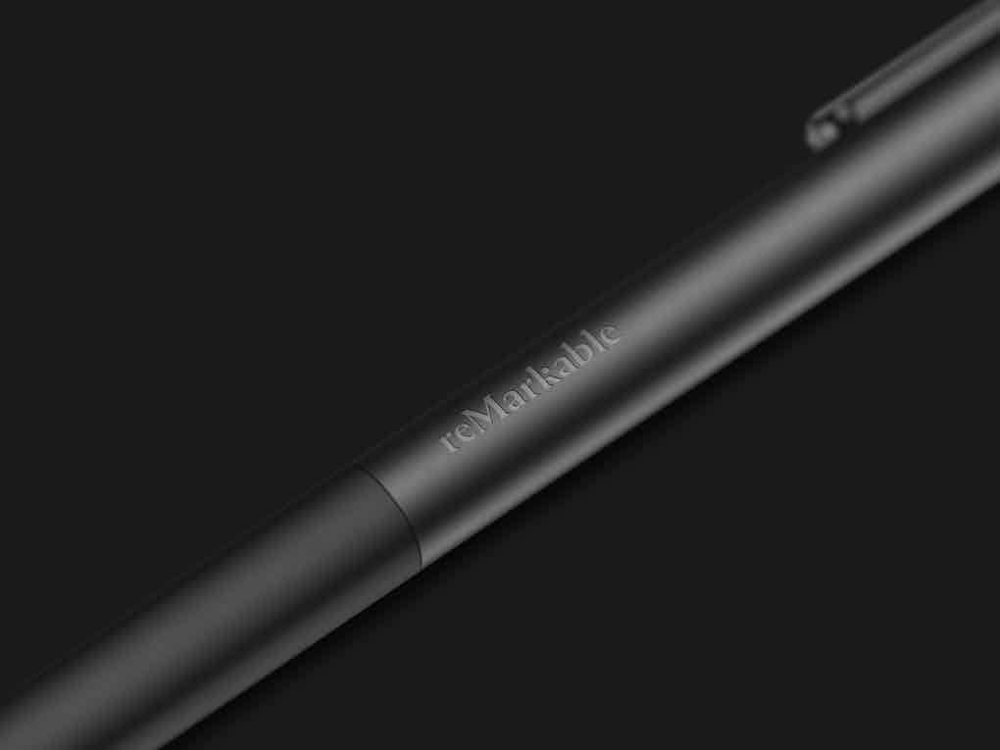

[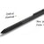]()

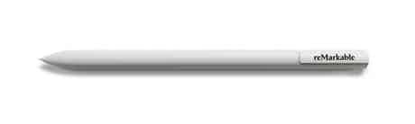

## Marker

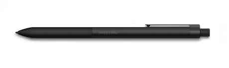

## Marker Signature

| Marker | Specification | Marker Signature |
| --- | --- | --- |
| 12 g | Weight | 18 g |
| White | Color | Black |
| Plastic | Material | Anodized aluminum |
| 1 extra Marker tip | Features | 3 extra Marker tips, pen clip, clicker |
| Included in product box | Availability | Available in our webshop |

## Folio

For safety and style

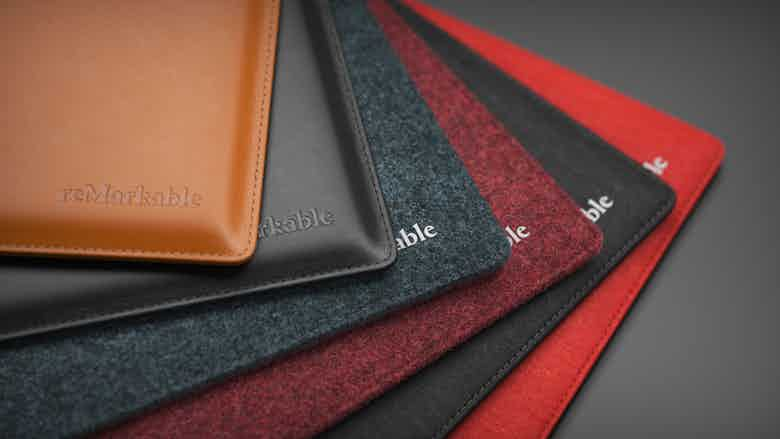

Even though reMarkable is a supremely durable device, we still want you to protect it from scratches and have a safe place for your Marker. Folio is designed to protect both.

Choose from a variety of premium materials and colors.

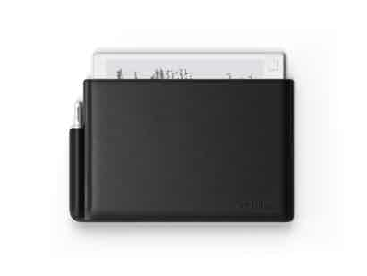

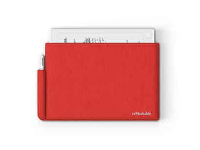

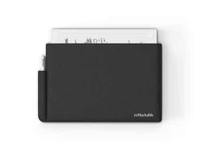

## Congratulations!

You have now learned about
the key aspects of reMarkable.

### Want more? Choose a topic below.

### Get your brain back

Learn more about how reMarkable fights digital distractions.
[Learn more](https://remarkable.com/getyourbrainback)

# Technical specifications

Size and Weight

- 177 x 256 x 6.7mm (6.9 x 10.1 x .26 inches)
- Approximately 350 gram (.77 pounds)

CANVAS display

- 10.3” monochrome digital paper display (no colors)
- 1872x1404 resolution (226 DPI)
- Partially powered by E-ink Carta technology
- Multi-point capacitive touch
- No glass parts, virtually unbreakable
- Paper-like surface friction

Pen

- No battery, setup or pairing required
- Special high-friction pen tip
- Tilt detection
- 2048 levels of pressure sensitivity

Connectivity

- Wi-Fi connected

Storage and RAM

- 8 GB internal storage (100,000 pages)
- 512 MB DDR3L RAM

Battery

- Rechargeable (Micro USB)
- 3000 mAh

Processor

- 1 GHz ARM A9 CPU

Operating system

- Codex, a custom Linux-based OS optimized for low-latency e-paper

Document support

- PDF and ePUB, with more formats to be announced

Other

- Menu language: English only
- Handwriting Conversion feature partially powered by MyScript Technology

# Inspired by paper

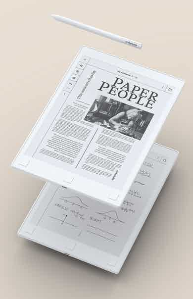

**Simplicity** is the foundation of reMarkable's design. It represents the possibilities that exist in a blank stack of paper sheets. A **subtle and non-intrusive** design that embodies the paper experience.

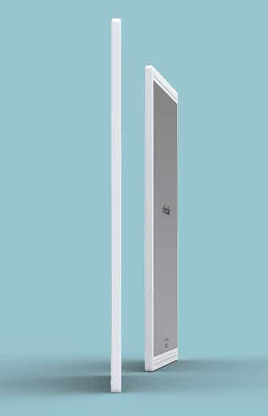

## Slim

The reMarkable's slender design means it fits easily in your bag

## Light

A notebook has to be portable, which is why reMarkable is made with the lightest materials.

## Robust

An aluminum back plate and PMMA cover lens makes reMarkable virtually unbreakable.

### Learn about reMarkable's tools

[Learn more](https://support.remarkable.com/hc/en-us/articles/115004558545-5-1-Tools-Overview#)

Enter your email, and we’ll keep you up to date on the latest.
Your email address