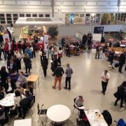
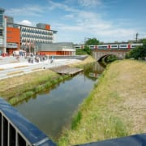

researchED – Working out what works

#### researchED Events *&* Tickets

[See full list & Book tickets](http://researched.org.uk/events/list)

### researchED Magazine

[Read more & subscribe here](https://researched.org.uk/pr/magazine-launch/)

### Next Event starts in



[14Days13Hours42Minutes13Seconds](https://researched.org.uk/event/researched-cymru/)

### [Upcoming: researchED Cymru](https://researched.org.uk/event/researched-cymru/)

researchEDRT[@sara_hjelm](http://twitter.com/sara_hjelm): One month to go until[@researchED1](http://twitter.com/researchED1) Haninge, March 15#rEDHan

researchEDRT[@researchEDScot1](http://twitter.com/researchEDScot1): The wait is over, the[#rEDGlas](http://twitter.com/search?q=%23rEDGlas) programme is here! You’ve got the rest of the week to make your choices... and Saturday…

researchEDRT[@researchEDGsy](http://twitter.com/researchEDGsy): We can't wait for researchED Guernsey on Saturday 18th April! Tickets are available to all, and will be reimbursed for G…

researchEDRT[@judehunton](http://twitter.com/judehunton): 3-2-1 Off we go! Tickets on sale NOW! We're looking forward to seeing as many people there as possible: it should be a fan…

researchEDRT[@violawiegand](http://twitter.com/violawiegand):[#rEDBrum](http://twitter.com/search?q=%23rEDBrum) attendees we are still collecting responses for this  so if you have 3 minutes for the survey, please take part…

researchEDRT[@HFletcherWood](http://twitter.com/HFletcherWood): I recently finished reading my back copies of the[@researchED1](http://twitter.com/researchED1) magazine. I learned lots. Here are a few articles that st…

researchEDRT[@SlentzKen](http://twitter.com/SlentzKen): Many thanks to[@HoratioSpeaks](http://twitter.com/HoratioSpeaks)[@ThinkReadTweet](http://twitter.com/ThinkReadTweet)[@Kathy_Rastle](http://twitter.com/Kathy_Rastle)[@buckingham_j](http://twitter.com/buckingham_j)[@HuntingEnglish](http://twitter.com/HuntingEnglish)[@Tom_Needham_](http://twitter.com/Tom_Needham_)[@KevinWheldall](http://twitter.com/KevinWheldall)[@RWhe](http://twitter.com/RWhe)…

researchEDRT[@Rosalindphys](http://twitter.com/Rosalindphys): “Why do you bang on about researchED all the time Ruth?” https://t.co/8JEe8nlZuM  https://t.co/U5fQ7lfD5v

researchEDRT[@researchEDDub](http://twitter.com/researchEDDub): 2019 was the year[@researchED1](http://twitter.com/researchED1) came to Ireland, with[#rEDDub](http://twitter.com/search?q=%23rEDDub) on October 5th. The huge demand for tickets and terrific fe…

researchEDRT[@UnityResSch](http://twitter.com/UnityResSch):  Unity Research School's December Newsletter  - https://t.co/XtFlXgKn21 No more sleeps! It's here - Unity Research Scho…

### Upcoming Events



[ #### researchED Cymru February 29 @ 8:00 am - 5:00 pmCardiff High School](https://researched.org.uk/event/researched-cymru/)[ #### researchED Haninge 2020 March 14 @ 9:00 am - 4:30 pmFredrika Bremergymnasiet](https://researched.org.uk/event/researched-haninge-2020/)[ #### researchED Blackpool 2020 March 21 @ 8:00 am - 5:00 pmSt. Mary’s Catholic Academy](https://researched.org.uk/event/researched-blackpool-2020/)[ #### researchED Belgium 2020 March 28 @ 9:30 am - 5:00 pmThomas More – Campus De Vest](https://researched.org.uk/event/researched-belgium-2020/)

[See full list & book tickets](http://www.researched.org.uk/events/list/)

### Latest magazine articles



24th June 2019

### [Message from the EDitor](https://researched.org.uk/message-from-the-editor-2/)

24th June 2019

### [D_ y_u kn_w wh_t I me_n? Reading for inference](https://researched.org.uk/d_-y_u-kn_w-wh_t-i-me_n-reading-for-inference/)

24th June 2019

### [The subtle art of slowly losing control](https://researched.org.uk/the-subtle-art-of-slowly-losing-control/)

24th June 2019

### [Screen queen: An interview with Dr. Jennifer Buckingham](https://researched.org.uk/screen-queen-an-interview-with-dr-jennifer-buckingham/)

24th June 2019

### [Single, bilingual: What do we need to know about second-language learning?](https://researched.org.uk/single-bilingual-what-do-we-need-to-know-about-second-language-learning/)

24th June 2019

### [10 things every teacher educator should know and be able to do](https://researched.org.uk/10-things-every-teacher-educator-should-know-and-be-able-to-do/)

 

#   [ResearchED - A Global Community](https://vimeo.com/185796132)

03:26

 [![](data:image/svg+xml,%3csvg xmlns='http://www.w3.org/2000/svg' viewBox='0 0 140 40' preserveAspectRatio='xMidYMid' role='img' focusable='false' aria-labelledby='logo-icon-title' data-evernote-id='20' class='js-evernote-checked'%3e%3ctitle id='logo-icon-title' data-evernote-id='152' class='js-evernote-checked'%3eVimeo%3c/title%3e%3cg data-evernote-id='153' class='js-evernote-checked'%3e%3cpath class='fill logo-v js-evernote-checked' d='M31.277 18.832c-.14 3.052-2.27 7.229-6.39 12.531-4.259 5.536-7.863 8.306-10.811 8.306-1.825 0-3.371-1.687-4.633-5.059l-2.529-9.275c-.938-3.372-1.943-5.06-3.019-5.06-.234 0-1.054.494-2.458 1.477l-1.474-1.901c1.546-1.358 3.071-2.717 4.572-4.078 2.062-1.783 3.609-2.72 4.642-2.814 2.438-.234 3.938 1.433 4.502 5.001.608 3.851 1.03 6.246 1.266 7.182.704 3.195 1.476 4.791 2.321 4.791.657 0 1.641-1.037 2.954-3.108 1.312-2.072 2.015-3.649 2.109-4.732.188-1.789-.516-2.686-2.109-2.686-.75 0-1.522.173-2.318.514 1.54-5.044 4.481-7.495 8.823-7.355 3.22.095 4.737 2.184 4.552 6.266z' data-evernote-id='154'%3e%3c/path%3e%3cpath class='fill logo-i js-evernote-checked' d='M50.613 28.713c-1.313 2.484-3.119 4.733-5.417 6.748-3.143 2.718-6.285 4.076-9.425 4.076-1.456 0-2.57-.469-3.343-1.406-.773-.938-1.137-2.153-1.09-3.653.045-1.548.526-3.938 1.441-7.173.914-3.232 1.373-4.967 1.373-5.201 0-1.218-.423-1.828-1.266-1.828-.282 0-1.079.494-2.393 1.477l-1.618-1.901c1.501-1.358 3.001-2.717 4.502-4.078 2.017-1.783 3.518-2.72 4.504-2.814 1.546-.14 2.684.314 3.411 1.367.726 1.052.996 2.417.81 4.098-.61 2.852-1.268 6.472-1.972 10.864-.046 2.01.681 3.014 2.182 3.014.656 0 1.827-.693 3.518-2.083 1.406-1.156 2.555-2.243 3.447-3.262l1.336 1.755zm-6.12-25.016c-.047 1.168-.633 2.288-1.76 3.361-1.266 1.212-2.767 1.82-4.501 1.82-2.672 0-3.963-1.166-3.869-3.499.045-1.213.76-2.381 2.144-3.501 1.384-1.119 2.919-1.68 4.609-1.68.984 0 1.805.387 2.462 1.155.656.772.961 1.553.915 2.344z' data-evernote-id='155'%3e%3c/path%3e%3cpath class='fill logo-m js-evernote-checked' d='M94.543 28.713c-1.314 2.484-3.117 4.733-5.416 6.748-3.145 2.718-6.285 4.076-9.426 4.076-3.051 0-4.527-1.687-4.432-5.06.045-1.501.338-3.306.877-5.415.539-2.108.832-3.748.879-4.921.049-1.779-.492-2.673-1.623-2.673-1.223 0-2.682 1.456-4.375 4.362-1.788 3.05-2.754 6.003-2.894 8.861-.095 2.02.103 3.568.592 4.645-3.272.096-5.565-.444-6.873-1.617-1.171-1.032-1.708-2.742-1.614-5.135.045-1.501.276-3.001.69-4.502.414-1.5.644-2.837.69-4.011.095-1.734-.54-2.604-1.9-2.604-1.177 0-2.444 1.339-3.806 4.011-1.361 2.673-2.113 5.465-2.253 8.371-.094 2.627.074 4.456.503 5.486-3.219.096-5.505-.582-6.857-2.035-1.122-1.214-1.634-3.06-1.539-5.54.044-1.214.258-2.911.645-5.084.386-2.175.603-3.87.647-5.087.093-.841-.119-1.263-.633-1.263-.281 0-1.079.475-2.393 1.424l-1.687-1.901c.234-.184 1.71-1.545 4.432-4.078 1.969-1.828 3.306-2.766 4.009-2.812 1.219-.095 2.204.409 2.954 1.511s1.126 2.38 1.126 3.834c0 .469-.047.915-.14 1.336.703-1.077 1.523-2.017 2.463-2.814 2.156-1.874 4.572-2.931 7.245-3.166 2.298-.187 3.938.352 4.925 1.617.795 1.033 1.17 2.511 1.125 4.433.329-.28.681-.586 1.056-.915 1.078-1.267 2.133-2.273 3.164-3.023 1.736-1.267 3.541-1.97 5.418-2.112 2.25-.187 3.867.35 4.852 1.611.844 1.028 1.219 2.5 1.127 4.415-.047 1.309-.363 3.213-.949 5.712-.588 2.501-.879 3.936-.879 4.31-.049.982.047 1.659.279 2.034.236.373.797.559 1.689.559.656 0 1.826-.693 3.518-2.083 1.406-1.156 2.555-2.243 3.447-3.262l1.337 1.757z' data-evernote-id='156'%3e%3c/path%3e%3cpath class='fill logo-e js-evernote-checked' d='M120.922 28.642c-1.361 2.249-4.033 4.495-8.02 6.743-4.971 2.856-10.012 4.284-15.125 4.284-3.797 0-6.52-1.267-8.16-3.797-1.172-1.735-1.734-3.797-1.688-6.189.045-3.797 1.736-7.407 5.064-10.832 3.658-3.75 7.973-5.627 12.945-5.627 4.596 0 7.033 1.873 7.314 5.615.188 2.384-1.125 4.842-3.938 7.368-3.004 2.76-6.781 4.515-11.328 5.263.842 1.169 2.109 1.752 3.799 1.752 3.375 0 7.059-.855 11.045-2.574 2.859-1.207 5.111-2.461 6.754-3.76l1.338 1.754zm-15.969-7.345c.045-1.259-.469-1.89-1.547-1.89-1.406 0-2.83.969-4.283 2.906-1.451 1.936-2.201 3.789-2.248 5.562-.025 0-.025.305 0 .911 2.295-.839 4.287-2.122 5.971-3.849 1.357-1.491 2.06-2.707 2.107-3.64z' data-evernote-id='157'%3e%3c/path%3e%3cpath class='fill logo-o js-evernote-checked' d='M140.018 23.926c-.189 4.31-1.781 8.031-4.783 11.169-3.002 3.137-6.73 4.706-11.186 4.706-3.705 0-6.52-1.195-8.441-3.585-1.404-1.777-2.182-4.001-2.32-6.668-.236-4.029 1.217-7.729 4.361-11.101 3.377-3.746 7.619-5.618 12.732-5.618 3.281 0 5.766 1.102 7.457 3.301 1.594 2.015 2.32 4.614 2.18 7.796zm-7.95-.264c.047-1.269-.129-2.434-.527-3.49-.4-1.057-.975-1.587-1.725-1.587-2.391 0-4.361 1.293-5.906 3.877-1.316 2.115-2.02 4.371-2.111 6.766-.049 1.176.164 2.21.633 3.104.514 1.032 1.242 1.549 2.182 1.549 2.109 0 3.914-1.244 5.416-3.735 1.267-2.068 1.945-4.23 2.038-6.484z' data-evernote-id='158'%3e%3c/path%3e%3c/g%3e%3c/svg%3e)](https://vimeo.com/185796132)

### How does researchED work?

[FIND OUT](https://researched.org.uk/about/how-it-works/)

## Stay up to date about researchED events!



### Sign up for our newsletter to receive information about new events, speakers sessions, and more.

- Email*

- First Name

- Last Name

- Which event newsletters are you interested in?*

Please select one or more.

    - Select All
    - UK events
    - EU events
    - US events
    - Canada events
    - Australia/NZ events
    - Africa events
    - Middle East events
    - Asia events
- Would you like to enter your address to receive researchED Magazine for FREE?

Free subscriptions are available to newsletter subscribers until December 2019. No obligations or credit card details necessary.

    - Yes, please

# Support our work around the world

[DONATE NOW](https://researched.org.uk/product/donation-to-researched/)

### Upcoming Events

1.

####   [researchED Cymru](https://researched.org.uk/event/researched-cymru/)

 February 29 @ 8:00 am - 5:00 pm
2.

####   [researchED Haninge 2020](https://researched.org.uk/event/researched-haninge-2020/)

 March 14 @ 9:00 am - 4:30 pm
3.

####   [researchED Blackpool 2020](https://researched.org.uk/event/researched-blackpool-2020/)

 March 21 @ 8:00 am - 5:00 pm
 [View All Events](https://researched.org.uk/events/)

[Privacy Policy](https://researched.org.uk/privacy-policy/)

### Tweets

RT[@sara_hjelm](http://twitter.com/sara_hjelm): One month to go until[@researchED1](http://twitter.com/researchED1) Haninge, March 15#rEDHan[** 1](https://twitter.com/intent/retweet?tweet_id=1228031249102639104)[** 0](https://twitter.com/intent/favorite?tweet_id=1228031249102639104)

RT[@researchEDScot1](http://twitter.com/researchEDScot1): The wait is over, the[#rEDGlas](http://twitter.com/search?q=%23rEDGlas) programme is here! You’ve got the rest of the week to make your choices... and Saturday…[** 20](https://twitter.com/intent/retweet?tweet_id=1222218733374070786)[** 0](https://twitter.com/intent/favorite?tweet_id=1222218733374070786)

RT[@researchEDGsy](http://twitter.com/researchEDGsy): We can't wait for researchED Guernsey on Saturday 18th April! Tickets are available to all, and will be reimbursed for G…[** 17](https://twitter.com/intent/retweet?tweet_id=1220789124824805381)[** 0](https://twitter.com/intent/favorite?tweet_id=1220789124824805381)

### researchED Newsletter

- Name

   First      Last

- Email*

- Which events are you interested in?
    - Select All
    - UK events
    - US events
    - EU events
    - Australia/NZ events
    - Canada events
    - Africa events
    - Middle East events
    - Asia events
    - South America

 © researchED 2018

- [](https://twitter.com/researchED1)