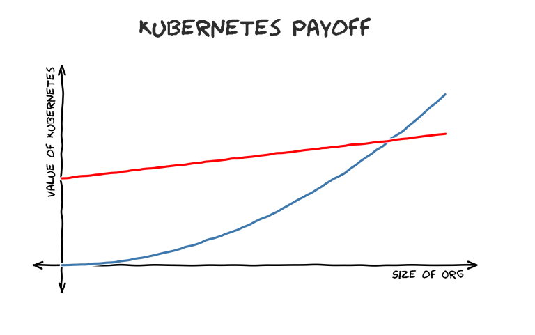
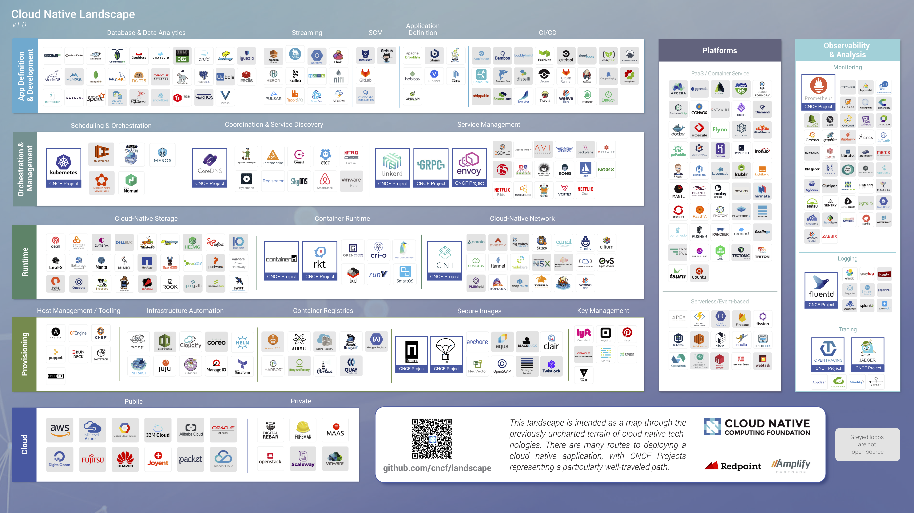
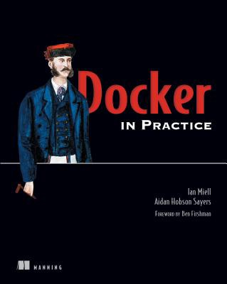

‘AWS vs K8s’ is the new ‘Windows vs Linux’

# ‘AWS vs K8s’ is the new ‘Windows vs Linux’

[zwischenzugs](https://zwischenzugs.com/author/zwischenzugs/)[Uncategorized](https://zwischenzugs.com/category/uncategorized/)March 25, 20199 Minutes

## Then…

If, like me, you’re over 40 and work in IT, you’ll probably remember a time when everyone used Windows, and a small but growing proportion of people were wasting their lives compiling Linux in their spare time.

The Windows users would look on, baffled: ‘Why would you do that, when Windows has everything you need, is supported, and is so easy to use?!’

Answers to this question varied. Some liked to tinker, some wanted an OS to be ‘free’, some wanted more control over their software, some wanted a faster system, but all had some niche reason to justify the effort.

## Now…

As I stayed up for another late night trying to get some new Kubernetes add-on to work as documented, it struck me that I’m in a similar place to those days. Until a couple of years ago, Kubernetes itself was a messy horror-show for the uninitiated, with regularly-changing APIs, poor documentation if you tried to build yourself, and all the characteristics you might expect of an immature large-scale software project.

That said, Kubernetes’ governance was and is *far* and away ahead of most open source software projects, but the feeling then was similar to compiling Linux at the turn of the century, or dealing with your laptop crashing 50% of the time you unplugged a USB cable (yes, kids, this used to happen).

It’s not like confusion and rate of change has come down to a low level. Even those motivated to keep up struggle with the rate of change in the ecosystem, and new well-funded technologies pop up every few months that are hard to explain to others.

Take knative for example:

So my AWS-using comrades see me breaking sweat on the regular and ask ‘why would you do that, when AWS has everything you need, is supported and used by everyone, and is so easy to use!?’

## AWS is Windows

Like Windows, AWS is a product. It’s not flexible, its behaviour is reliable. The APIs are well defined, the KPIs are good enough to be useful for most ‘real’ workloads. There are limits on all sorts of resources that help define what you can and can’t achieve.

Most people want this, like most people want a car that runs and doesn’t need to be fixed often. Some people like to maintain cars. Some companies retain mechanics to maintain a fleet of cars, because it’s cheaper at scale. In the same way, some orgs get to the point where they could see benefits from building their own data centres again. Think Facebook, or for a full switcher, [Dropbox](https://www.bloomberg.com/gadfly/articles/2018-03-01/dropbox-s-best-move-was-breaking-up-with-amazon-s-cloud). (We’ll get back to this).

Like Microsoft, (and now [Google](https://www.wordstream.com/blog/ws/2013/06/27/discontinued-google-products-services)) AWS embraces and extends, throwing [more](https://www.quora.com/How-many-AWS-services-are-there)[and](https://www.quora.com/How-many-AWS-services-are-there)[more products out there](https://www.quora.com/How-many-AWS-services-are-there) as soon as they become perceived as profitable.

## AWS and Kubernetes

Which brings us to AWS’s relationship with Kubernetes. It’s no secret that AWS doesn’t see the point of it. They already have ECS, which is an ugly hulking brute of a product that makes perfect sense if you are heavily bought into AWS in the first place.

But there’s EKS, I hear you say. Yes, there is. I haven’t looked at it lately, but it took a long time to come, and when it did come it was not exactly feature rich. It felt like one cloud framework (AWS) had mated with another (K8s) and a difficult adolescent dropped out. Complaints continue of deployment ‘taking too long’, for example.

Like Microsoft and Linux, AWS ignored Kubernetes for as long as it could, and like Microsoft, AWS has been forced to ’embrace and extend’ its rival to protect its market share. I’ve been in meetings with AWS folk who express mystification at why we’d want to use EKS when ECS is available.

## EKS and Lock-in

Which brings us to one of the big reasons AWS was able to deliver EKS, thereby ’embracing’ Kubernetes: IAM.

EKS (like all AWS services) is heavily integrated with AWS IAM. As most people know, IAM is the true [source of](https://forrestbrazeal.com/2019/02/18/cloud-irregular-iam-is-the-real-cloud-lock-in/)[(L)](https://forrestbrazeal.com/2019/02/18/cloud-irregular-iam-is-the-real-cloud-lock-in/)[AWS lock-in](https://forrestbrazeal.com/2019/02/18/cloud-irregular-iam-is-the-real-cloud-lock-in/) (and Lambda is the lock-in technology par excellence. You can’t move a server if there are none you can see).

Shifting your identity management is pretty much the last thing any organisation wants to do. Asking your CTO to argue for a fundamental change to a core security system with less than zero benefit to the business in the near term and lots of risk is not a career-enhancing move.

On the other hand, similar arguments were put forward for why Linux would never threaten Windows, and while that’s true on the desktop, the advent of the phone and the Mac has reduced Windows to a secondary player in the consumer computing market. Just look at their failure to force their browsers onto people in the last 10 years.

So it only takes a few unexpected turns in the market for something else to gain momentum and knife the king of the hill. Microsoft know this, and AWS know this. It’s why Microsoft and AWS kept adding new products and features to their offering, and it’s why EKS had to come.

Microsoft eventually turned their oil tanker towards the cloud, going big on open source, and Linux and Docker, and all the things that would drag IT to their services. Oh, and you can use the same AD as your corporate network, and shift your Microsoft Windows licenses to the cloud. And the first one’s free. Microsoft don’t care about the OS anymore. Nobody does, not even [RedHat](https://techcrunch.com/2018/01/30/red-hat-acquirescoreos-for-250-million-in-kubernetes-expansion/), a business built around supporting a rival OS to Windows. The OS is dead, a commodity providing less and less surplus value.

Will Kubernetes force AWS to move their oil tanker towards Kubernetes? Can we expect to see them embrace Istio and Knative and whichever frameworks come after fully into their offering? (I don’t count [how](https://aws.amazon.com/blogs/opensource/getting-started-istio-eks/)[–](https://aws.amazon.com/blogs/opensource/getting-started-istio-eks/)[to](https://aws.amazon.com/blogs/opensource/getting-started-istio-eks/) guides in their blogs).

## AWS’ Competition and Cost

I don’t know. But here’s some more reasons why it might.

Like Microsoft in the heyday of Windows OS, AWS has only one competitor: the private data centre. And like Microsoft’s competitor then (Linux), adoption of that competitor is painful, expensive and risky to adopt.

But what is the OS of that data centre? Before Kubernetes the answer would have been OpenStack. OpenStack is widely regarded as a failure, but in my experience it’s alive (if not kicking) in larger organisations. I’m not an OpenStack expert, but as far as I can tell, it couldn’t cover [all the ground required](https://www.mirantis.com/blog/six-reasons-openstack-fails-hint-its-not-the-technology/) to become a [stable](https://www.packet.com/blog/how-we-failed-at-openstack/)[product](https://www.packet.com/blog/how-we-failed-at-openstack/) across all the infra it needed to run on *and* be a commodity product. Again, this is something Microsoft ruled at back in the day: you could run it on ‘any’ PC and ‘any’ hardware and it would ‘just work’. Apple fought this by limiting and controlling the hardware (and making a tidy profit in the process). Linux had such community support that it eventually covered the ground it needed to to be useful enough for its use case.

OpenStack hasn’t got there, [and tried to](https://www.theregister.co.uk/2018/06/26/openstacks_next_act/)[do](https://www.theregister.co.uk/2018/06/26/openstacks_next_act/)[too much](https://www.theregister.co.uk/2018/06/26/openstacks_next_act/), but it’s embedded enough that it has become the default base of a Kubernetes installation for those organisations that don’t want to tie into a cloud provider.

Interestingly, the [reasons AWS](https://www.techrepublic.com/article/private-clouds-very-public-failure/)[put](https://www.techrepublic.com/article/private-clouds-very-public-failure/)[forward](https://www.techrepublic.com/article/private-clouds-very-public-failure/) for why private clouds fail will be just as true for themselves: enterprises can’t manage elastic demand properly, whether it’s in their own data centre or when they’re paying someone else. Command and control financial governance structures just aren’t changing overnight to suit an agile provisioning model. (As an aside, if you want to transform IT in an enterprise, start with finance. If you can crack that, you’ve a chance to succeed with sec and controls functions. If you don’t know why it’s important to start with finance, you’ll definitely fail).

But enterprises have other reasons not to go all in on AWS: lock-in (see above) and economies of scale. We’ve already referenced Dropbox’s move from AWS to their own DC’s.

There’s an interesting parallel here with my experience of cloud services. Personally, I have found that cloud storage, despite its obvious benefits, still doesn’t work out cheaper (yes, even if I include my own labour, and redundancy requirements) by quite some margin for my own data. Why is this? Well, for several reasons:

- I have the expertise and ability to design a solution that reduces labour cost
- Depreciation on spinning disks is very low (especially if you buy >2), and access speed is high
- I have enough data to store that the linear cloud cost starts to look expensive

These reasons (expertise, asset value, and economies of data scale) are some of the reasons why large orgs would do the same thing. Here’s an unscientific graph that expresses this:

**Red line = cost of running Kubernetes**

The zero-day cost of running Kubernetes is very high (red line on the left), but the value increases exponentially as you scale up the service. This is why AWS makes so much money: the value to you as the user is massively greater than the cost for as long as its non-linear nature isn’t revealed to you. Put bluntly: if you get big enough, then AWS starts screwing you, but you might not care, since your business is scaling. You’re a frog, boiling in the kettle. If and when you realise where you are, it’s too late – getting out is going to be very very hard.

## AWS and the ‘What if Bezos Loses His Mind?’ Factor

Linux only really got going when large companies got behind it. Similarly, Kubernetes has had significant funding from the start from two big players: Google and RedHat.

What’s going to really move the needle is if organisations take seriously AWS’s monopoly problem. Some have to take it seriously, because there are regulatory requirements to have plans to move somehow within a reasonable timeframe should Bezos lose his mind, or Amazon becomes riddled with Russian spies. Other reasons are that different cloud providers have different strengths, and large orgs are more likely to straddle providers as time goes on.

If enough organisations do that, then there’s little that AWS can do to counter the threat.

With Microsoft there was no alternative but to pay their tax if you wanted the software, but with Linux you really aren’t truly locked in to one provider. I’ve seen large orgs play chicken with RedHat during negotiations and put serious money into investigating using CentOS instead.

The same thing is happening with Kubernetes as happened with Linux. We’re already seeing Kubernetes adopt the[‘distro’](https://kubernetes.io/docs/setup/pick-right-solution/#table-of-solutions)[model](https://kubernetes.io/docs/setup/pick-right-solution/#table-of-solutions)[of Linux](https://kubernetes.io/docs/setup/pick-right-solution/#table-of-solutions), where a curated version of the platform is created as an easier to consume ‘flavour’. Early on there was RedHat’s OpenShift, which has since renamed itself[‘](https://www.okd.io/)[OKD](https://www.okd.io/)[‘](https://www.okd.io/) (OpenShift Kubernetes Distribution, I assume).

Some orgs will pay the tax of having a large monopolistic supporter of Kubernetes run the show, but (as with Linux) there will always be the option of switching to in-house support, or another provider, because the core system isn’t owned by anyone.

## The Future

Kubernetes is big enough and independent enough to survive on its own.

Look at OpenShift, and how it avoided accusations of being a [Kubernetes](https://stacksense.io/krishnan/thought-leadership/openshift-is-kubernetes-fork/)[fork](https://stacksense.io/krishnan/thought-leadership/openshift-is-kubernetes-fork/). Whatever the legal arguments, RedHat’s protestations were not disingenuous – they know not only that money can be made on top of Open Source infrastructure, but that they benefit from its success too. They don’t need to fork Kubernetes. Interestingly, they did fork Docker, even before the [OCI](https://thenewstack.io/oci-building-way-kubernetes-run-containers-without-docker/)[fork](https://thenewstack.io/oci-building-way-kubernetes-run-containers-without-docker/), and with good reason, as Docker were making decisions clearly designed for their own survival (hard-coded default registry being Docker’s own for reasons of ‘consistency’, for example).

Kubernetes doesn’t have this problem. I’ve not heard of any vendor pushing their own interests over others at the cost of anyone else into the codebase.

What does worry me ([and others](https://www.influxdata.com/blog/will-kubernetes-collapse-under-the-weight-of-its-complexity/)) is this:

Cloud Native Computing Foundation ‘Landscape’: there will be a test….

Like Linux, there are a bewildering array of technologies sitting in ‘userland’ in various states of maturity and community acceptance, most of which likely will be out of date in a couple of years. I can barely remember what the various tools in logging do, let alone span the whole graph like an architect is supposed to.

If I’m using AWS I’m looking at that, thinking: what a headache! You may as well try and get to the bottom of sound in Linux, or consider all the options when [deciding on a Linux](https://www.slant.co/topics/343/~best-linux-desktop-environments)[desktop](https://www.slant.co/topics/343/~best-linux-desktop-environments) (45!).

## Conclusion

My original thesis was that AWS is the new Windows to Kubernetes’ Linux. If that’s the case, the industry better hurry up with its distro management if it’s not going to go the way of OpenStack.

Or to put it another way: where is the data centre’s Debian? Ubuntu?

* * *

If you liked this post, you might also like:

- [Why Are Enterprises So Slow?](https://zwischenzugs.com/2018/10/02/why-are-enterprises-so-slow/)
- [My 20-Year Experience of Software Development Methodologies](https://zwischenzugs.com/2017/10/15/my-20-year-experience-of-software-development-methodologies/)

* * *

***If you like this, you might like one of my books:
[Learn Bash the Hard Way](https://leanpub.com/learnbashthehardway?p=4369)***
***[Learn Git the Hard Way](https://leanpub.com/learngitthehardway?p=4369)***

***[Learn Terraform the Hard Way](https://leanpub.com/learnterraformthehardway)***

***[Get 39% off Docker in Practice with the code: 39miell2](https://www.manning.com/books/docker-in-practice-second-edition?a_aid=zwischenzugs&a_bid=550032fc)***

Advertisements

Report this ad

Report this ad

### Share this:

- [Email](https://zwischenzugs.com/2019/03/25/aws-vs-k8s-is-the-new-windows-vs-linux/?share=email&nb=1)

-

- [reddit](https://www.reddit.com/submit?url=https%3A%2F%2Fzwischenzugs.com%2F2019%2F03%2F25%2Faws-vs-k8s-is-the-new-windows-vs-linux%2F&title=%27AWS%20vs%20K8s%27%20is%20the%20new%20%27Windows%20vs%20Linux%27)

[Upvote](https://www.reddit.com/submit?url=https%3A%2F%2Fzwischenzugs.com%2F2019%2F03%2F25%2Faws-vs-k8s-is-the-new-windows-vs-linux%2F&title=%27AWS%20vs%20K8s%27%20is%20the%20new%20%27Windows%20vs%20Linux%27)[Downvote](https://www.reddit.com/submit?url=https%3A%2F%2Fzwischenzugs.com%2F2019%2F03%2F25%2Faws-vs-k8s-is-the-new-windows-vs-linux%2F&title=%27AWS%20vs%20K8s%27%20is%20the%20new%20%27Windows%20vs%20Linux%27)[(L)](https://www.reddit.com/submit?url=https%3A%2F%2Fzwischenzugs.com%2F2019%2F03%2F25%2Faws-vs-k8s-is-the-new-windows-vs-linux%2F&title=%27AWS%20vs%20K8s%27%20is%20the%20new%20%27Windows%20vs%20Linux%27)

- [**Tweet](https://twitter.com/intent/tweet?original_referer=https%3A%2F%2Fzwischenzugs.com%2F2019%2F03%2F25%2Faws-vs-k8s-is-the-new-windows-vs-linux%2F&ref_src=twsrc%5Etfw&related=wordpressdotcom&text=%27AWS%20vs%20K8s%27%20is%20the%20new%20%27Windows%20vs%20Linux%27&tw_p=tweetbutton&url=https%3A%2F%2Fzwischenzugs.com%2F2019%2F03%2F25%2Faws-vs-k8s-is-the-new-windows-vs-linux%2F&via=ianmiell)
- [ Post]()
- [*834*********]()
- [(L)](https://www.facebook.com/sharer/sharer.php?kid_directed_site=0&sdk=joey&u=https%3A%2F%2Fzwischenzugs.com%2F2019%2F03%2F25%2Faws-vs-k8s-is-the-new-windows-vs-linux%2F&display=popup&ref=plugin&src=share_button)

-
.

[Like](https://widgets.wp.com/likes/index.html?ver=20190321#)

- 
- 

[2 bloggers](https://widgets.wp.com/likes/index.html?ver=20190321#) like this.

### *Related*

[Anatomy of a Linux DNS Lookup - Part IV](https://zwischenzugs.com/2018/08/06/anatomy-of-a-linux-dns-lookup-part-iv/)With 6 comments

[Apple's HQ, Ruskin, Gothic Architecture, and Agile](https://zwischenzugs.com/2019/04/12/apples-hq-ruskin-gothic-architecture-and-agile/)With 2 comments

[Hitler Uses Docker, Annotated](https://zwischenzugs.com/2016/04/12/hitler-uses-docker-annotated/)

## Published by zwischenzugs

[View all posts by zwischenzugs](https://zwischenzugs.com/author/zwischenzugs/)

**Published**March 25, 2019