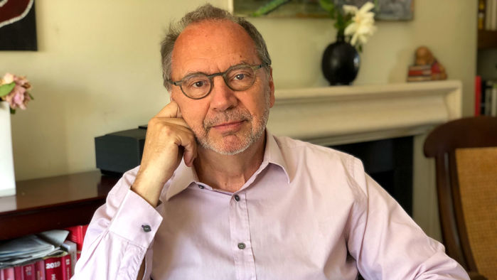
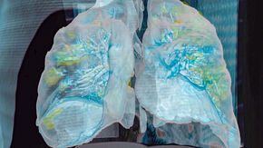
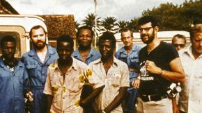
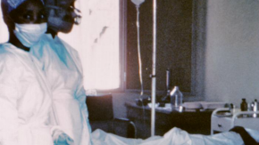

‘Finally, a virus got me.’ Scientist who fought Ebola and HIV reflects on facing death from COVID-19 | Science | AAAS

 

“You live in a routine from syringe to infusion and you hope you make it,” Peter Piot says about his time in a London hospital.

  Heidi Larson

# ‘Finally, a virus got me.’ Scientist who fought Ebola and HIV reflects on facing death from COVID-19

By [Dirk Draulans](https://www.sciencemag.org/author/dirk-draulans)May. 8, 2020 , 5:00 PM

Virologist Peter Piot, director of the London School of Hygiene & Tropical Medicine, fell ill with COVID-19 in mid-March. He spent a week in a hospital and has been recovering at his home in London since. Climbing a flight of stairs still leaves him breathless.

Piot, who grew up in Belgium, was [one of the discoverers of the Ebola virus](https://www.sciencemag.org/news/2014/08/part-one-virologists-tale-africas-first-encounter-ebola) in 1976 and spent his career fighting infectious diseases. He headed the Joint United Nations Programme on HIV/AIDS between 1995 and 2008 and is currently a coronavirus adviser to European Commission President Ursula von der Leyen. But his personal confrontation with the new coronavirus was a life-changing experience, Piot says.

This interview took place on 2 May. Piot’s answers have been edited and translated from Dutch:

## SIGN UP FOR OUR DAILY NEWSLETTER

Get more great content like this delivered right to you!

“On 19 March, I suddenly had a high fever and a stabbing headache. My skull and hair felt very painful, which was bizarre. I didn’t have a cough at the time, but still, my first reflex was: I have it. I kept working—I’m a workaholic—but from home. We put a lot of effort into teleworking at the London School of Hygiene & Tropical Medicine last year, so that we didn’t have to travel as much. That investment, made in the context of the fight against global warming, is now very useful, of course.

I tested positive for COVID-19, as I suspected. I put myself in isolation in the guest room at home. But the fever didn’t go away. I had never been seriously ill and have not taken a day of sick leave the past 10 years. I live a pretty healthy life and walk regularly. The only risk factor for corona is my age—I’m 71. I’m an optimist, so I thought it would pass. But on 1 April, a doctor friend advised me to get a thorough examination because the fever and especially the exhaustion were getting worse and worse.

It turned out I had severe oxygen deficiency, although I still wasn’t short of breath. Lung images showed I had severe pneumonia, typical of COVID-19, as well as bacterial pneumonia. I constantly felt exhausted, while normally I’m always buzzing with energy. It wasn’t just fatigue, but complete exhaustion; I’ll never forget that feeling. I had to be hospitalized, although I tested negative for the virus in the meantime. This is also typical for COVID-19: The virus disappears, but its consequences linger for weeks.

### Related

- 

##   [How does coronavirus kill? Clinicians trace a ferocious rampage through the body, from brain to toes](https://www.sciencemag.org/news/2020/04/how-does-coronavirus-kill-clinicians-trace-ferocious-rampage-through-body-brain-toes)

- 

##   [Why don’t some coronavirus patients sense their alarmingly low oxygen levels?](https://www.sciencemag.org/news/2020/04/why-don-t-some-coronavirus-patients-sense-their-alarmingly-low-oxygen-levels)

- 

##   [Part one: A virologist's tale of Africa's first encounter with Ebola](https://www.sciencemag.org/news/2014/08/part-one-virologists-tale-africas-first-encounter-ebola)

- 

##   [Part two: A virologist's tale of Africa's first encounter with Ebola](https://www.sciencemag.org/news/2014/08/part-two-virologists-tale-africas-first-encounter-ebola)

[See all of our coverage of the coronavirus outbreak](https://www.sciencemag.org/tags/coronavirus)

I was concerned I would be put on a ventilator immediately because I had seen publications showing it increases your chance of dying. I was pretty scared, but fortunately, they just gave me an oxygen mask first and that turned out to work. So, I ended up in an isolation room in the antechamber of the intensive care department. You’re tired, so you’re resigned to your fate. You completely surrender to the nursing staff. You live in a routine from syringe to infusion and you hope you make it. I am usually quite proactive in the way I operate, but here I was 100% patient.

I shared a room with a homeless person, a Colombian cleaner, and a man from Bangladesh—all three diabetics, incidentally, which is consistent with the known picture of the disease. The days and nights were lonely because no one had the energy to talk. I could only whisper for weeks; even now, my voice loses power in the evening. But I always had that question going around in my head: How will I be when I get out of this?

After fighting viruses all over the world for more than 40 years, I have become an expert in infections. I’m glad I had corona and not Ebola, although I read a scientific study yesterday that concluded you have a 30% chance of dying if you end up in a British hospital with COVID-19. That’s about the same overall mortality rate as for Ebola in 2014 in West Africa. That makes you lose your scientific level-headedness at times, and you surrender to emotional reflections. They got me, I sometimes thought. I have devoted my life to fighting viruses and finally, they get their revenge. For a week I balanced between heaven and Earth, on the edge of what could have been the end.

I was released from the hospital after a long week. I traveled home by public transport. I wanted to see the city, with its empty streets, its closed pubs, and its surprisingly fresh air. There was nobody on the street—a strange experience. I couldn’t walk properly because my muscles were weakened from lying down and from the lack of movement, which is not a good thing when you’re treating a lung condition. At home, I cried for a long time. I also slept badly for a while. The risk that something could still go seriously wrong keeps going through your head. You’re locked up again, but you’ve got to put things like that into perspective. I now admire Nelson Mandela even more than I used to. He was locked in prison for 27 years but came out as a great reconciler.

I have always had great respect for viruses, and that has not diminished. I have devoted much of my life to the fight against the AIDS virus. It’s such a clever thing; it evades everything we do to block it. Now that I have felt the compelling presence of a virus in my body myself, I look at viruses differently. I realize this one will change my life, despite the confrontational experiences I’ve had with viruses before. I feel more vulnerable.

One week after I was discharged, I became increasingly short of breath. I had to go to the hospital again, but fortunately, I could be treated on an outpatient basis. I turned out to have an organizing pneumonia-induced lung disease, caused by a so-called cytokine storm. It’s a result of your immune defense going into overdrive. Many people do not die from the tissue damage caused by the virus, but from the exaggerated response of their immune system, which doesn’t know what to do with the virus. I’m still under treatment for that, with high doses of corticosteroids that slow down the immune system. If I had had that storm along with the symptoms of the viral outbreak in my body, I wouldn’t have survived. I had atrial fibrillation, with my heart rate going up to 170 beats per minute; that also needs to be controlled with therapy, particularly to prevent blood clotting events, including stroke. This is an underestimated ability of the virus: It can probably affect all the organs in our body.

Many people think COVID-19 kills 1% of patients, and the rest get away with some flulike symptoms. But the story gets more complicated. Many people will be left with chronic kidney and heart problems. Even their neural system is disrupted. There will be hundreds of thousands of people worldwide, possibly more, who will need treatments such as renal dialysis for the rest of their lives. The more we learn about the coronavirus, the more questions arise. We are learning while we are sailing. That’s why I get so annoyed by the many commentators on the sidelines who, without much insight, criticize the scientists and policymakers trying hard to get the epidemic under control. That’s very unfair.

>

> “> My lung images finally look better again. I opened up a good bottle of wine to celebrate, the first in a long time.> ”

>
>  Peter Piot, London School of Hygiene & Tropical Medicine

Today, after 7 weeks,  I feel more or less in shape for the first time. I ate white asparagus, which I order from a Turkish greengrocer around the corner from my home; I’m from Keerbergen, Belgium, an asparagus-growing community. My lung images finally look better again. I opened up a good bottle of wine to celebrate, the first in a long time. I want to get back to work, although my activity will be limited for a while. The first thing I picked up again is my work as a COVID-19 R&D special adviser to von der Leyen.

The Commission is strongly committed to supporting the development of a vaccine. Let’s be clear: Without a coronavirus vaccine, we will never be able to live normally again. The only real exit strategy from this crisis is a vaccine that can be rolled out worldwide. That means producing billions of doses of it, which, in itself, is a huge challenge in terms of manufacturing logistics. And despite the efforts, it is still not even certain that developing a COVID-19 vaccine is possible.

Today there’s also the paradox that some people who owe their lives to vaccines no longer want their children to be vaccinated. That could become a problem if we want to roll out a vaccine against the coronavirus, because if too many people refuse to join, we will never get the pandemic under control.

I hope this crisis will ease political tensions in a number of areas. It may be an illusion, but we have seen in the past that polio vaccination campaigns have led to truces. Likewise, I hope that the World Health Organization [WHO], which is doing a great job in the fight against COVID-19, can be reformed to make it less bureaucratic and less dependent on advisory committees in which individual countries primarily defend their own interests. WHO too often becomes a political playground.

Anyway, I remain a born optimist. And now that I have faced death, my tolerance levels for nonsense and bullshit have gone down even more than before. So, I continue calmly and enthusiastically, although more selectively than before my illness.”

*A longer version of this interview [appeared on 5 May](https://www.knack.be/nieuws/gezondheid/vlaamse-topviroloog-peter-piot-is-zelf-coronapatient-eindelijk-heeft-een-virus-me-te-pakken/article-longread-1595731.html?cookie_check=1588877603) in the Belgian magazine *Knack*. Translation by Martin Enserink.*