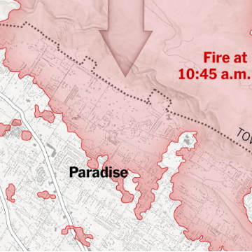

‘Hell on Earth’: The First 12 Hours of California’s Deadliest Wildfire

‘Hell on Earth’: The First 12 Hours of California’s Deadliest Wildfire

https://www.nytimes.com/interactive/2018/11/18/us/california-camp-fire-paradise.html?emc=edit_ne_20181119&module=inline&nl=evening-briefing&nlid=72982178_ne_20181119&te=1

The Camp Fire, which has killed dozens, quickly devastated the town of Paradise within hours of starting.