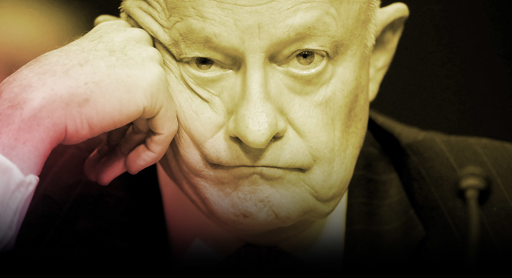
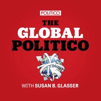
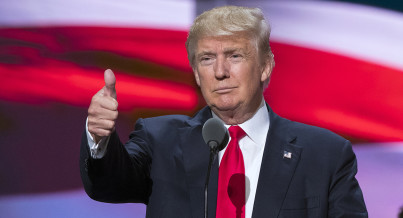

‘The Russians Have Succeeded Beyond Their Wildest Expectations’

           

Getty Images

 [THE GLOBAL POLITICO](https://www.politico.com/magazine/tag/the-global-politico)

#   ‘The Russians Have Succeeded Beyond Their Wildest Expectations’

Former intelligence chief James Clapper says President Trump is dead wrong about Russian interference in America’s elections. And they’re going to get away with it again, he warns.

By SUSAN B. GLASSER

| October 30, 2017

- [****  Facebook](http://api.addthis.com/oexchange/0.8/forward/facebook/offer?pco=tbx32nj-1.0&url=http://politi.co/2z3Thyf&pubid=politico.com/magazine)

- [****  Twitter](http://api.addthis.com/oexchange/0.8/forward/twitter/offer?pco=tbx32nj-1.0&url=http://politi.co/2z3Thyf&text=%E2%80%98The%20Russians%20Have%20Succeeded%20Beyond%20Their%20Wildest%20Expectations%E2%80%99&pubid=politico.com/magazine&via=politicomag)

- [****  Google +](http://api.addthis.com/oexchange/0.8/forward/googleplus/offer?pco=tbxnj-1.0&url=http://politi.co/2z3Thyf&pubid=politico.com/magazine&title=%E2%80%98The+Russians+Have+Succeeded+Beyond+Their+Wildest+Expectations%E2%80%99)

- [****  Email](https://www.politico.com/magazine/story/2017/10/30/james-clapper-russia-global-politico-trump-215761?utm_source=pocket&utm_medium=email&utm_campaign=pockethitsmailto:?to=&subject=%E2%80%98The%20Russians%20Have%20Succeeded%20Beyond%20Their%20Wildest%20Expectations%E2%80%99&body=https://www.politico.com/magazine/story/2017/10/30/james-clapper-russia-global-politico-trump-215761)

- [****  Comment](https://www.politico.com/magazine/story/2017/10/30/james-clapper-russia-global-politico-trump-215761?utm_source=pocket&utm_medium=email&utm_campaign=pockethits#superComments)

- [****  Print](https://www.politico.com/magazine/story/2017/10/30/james-clapper-russia-global-politico-trump-215761?utm_source=pocket&utm_medium=email&utm_campaign=pockethits#)

.

 .

## The Friday Cover

 

 [Read more](https://www.politico.com/magazine/story/2017/10/27/kabul-afghanistan-us-fixer-scott-guggenheim-215742)

.

 .

 

*Subscribe to The Global POLITICO on Apple Podcasts [here](https://itunes.apple.com/us/podcast/the-global-politico/id1202281739?mt=2). | Subscribe via Stitcher [here](https://www.stitcher.com/podcast/politico/the-global-politico).*

America’s former top spymaster has a few things he’d like to clear up about the Russia investigation.

.

 .

James Clapper, a crusty ex-cargo pilot who rose through the Air Force ranks and retired as director of national intelligence in January, only to emerge publicly as one of President Donald Trump’s foremost critics, wants you to know that no matter how much Trump rants about the “Russia hoax,” the 2016 hacking was not only real and aimed at electing Trump but constituted a major victory for a dangerous foreign adversary. “The Russians,” he said, have “succeeded beyond their wildest expectations.”

Far from being the “witch hunt” Trump has repeatedly called it, the investigation of whether Trump’s team colluded with Russia constitutes a “cloud not only over the president, but the office of the presidency, the administration, the government and the country” until it is resolved, Clapper told me in an extensive new interview for The Global Politico, our weekly podcast on world affairs.


The Global Politico

Episode 39: James Clapper: The Russians have succeeded beyond their wildest expectations

The former director of national intelligence has emerged publicly as one of President Donald Trump’s foremost critics and he wants you to know...

00:00:00

Share
Subscribe
[](https://megaphone.fm/)

And yes, Clapper is sticking with his view that the allegations are “worse than Watergate,” given that the Russiagate investigation involves “a foreign adversary actively and aggressively and directly engaging in our political processes to interfere with them and to undermine our system, whereas in Watergate you were dealing with a two-bit petty burglary, domestic only.”

With special prosecutor Robert Mueller now reported to have secured the first indictment in the Russiagate probe, Clapper commented at length in our interview on the investigation whose initial stages he observed up close as President Barack Obama’s top intelligence official, telling me that new revelations in recent months have only deepened his concern about the Russian intervention—beyond what even Obama’s most senior officials knew before last year’s election.

“We had a general awareness, for example, of Russian use of social media—Facebook ads, use of Twitter, fake news implants—we had a general understanding of that,” Clapper said. “But now, as time has elapsed and time has gone on, I’ve certainly learned a lot more about the depth and breadth of what the Russians were about,” he added, referring to recent reports of an extensive and sophisticated Russian campaign of purchasing targeted ads on those platforms, creating false-front groups aimed at everyone from Black Lives Matter supporters to anti-immigration activists, and spreading misinformation.

Clapper has repeatedly sounded the alarm about the Russia investigation since Trump came to office denying the U.S. intelligence community finding that Clapper made public last year: that Russia had intervened explicitly on Trump’s behalf. At times, he’s even seemed to infuriate the president, who has publicly compared Clapper and other intelligence pros to Nazis, falsely claimed they illegally wiretapped him at Trump Tower, and taunted him and former acting Attorney General Sally Yates for having “choked like dogs” in Hill testimony.

In our interview, I asked whether Russian President Vladimir Putin now believes he is winning in his campaign against the United States.

##  The Global Politico

Susan B. Glasser’s weekly podcast takes you backstage in a world disrupted.

   ****  Email

By signing up you agree to receive email newsletters or alerts from POLITICO. You can unsubscribe at any time.

“Why wouldn’t he?” Clapper responded. “I mean, the Russians succeeded, I believe, beyond their wildest expectations. Their first objective in the election was to sow discontent, discord and disruption in our political life, and they have succeeded to a fare-thee-well. They have accelerated, amplified the polarization and the divisiveness in this country, and they’ve undermined our democratic system. They wanted to create doubt in the minds of the public about our government and about our system, and they succeeded to a fare-thee-well.”

“They’ve been emboldened,” he added, “and they will continue to do this.”
***

A year ago, the idea of James Clapper as a pundit, a public figure who would spend his days yakking on CNN, giving interviews and responding to intemperate tweets, was simply unthinkable. “Public appearances don’t come easy to James Clapper,” said the lead sentence of an extensive [profile](https://www.wired.com/2016/11/james-clapper-us-intelligence/) of America’s top spy that appeared last November in *Wired* magazine.

And yet here he is, a gruff, press-averse, 75-year-old veteran of the closest thing America has to a “deep state” for more than five decades, speaking out nearly every day of the Trump presidency. Trump’s rhetoric is “downright scary and disturbing,” Clapper agonized in an extraordinary monologue on live TV in August, amid Trump’s “fire and fury” threats toward North Korea. He questioned Trump’s “fitness for office” and openly worried about his control over the nuclear launch codes. In our conversation, Clapper didn’t back off one word of it, slamming Trump’s lies, “distortions and untruths.”

In a year of strange twists, his transformation may well be one of the strangest.

 

 [THE GLOBAL POLITICO](http://www.politico.com/global-politico)

###   [James Clapper: The Full Transcript](https://www.politico.com/magazine/story/2017/10/30/james-clapper-the-full-transcript-215755)

By [SUSAN B. GLASSER](https://www.politico.com/staff/susan-b-glasser)

This is, after all, is no limelight-seeking politician trashing the man in the White House for a quick cable-TV adrenaline rush. And he is certainly no liberal partisan: just ask Democrats like Oregon Senator Ron Wyden, who excoriated Clapper for what appeared to be misleading a Senate committee about the intelligence community’s surveillance of private U.S. citizens, information later revealed by Edward Snowden’s disclosures. (His testimony was “a big mistake,” Clapper now says, but not “a lie.”) Clapper was not only a fierce defender of the post-9/11 widening of the intelligence-gathering net but a tough-minded former Air Force lieutenant general who once said, “I never met a collection capability I didn’t like.”

A villain to many critics of America’s vast surveillance regime, he’s perhaps the most unlikely Trump basher out there.

In some ways, it’s a role Clapper still finds unsettling. When we met the other morning off the lobby of a Manhattan hotel, he was every bit the anonymous former spook, dressed in a blue blazer and sport shirt, as he talked about his “reverence” for the office of the president and how his family has served in intelligence ever since his father’s World War II service. “It’s a very painful thing for me to be seen as a critic of this president,” he told me, “but I have those concerns.”

Even after Trump’s election, Clapper clearly didn’t anticipate—at least at first—a new life in the spotlight, as is clear listening to his account of what he did when then-President-elect Trump first started attacking the intelligence community’s Russia findings. He didn’t publicly blast Trump—he called him on the phone.

When Trump, to his surprise, picked up, Clapper recounted, “I attempted to impart to him what a national treasure he was inheriting in the form of the U.S. intelligence community, that was standing by to do everything it could to help him and support him in the very difficult job he was taking on, where information—and, specifically, intelligence—was going to be invaluable in helping him make decisions and gauge risk. And so, I, again, felt I couldn’t let that pass, and I needed to attempt to defend the community.”

Clapper told me his own realization about Russia’s attack on the U.S., combined with Trump’s refusal to accept it, had prompted his turn toward public activism. He described the election hacking as his “wake-up call,” and said he had concluded that Russia remains a “profound threat” to the United States to which Trump’s administration has so far shown “indifference.”

In our conversation, Clapper contrasted Trump’s focus on undermining the Iran nuclear deal forged by Obama, despite international observers’ repeated finding that Iran is in compliance with the deal, with what appears to be indifference toward more significant Russian arms-control violations of the Intermediate Nuclear Forces Treaty. “If you look at what Russia is trying to do to undermine us, and the modernization of their strategic nuclear forces—and they only have one adversary in mind when they do that—I just find it worrisome, bothersome, that there isn’t more focus on the threat posed by Russia,” he said.

But Clapper doesn’t comment about just Trump and Russia these days.

He also ranged widely from his worries about the standoff with North Korea to last week’s Communist Party Congress in China to the recent controversy involving White House chief of staff John Kelly and whether it signals an overreliance by Trump on current and former generals in positions meant for civilians.

“I just thought it was terrible,” he said, referring to the public fight between the White House and a military wife who lost her husband in an attack in Niger and said she was offended by Trump in a condolence call. Kelly, in the course of that fight, complained bitterly about a congresswoman who listened in on the Trump call, even misrepresenting a speech she had given, and appearing to lecture Americans on why only that small percentage of citizens who have served in the military could understand the nature of their sacrifice.

He took particular issue with White House spokeswoman Sarah Huckabee Sanders’ comment that Kelly’s word about the congresswoman should not be second-guessed because he had been a four-star general, a remark Clapper called “absurd.”

“Once you’re out of uniform and you’re in a political position—which he’s in—people do listen to that, but I don’t believe that entitles any of us to being unquestioned. It would have been great for me in the 16 years that I served in civilian capacities after I left the military if, well, I got a pass. No one is ever going to question anything I said or did. Well, they certainly did, and that is appropriate in our system,” Clapper said.

More generally, I asked whether Clapper—who retired from the military in 1995 but still carries the bearing of his three decades in the Air Force—worried about the Trump era as the new age of militarized government, not only with Kelly as chief of staff but also a sitting lieutenant general, H.R. McMaster, as national security adviser, and a former general, James Mattis, as defense secretary. Clapper said that while he has “a visceral aversion” to generals “filling these political, civilian positions,” he’s nonetheless “glad they’re there.”

In particular, he added, Mattis “carries perhaps a greater burden than any of his predecessors.” The comment sounded ominous, but it remained spymaster-cryptic; when I pressed for explanation, Clapper didn’t offer any.

He did, however, suggest that Mattis will have a tough task ahead with Pyongyang, where Clapper—who early in his intelligence career served as an analyst responsible for North Korea—said he fears that “some of this intemperate, bellicose rhetoric” between Trump and North Korean leader Kim Jong Un could lead to a “cataclysmic” war.

The risk, he said, came primarily from Kim miscalculating as a result of Trump’s heated words.

“Kim Jong Un doesn’t have any advisers that are going to give him objective counsel. He’s surrounded by medal-bedecked sycophants, who dutifully follow him around like puppy dogs with their notebooks open, ascribing his every utterance, and pushing back against the great leader is not a way to get ahead,” Clapper said. “And so I do wonder what Kim Jong Un’s ignition point is, when some insult that’s been hurled at him by the president will just ignite him.”

***

Inevitably, though, any conversation with James Clapper these days begins and ends with Trump and Russia.

I asked him as our interview neared an end to put his intelligence analyst hat on and answer perhaps Washington’s No. 1 parlor game question: Does he think Trump will serve out his full term?

Yes, Clapper answered, “I do. I think it would take a lot to remove him from office. The 25th Amendment that people bring up is a very, very high bar for removal, and appropriately so. And if that were to happen—and let’s just say for the sake of discussion there were an impeachment, even less likely a conviction—all that would serve to do is heighten the polarization and the divisiveness, because the base will never accept that, and that would just feed the conspiracy theories.”

In the end, he is still more intelligence analyst than advocate. “So I’m not sure,” Clapper concluded, “that an outcome like that—the president’s removal—would be a good thing.”

 [**** Share on Facebook](http://api.addthis.com/oexchange/0.8/forward/facebook/offer?pco=tbx32nj-1.0&url=http://politi.co/2z3Thyf&pubid=politico.com/magazine)  [**** Share on Twitter](http://api.addthis.com/oexchange/0.8/forward/twitter/offer?pco=tbx32nj-1.0&url=http://politi.co/2z3Thyf&pubid=politico.com/magazine&text=%E2%80%98The+Russians+Have+Succeeded+Beyond+Their+Wildest+Expectations%E2%80%99)

*Susan B. Glasser is POLITICO’s chief international affairs columnist. Her new podcast, The Global Politico, comes out Mondays. Subscribe [here](https://itunes.apple.com/us/podcast/the-global-politico/id1202281739?mt=2). Follow her on Twitter @sbg1.*

###### This story tagged under:

- [Russia](https://www.politico.com/magazine/tag/russia)

- [THE GLOBAL POLITICO](https://www.politico.com/magazine/tag/the-global-politico)

 [Show Comments](https://www.politico.com/magazine/story/2017/10/30/james-clapper-russia-global-politico-trump-215761?utm_source=pocket&utm_medium=email&utm_campaign=pockethits#superComments)

## More from POLITICO Magazine

- 

[Culture Club](https://www.politico.com/magazine/tag/culture-club)

### [Is This the Worst Explanation for Why Trump Won?](https://www.politico.com/magazine/story/2017/10/31/donald-trump-election-dilbert-facts-persuasion-215766)

  By Virginia Heffernan

- 

[Off Message](https://www.politico.com/magazine/tag/off-message)

### [Preet Bharara Reads Bob Mueller’s Tea Leaves](https://www.politico.com/magazine/story/2017/10/31/preet-bharara-reads-bob-muellers-tea-leaves-215767)

  By [Edward-Isaac Dovere](https://www.politico.com/staff/edward-isaac-dovere)

- 

[What Works](https://www.politico.com/magazine/what-works/)

### [Mayors to Young America: ‘Can We Talk?’](https://www.politico.com/magazine/story/2017/10/30/mayors-poll-millennials-cities-urban-policy-215765)

  By Derek Robertson