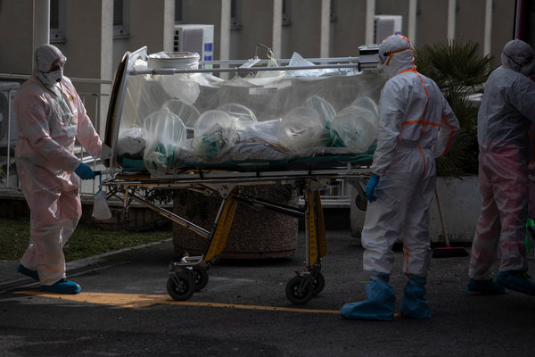
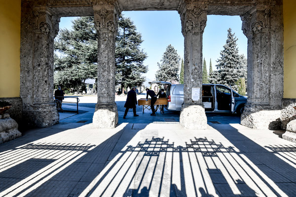
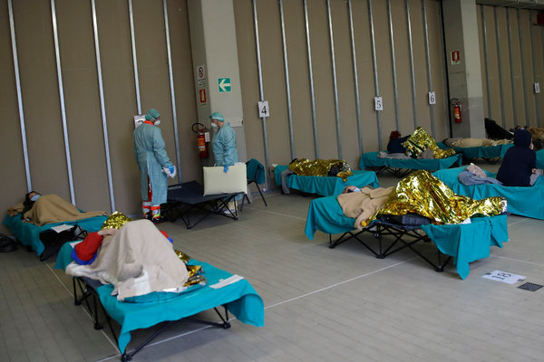

‘We Take the Dead From Morning Till Night’ - The New York Times

## **  **Bergamo, Italy

This is the bleak heart of the world’s deadliest coronavirus outbreak.

There have been 8,165 deaths in Italy, more than China and Spain combined, many times more than the United States.

And in Italy the most deaths are in the Bergamo area. Officially 1,328 people have died there. The actual toll may be four times higher, so many that the local paper is given over to death notices.

Once known as a quiet and wealthy province, Bergamo is now a place where Red Cross workers go door to door, carrying away the afflicted, like Claudio Travelli.

Where patients line hospital corridors, exhausting and infecting doctors and nurses.

Where the coffins are so numerous, the army has been called to take them from warehouses for cremation.

# ‘We Take the Dead From Morning Till Night’

Photographs by Fabio BucciarelliWritten by Jason HorowitzMarch 27, 2020

The streets of Bergamo are empty. As in all of Italy, people can leave their homes only for food and medicines and work. The factories and shops and schools are closed. There is no more chatting on the corners or in the coffee bars.

But what won’t stop are the sirens.

While the world’s attention now shifts to its own centers of contagion, the sirens keep sounding. Like the air raid sirens of the Second World War, they are the ambulance sirens that many survivors of this war will remember. They blare louder as they get closer, coming to collect the parents and grandparents, the keepers of Italy’s memory.

The grandchildren wave from terraces, and spouses sit back on the corners of now empty beds. And then the sirens start again, becoming fainter as the ambulances drive away toward hospitals crammed with coronavirus patients.

“At this point, all you hear in Bergamo is sirens,” said Michela Travelli.

On March 7, her father, Claudio Travelli, 60, was driving a food delivery truck all around northern Italy. The next day, he developed a fever and flu-like symptoms. His wife had run a fever in recent days, and so he called his family doctor, who told him to take a common Italian fever reducer and rest up.

For much of the prior month, Italian officials had sent mixed messages about the virus.

On Feb. 19, some 40,000 people from Bergamo, a province of about a million people in the region of Lombardy, traveled 30 miles to Milan to watch a Champions League soccer game between Atalanta and the Spanish team Valencia. (The mayor of Bergamo, Giorgio Gori, this week called the match “a strong accelerator of contagion.”) Mr. Travelli and his wife didn’t take the threat of the virus seriously back then, their daughter said, “because it wasn’t sold as a grave thing.”

But Mr. Travelli could not shake his fever, and he got sicker.

On Friday, March 13, he felt unbearable pressure on his chest and suffered dry heaves. His temperature spiked and his family called an ambulance. An ambulance crew found her father with low levels of oxygen in his blood but, following the advice of Bergamo’s hospitals, recommended he stay home. “They said, ‘We have seen worse, and the hospitals are like the trenches of a war,’” Ms. Travelli said.

## Nembro, March 19

Red Cross workers have the dangerous task of entering the homes of people suspected of being infected by coronavirus.

## Cenate Sotto, March 15

Claudio Travelli’s wife and daughters waited to see if he would be taken away to a hospital.

## Cenate Sotto, March 15

Neighbors, locked down and isolated from each other, can do little more than watch.

Another day at home led to a night of coughing fits and fever. On Sunday, Mr. Travelli woke up and wept, saying, “I’m sick. I can’t do it anymore,” his daughter said. He took more fever suppressant but his temperature climbed to nearly 103 degrees and his skin became yellow.

This time, as the ambulance arrived, his daughters, both wearing gloves and masks, packed a bag with two pairs of pajamas, a bottle of water, a cellphone and a charger. His oxygen levels had dipped.

Red Cross workers hovered over him on a bed, where he lay below a painting of the Virgin Mary. They brought him into the ambulance. His granddaughters, 3 and 6, waved goodbye from the terrace. He looked up at them, at the balconies draped with Italians flags. Then the ambulance left and there was nothing to hear. “Only the police and the sirens,” his daughter said.

The ambulance crew that took Mr. Travelli away had started early that morning.

At 7:30 a.m., a crew of three Red Cross volunteers met to make sure the ambulance was certified as cleaned and stocked with oxygen. Like masks and gloves, the tanks had become an increasingly rare resource. They blasted one another in sprays of alcohol disinfectants. They sanitized their cellphones.

“We can’t be the *untori*,” said Nadia Vallati, 41, a Red Cross volunteer, whose day job is working in the city’s tax office. She was referring to the infamous “anointers,” suspected in Italian lore of spreading contagion during the 17th century plague. After sanitizing, Ms. Vallati and her colleagues wait for an alarm to sound in their headquarters. It never takes long.

Indistinguishable from one another in the white medical scrubs pulled over their red uniforms, crew members entered Mr. Travelli’s home on March 15 with tanks of oxygen. “Always with oxygen,” Ms. Vallati said.

One of the biggest dangers for coronavirus patients is hypoxemia, or low blood oxygen. Normal readings are between 95 and 100, and doctors worry when the number dips below 90.

Ms. Vallati said she had found coronavirus patients with readings of 50. Their lips are blue. Their fingertips turn violet. They take rapid, shallow breaths and use their stomach muscles to pull in air. Their lungs are too weak.

## Pradalunga, March 15

Teresina Coria, 88, was helped from her bed to be taken to a hospital.

## Pradalunga, March 15

She was barely conscious when Red Cross workers arrived.

## Pradalunga, March 15

Oxygen has become an essential treatment for victims whose lungs steadily fail.

In many of the apartments they visit, patients clutch small oxygen tanks, the size of SodaStreams, that are procured for them with a doctor’s prescription by family members. They lay in bed next to them. They eat with them at the kitchen table. They watch the nightly reports of Italy’s dead and infected with them on their couches.

On March 15, Ms. Vallati put her hand, wrapped in two layers of blue gloves, on the chest of Teresina Coria, 88, as they measured her oxygen level. The next day, Antonio Amato, an outlier at the age of 40, sat in his armchair, holding his oxygen tank as his children, whom he could not hold for fear of contagion, waved to him from across the room.

On a Saturday, Ms. Vallati found herself in the bedroom of a 90-year-old man. She asked his two granddaughters if he had had any contact with anyone who had the coronavirus. Yes, they said, the man’s son, their father, who had died on Wednesday. Their grandmother, they told her, had been taken away on Friday and was in critical condition.

They weren’t crying, she said, because “they didn’t have any tears left.”

## Dalmine, March 16

Antonio Amato, 40, was assisted while his children were kept at a distance to avoid contagion.

## Dalmine, March 16

He, like the others, was given oxygen and taken to a hospital.

## Dalmine, March 16

The children said goodbye, uncertain whether they would see him again.

On another recent tour in the highly infected Valle Seriana under the Alps, Ms. Vallati said, they picked up a woman of about 80. Her husband of many decades asked to kiss her goodbye. But Ms. Vallati told him he could not, because the risk of contagion was too high. As the man watched the crew take his wife away, Ms. Vallati saw him go into another room and close the door behind him, she said.

While those suspected of infection are taken to hospitals, the hospitals themselves are not safe. Bergamo officials first detected the coronavirus at the Pesenti Fenaroli di Alzano Lombardo hospital.

By then, officials say, it had already been present for some time, masked as ordinary pneumonia, infecting other patients, doctors, and nurses. People carried it out of the hospital and into the city, out of the city and into the province. Young people passed it to their parents and grandparents. It spread around bingo halls and over coffee cups.

The mayor, Mr. Gori, has talked about how infections have ravaged his town and nearly broken one of Europe’s wealthiest and most sophisticated health care systems. Doctors estimate that 70,000 people in the province have the virus. Bergamo has had to send 400 bodies to other provinces and regions and countries because there is no room for them there.

“If we have to identify a spark,” he said, “it was the hospital.”

When an ambulance arrives, its crew proceeds with extreme caution. Only one of the three, the team leader, accompanies the patient inside. If the patient is heavy, another helps.

## Seriate, March 15

The virus has so devoured the area of Bergamo, its hospitals are a source of dread.

## Pradalunga, March 15

Red Cross workers disinfect to try to avoid spreading the virus, and catching it.

## Alzano Lombardo, March 20

Ambulances are disinfected, too.

This weekend, a group of doctors from one Bergamo hospital [wrote in a medical journal](https://catalyst.nejm.org/doi/full/10.1056/CAT.20.0080?fbclid=IwAR0wa6jzq-t_YYlZlYQtWiVmphT8pjyGBCndLhJGSN34dBaeZJoGP0sfneo) associated with The New England Journal of Medicine that “we are learning that hospitals might be the main Covid-19 carriers” and “as they are rapidly populated by infected patients, facilitating transmission to uninfected patients.”

Ambulances and their personnel get infected, they said, but perhaps show no symptoms, and spread the virus further. As a result, the doctors urged home care and mobile clinics to avoid bringing people to the hospital unless absolutely necessary.

But Ms. Vallati said they had no choice with the gravest cases. The authors of the paper work at Bergamo’s Papa Giovanni XXIII, where Ms. Vallati’s crew have taken many of the sick.

Dr. Ivano Riva, an anesthesiologist there, said the hospital was still admitting up to 60 new coronavirus patients a day. They are tested for the virus he said, but at this point the clinical evidence — the coughs, the low oxygen levels, the fevers — is a better indicator, especially since 30 percent of the tests produced false negatives.

The hospital had 500 coronavirus patients, who occupied all 90 I.C.U. beds. About a month ago, the hospital had seven such beds.

## Bergamo, Papa Giovanni XXIII Hospital, March 21

Some patients wear transparent plastic helmets filled with oxygen to help them breathe.

## Bergamo, Papa Giovanni XXIII Hospital, March 21

The most critical cases are anesthetized and intubated.

## Bergamo, Papa Giovanni XXIII Hospital, March 21

Since intensive care units have been expanded, ventilators and respirators are in demand.

Oxygen flows everywhere through Lombardy’s hospitals now, and workers are constantly pushing carts of tanks around the corridors. A tanker truck filled with oxygen is parked outside. Patients are jammed next to supply closets and in hallways.

Dr. Riva said 26 of his hospital’s 101 medical staff members were out of work with the virus. “It’s a situation that no one has ever seen, I don’t think in any other part of the world,” he said.

If people don’t stay at home, he said, “the system will fail.”

His colleagues wrote in the paper that intensive care unit beds were reserved for coronavirus patients with “a reasonable chance to survive.” Older patients, they said, “are not being resuscitated and die alone.”

Mr. Travelli ended up at the nearby Humanitas Gavazzeni hospital, where, after a false negative, he tested positive for the virus. He is still alive.

“Papi, you were lucky because you found a bed — now you have to fight, fight, fight,” his daughter Michela told him in a telephone call, their last before he was fitted with a helmet to ease his breathing. “He was scared,” she said. “He thought he was dying.”

In the meantime, Ms. Travelli said she had been quarantined and had lost her sense of taste for food, a frequent complaint among people without symptoms, but who have had close contact with the virus.

## Ponte San Pietro, Policlinico San Pietro, March 23

I.C.U. wards require specialized nurses, who are themselves getting infected, adding to staffing strains.

## Bergamo, Papa Giovanni XXIII Hospital, March 21

Coronavirus patients occupy all 90 I.C.U. beds.

## Bergamo, Papa Giovanni XXIII Hospital, March 21

Doctors turn many patients onto their stomachs to relieve pressure on their lungs.

So many people are dying so quickly, the hospital mortuaries and funeral workers cannot keep up. “We take the dead from the morning till night, one after the other, constantly,” said Vanda Piccioli, who runs one of the last funeral homes to remain open. Others have closed as a result of sick funeral directors, some in intensive care. “Usually we honor the dead. Now it’s like a war and we collect the victims.”

Ms. Piccioli said one member of her staff had died of the virus on Sunday. She considered closing but decided they had a responsibility to keep going, despite what she said was constant terror of infection and emotional trauma. “You are a sponge and you take the pain of everybody,” she said.

She said her staff moved 60 infected bodies daily, from Papa Giovanni and Alzano hospitals, from clinics, from nursing homes and apartments. “It’s hard for us to get masks and gloves,” she said. “We are a category in the shadows.”

Ms. Piccioli said that in the beginning, they sought to get the personal effects of the dead, kept in red plastic bags, back to their loved ones. A tin of cookies. A mug. Pajamas. Slippers. But now they simply don’t have time.

## Alzano Lombardo, March 16

Funeral parlor employees wore protective gear as they picked up coffins at the mortuary of Alzano Lombardo hospital, source of the outbreak.

## Alzano Lombardo, March 16

Some of them are getting sick, too.

## Alzano Lombardo, March 16

In the hospital mortuaries, coffins back up in empty rooms. The red plastic bags, filled with personal effects, mark coronavirus victims.

Still, the calls to the Red Cross crew do not stop.

On March 19, Ms. Vallati and her crew entered the apartment of Maddalena Peracchi, 77, in Gazzaniga. She had run out of oxygen. Her daughter Cinzia Cagnoni, 43, who lives in the apartment downstairs, had placed an order for a new tank that would arrive on Monday, but the Red Cross volunteers told her she wouldn’t hold out that long.

“We were a little agitated because we knew that this could be the last time we saw each other,” Ms. Cagnoni said. “It’s like sending someone to die alone.”

She and her sister and her father put on a brave face under their masks, she said. “You can do it,’’ they told her mother, she said. “We will wait for you, there are still so many things we need to do with you. Fight back.”

The volunteers brought Ms. Peracchi down to the ambulance. One of her daughters urged her stunned grandchildren to bid farewell with louder voices. “I thought a thousand things,’’ Ms. Cagnoni said. “Don’t abandon me. God help us. God save my mother.” The ambulance doors closed. The sirens sounded, as they do “all the hours of the day,” Ms. Cagnoni said.

The crew drove to Pesenti Fenaroli di Alzano Lombardo, where Ms. Peracchi was found to have the coronavirus and pneumonia on both sides of her lungs. On Thursday night, her daughter said she was “holding on by a thread.”

## Gazzaniga, March 19

Maddalena Peracchi’s family consulted with the Red Cross team.

## Gazzaniga, March 19

She did not want to go.

## Gazzaniga, March 19

Ms. Cagnoni got as close as she could to her mother’s face and told her she could get through this.

Ms. Peracchi is a woman of deep Catholic faith, said her daughter, who spiked a temperature herself the night the ambulance took her mother away and has remained quarantined since.

It pained her mother, she said, that if it came to it, “we cannot have a funeral.”

To contain the virus, all religious and civil celebrations are banned in Italy. That includes funerals. Bergamo’s cemetery is locked shut. A chilling backlog of coffins waits in a traffic jam for the crematorium inside the cemetery’s church.

Officials have banned changing the clothes of the dead and require that people be buried or cremated in the pajamas or medical gowns they perish in. Corpses need to be wrapped in an extra bag or cloaked in a disinfecting cloth. The lids of coffins, which usually cannot be closed without a formal death certificate, now can be, though they still have to wait to be sealed. Bodies often linger in homes for days, as stairs and stuffy rooms become especially dangerous.

“We are trying to avoid it,” the funeral director, Ms. Piccioli, said of home visits. Nursing homes were much easier because you could arrive with five or six coffins to be filled and loaded directly into the vans. “I know it’s terrible to say,” she said.

Through a network of local priests, she helps arrange quick prayers, rather than proper funerals, for the dead and the families who are not quarantined.

That was the case for Teresina Gregis, who was interred at the Alzano Lombardo cemetery on March 21 after she died at home. Ambulance workers had told her family that there was no room in the hospitals.

## Alzano Lombardo, March 21

Teresina Gregis’s family found one of the last three available burial recesses.

## Alzano Lombardo, March 21

She died without being tested for coronavirus and had pre-existing heart and respiratory problems.

## Alzano Lombardo, March 21

Only a small group could mourn, given the lockdown restrictions.

“All the beds are full,” they told the family, according to her daughter-in-law, Romina Mologni, 34. Since she was 75, she said, “they gave priority to others who were younger.”

In her last weeks at home, her family struggled to find tanks of oxygen, driving all over the province as she sat facing her garden and the pinwheels she adored.

When she died, all the flower shops were closed because of the lockdown. Ms. Mologni instead brought to the cemetery one of the pinwheels her own daughter had given her grandmother. “She liked that one.”

Photo editing by David Furst and Gaia Tripoli. Design and development by Rebecca Lieberman and Matt Ruby.

Obituary from L’Eco di Bergamo, March 13, 2020.
Related Stories

[  ### Italy, Pandemic’s New Epicenter, Has Lessons for the World  The country’s experience shows that steps to isolate the coronavirus and limit people’s movement need to be put in place early, with absolute clarity, then strictly enforced.](https://www.nytimes.com/2020/03/21/world/europe/italy-coronavirus-center-lessons.html)

[  ### Italy’s Coronavirus Victims Face Death Alone, With Funerals Postponed  As morgues are inundated, coffins pile up and mourners grieve in isolation: ‘‘This is the bitterest part.’’](https://www.nytimes.com/2020/03/16/world/europe/italy-coronavirus-funerals.html)

[  ### Italy’s Health Care System Groans Under Coronavirus — a Warning to the World  In less than three weeks, the virus has overloaded hospitals in northern Italy, offering a glimpse of what countries face if they cannot slow the contagion.](https://www.nytimes.com/2020/03/12/world/europe/12italy-coronavirus-health-care.html)