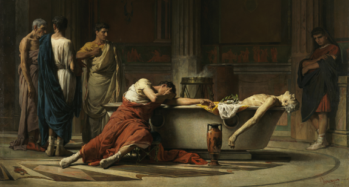
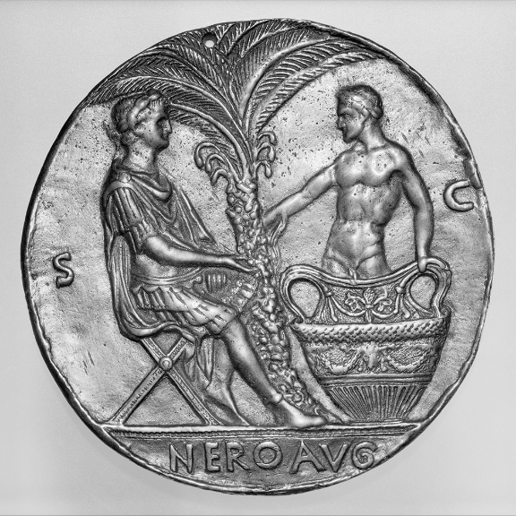

“Study Death Always” | James S. Romm

# Roundtable

## “Study Death Always”

Why Seneca’s advice for living centered on dying.

[By James S. Romm](https://www.laphamsquarterly.org/contributors/romm)

Wednesday, February 07, 2018

*The Death of Seneca*, by Manuel Domínguez Sánchez, 1871. Prado Museum.

Recent experiments have shown that psilocybin, a compound found in hallucinogenic mushrooms, can greatly reduce the fear of death in terminal cancer patients. The drug imparts “an understanding that in the largest frame, everything is fine,” said pharmacologist Richard Griffiths in a 2016 [interview](https://www.scientificamerican.com/article/psilocybin-a-journey-beyond-the-fear-of-death/). Test subjects reported a sense of “the interconnectedness of all people and things, the awareness that we are all in this together.” Some claimed to have undergone a mock death during their psychedelic experience, to have “stared directly at death…in a kind of dress rehearsal,” as [Michael Pollan](https://www.laphamsquarterly.org/contributors/pollan) wrote in [a *New Yorker* account](http://www.newyorker.com/magazine/2015/02/09/trip-treatment) of these experiments. The encounter was felt to be not morbid or terrifying, but liberating and affirmative.

“In the largest frame, everything is fine.” That sounds very much like the message [Lucius Annaeus Seneca](https://www.laphamsquarterly.org/contributors/seneca-younger) preached to Roman readers of the mid-first century, relying on Stoic philosophy, rather than an organic hallucinogen, as a way to glimpse that truth. “The interconnectedness of all things” was also one of his principal themes, as was the idea that one must rehearse for death throughout one’s life—for life, properly understood, is really only a journey toward death; we are dying every day, from the day we are born. In his works of ethical thought, Seneca spoke to his addressees, and through them to humankind generally, about the need to accept death, even to the point of ending one’s own life, with a candor nearly unparalleled in his time or ours.

“Study death always,” Seneca counseled his friend Lucilius, and he took his own advice. From what is likely his earliest work, the *Consolation to Marcia* (written around AD 40), to the magnum opus of his last years (63–65), the *Moral Epistles*, Seneca returned again and again to this theme. It crops up in the midst of unrelated discussions, as though never far from his mind; a ringing endorsement of rational suicide, for example, intrudes without warning into advice about keeping one’s temper, in *On Anger*. Examined together, Seneca’s thoughts organize themselves around a few key themes: the universality of death; its importance as life’s final and most defining rite of passage; its part in purely natural cycles and processes; and its ability to liberate us, by freeing souls from bodies or, in the case of suicide, to give us an escape from pain, from the degradation of enslavement, or from cruel kings and tyrants who might otherwise destroy our moral integrity.

This last point had particular resonance for Seneca and his original readers, who had often seen death or degradation arrive at an emperor’s behest. A politician as well as a philosopher, Seneca had been a young senator in the late 30s, when Caligula went mad and began brutalizing those he mistrusted; in the 40s, under Claudius, Seneca was himself sentenced to death in a political show trial, but the sentence was commuted to exile on the island of Corsica. Recalled to Rome and appointed tutor to young Nero, Seneca spent the 50s and early 60s inside the imperial household, watching as Nero became more deranged and, toward family members whom he perceived as threats, murderous. Finally, suspected (probably wrongly) of collusion in a failed assassination plot, Seneca too incurred Nero’s wrath and was forced to commit suicide himself, in his sixties, in 65.

Rome’s century-old form of government, in which a *princeps* or “first man” held unofficial but near-absolute power, had, in the reign of Caligula especially, revealed itself as an autocracy. As chief adviser to Nero for more than a decade, Seneca dutifully served the system’s needs, and got rich by doing so, points held against him by his contemporaries (and by modern readers as well). But philosophy offered an antidote to the toxic atmosphere of the imperial palace. Seneca continued to publish treatises throughout his fifteen years at Nero’s side, giving friends and fellow senators a larger moral framework for dealing with troubled times. (He wrote verse tragedies as well, of which many survive today.)

Nero and the dying Seneca, after a design by Master of the Roman Emperors, c. 1445. The Metropolitan Museum of Art, The Erich Lederer Collection, Gift of Mrs. Erich Lederer, 1986.

Seneca, like many leading Romans of his day, found that larger moral framework in Stoicism, a Greek school of thought that had been imported to Rome in the preceding century and had begun to flourish there. The Stoics taught their followers to seek an inner kingdom, the kingdom of the mind, where adherence to virtue and contemplation of nature could bring happiness even to an abused slave, an impoverished exile, or a prisoner on the rack. Wealth and position were regarded by the Stoics as *adiaphora*, “indifferents,” conducing neither to happiness nor to its opposite. Freedom and health were desirable only in that they allowed one to keep one’s thoughts and ethical choices in harmony with Logos, the divine Reason that, in the Stoic view, ruled the cosmos and gave rise to all true happiness. If freedom were destroyed by a tyrant or health were forever compromised, such that the promptings of Reason could no longer be obeyed, then death might be preferable to life, and suicide, or self-euthanasia, might be justified.

Seneca inherited this Stoic system from his Greek predecessors and his Roman teachers but gave new prominence to its doctrines concerning modes of death and, in particular, suicide. Indeed this last topic receives an emphasis in his writings that far exceeds what is found in other surviving Stoic treatises, such as the *Discourses* of [Epictetus](https://www.laphamsquarterly.org/contributors/epictetus) or the *Meditations* of [Marcus Aurelius](https://www.laphamsquarterly.org/contributors/aurelius). We modern readers must bear in mind that, as a political insider under two of Rome’s most depraved rulers, Seneca often witnessed suicides of the kind he describes in his essays. Caligula and Nero, and indeed all the Julio-Claudian emperors, regularly required their political enemies to take their own lives, threatening to both execute them and seize their estates if they did not do so. Seneca was a witness to many such forced suicides, and so he revisits the theme of whether and when to make an exit from pain, or from political oppression, with a frequency and intensity that go far beyond his fellow Stoics.

In other ways too, Seneca was more than a pure or doctrinaire follower of the Stoic path. At times he borrows from the Epicureans, a rival school, the idea that death is merely a dissolution into constituent elements that will have a new “life” as parts of other substances. Occasionally he sounds the Platonic theme of the immortality and infinite reincarnations of the human soul. He had no fixed ideas about the afterlife, except for his certainty that it held nothing fearful, and that the visions of monsters and torments in Hades promulgated by the poets were only empty fictions. He wavered too in his assessments of self-euthanasia: at times he praises those who forestalled a painful death, or an execution, by ending their own lives, but at others he admires the fortitude of those who declined to do this. Even in the case of suicide, which he generally defends as preferable to a morally debased life, Seneca reveals one hesitation: when family and friends depend on you, he admits in one passage of his *Epistles*, you may have to pull your departing life back from the brink. (He himself, as a young man plagued by suffocating respiratory illness, had rejected suicide for the sake of his elderly father, or so he tells us in *Epistle* 78.1.)

The “right to die,” even in cases of painful terminal illness, has proven a contentious idea for modern societies. Physician-assisted suicide or voluntary euthanasia has been legalized, at the time of this writing, by only a handful of countries and by four out of fifty U.S. states; in nearly all cases, the laws permitting these measures have been passed only within the last two decades. Debate over these legal measures has usually been intense, with opponents often basing their arguments on notions of the sanctity of human life. But Seneca’s writings remind us that there is also such a thing as a sanctity of death. To “die well” was immensely important to Seneca, whether that meant accepting one’s death with equanimity, choosing the time or method of one’s exit, or, as he often illustrates with vivid examples, enduring with courage the violence done to one’s body, either by one’s own hand or by that of an implacable enemy.

Because these examples are so frequent and so grim, modern readers have sometimes found Seneca’s writings to be macabre or death obsessed. But Seneca might reply that such readers are *life* obsessed, deluding themselves with a denial of the importance of death. Dying, for him, was one of the essential functions of living, and the only one that could not be learned or refined through repetition. Because we will die only once, and quite possibly without advance warning, it’s essential that we prepare ourselves ahead of time and be ready at all moments.

“Study death,” “rehearse for death,” “practice death”—this constant refrain in his writings did not, in Seneca’s eyes, spring from a morbid fixation but rather from a recognition of how much was at stake in navigating this essential, and final, rite of passage. As he wrote in *On the Shortness of Life*, “A whole lifetime is needed to learn how to live, and—perhaps you’ll find this more surprising—a whole lifetime is needed to learn how to die.”

*Excerpted from Seneca’s *[How to Die: An Ancient Guide to the End of Life](https://press.princeton.edu/titles/11228.html)*, edited, translated, and introduced by James S. Romm. Copyright © 2018 by Princeton University Press. Reprinted by permission.*

# Contributor

 **  [James S. Romm](https://www.laphamsquarterly.org/contributors/romm)  **

James S. Romm is the author of *Dying Every Day: Seneca at the Court of Nero* and *Ghost on the Throne: The Death of Alexander the Great and the War for Crown and Empire* and the editor and translator of Seneca’s *How to Die: An Ancient Guide to the End of Life*. He has written essays and reviews for the *Wall Street Journal*, the *New York Review of Books*, and NewYorker.com, among other publications. He is the James H. Ottaway Jr. Professor of Classics at Bard College and lives in Barrytown, New York.