• Statista - The Statistics Portal for Market Data, Market Research and Market Studies

[![](data:image/svg+xml,%3csvg id='statistaLogo--svg' class='statistaLogo statistaLogoSvg statistaLogoSvg--dark js-evernote-checked' data-name='Statista Logo' xmlns='http://www.w3.org/2000/svg' viewBox='0 0 215 42' data-evernote-id='1523'%3e%3cpath id='a' class='statistaLogoSvg__path js-evernote-checked' d='M159.43%2c17.08c0-5.93-3.57-8.83-9.86-8.83s-10.52%2c3.57-10.88%2c10.16h6.77c.12-2.78.79-4.6%2c3.87-4.6%2c2.24%2c0%2c3.33%2c1.46%2c3.33%2c4.18v1.93c-9.74%2c3.69-14.46%2c7.62-14.46%2c14.76%2c0%2c4.17%2c2.3%2c7.32%2c6.9%2c7.32%2c3.26%2c0%2c5.38-1.09%2c7.92-3.15.06.79.3%2c1.64.36%2c2.54h6.48a23.43%2c23.43%2c0%2c0%2c1-.43-3.44Zm-6.77%2c16.33c-1.15%2c1.63-2.66%2c3-4.54%2c3-2.05%2c0-3.14-.85-3.14-3%2c0-2.84%2c1.51-5.08%2c7.68-8.59Z' data-evernote-id='1524'%3e%3c/path%3e%3cpath id='t' class='statistaLogoSvg__path js-evernote-checked' d='M130.46.08h-6.77V8.85h-3.75v5.57h3.75V34.68c0%2c5%2c2.84%2c7.32%2c7.92%2c7.32a11.8%2c11.8%2c0%2c0%2c0%2c3.39-.36V35.83h-2.24c-1.57%2c0-2.3-1-2.3-2.66V14.42H135V8.85h-4.54Z' data-evernote-id='1525'%3e%3c/path%3e%3cpath id='s' class='statistaLogoSvg__path js-evernote-checked' d='M7.14%2c16.41c0-1.69%2c1.21-2.6%2c3-2.6%2c2.18%2c0%2c3.39%2c1.46%2c3.87%2c4.06l5.75-1c-1-5.08-4.6-8.65-9.92-8.65C4.72%2c8.25.72%2c11.82.72%2c17c0%2c8.89%2c12.71%2c11%2c12.71%2c16.63a2.75%2c2.75%2c0%2c0%2c1-3%2c2.85c-3.08%2c0-4.05-2.43-4.47-5.15L0%2c32.93C1%2c38.61%2c4.42%2c42%2c10.34%2c42c5.51%2c0%2c9.5-3%2c9.5-8.77C19.84%2c23.55%2c7.14%2c21.5%2c7.14%2c16.41Z' data-evernote-id='1526'%3e%3c/path%3e%3cg id='i' data-evernote-id='1527' class='js-evernote-checked'%3e%3crect class='statistaLogoSvg__path js-evernote-checked' x='85.7' y='8.85' width='6.78' height='32.54' data-evernote-id='1528'%3e%3c/rect%3e%3crect class='statistaLogoSvg__path js-evernote-checked' x='85.7' width='6.78' height='6.17' data-evernote-id='1529'%3e%3c/rect%3e%3c/g%3e%3cpath id='t-2' data-name='t' class='statistaLogoSvg__path js-evernote-checked' d='M81.23%2c14.42V8.85H76.69V.08H69.92V8.85H66.17v5.57h3.75V34.68c0%2c5%2c2.84%2c7.32%2c7.92%2c7.32a11.8%2c11.8%2c0%2c0%2c0%2c3.39-.36V35.83H79c-1.57%2c0-2.3-1-2.3-2.66V14.42Z' data-evernote-id='1530'%3e%3c/path%3e%3cpath id='a-2' data-name='a' class='statistaLogoSvg__path js-evernote-checked' d='M62%2c17.08c0-5.93-3.57-8.83-9.86-8.83S41.61%2c11.82%2c41.25%2c18.41H48c.13-2.78.79-4.6%2c3.87-4.6%2c2.24%2c0%2c3.33%2c1.46%2c3.33%2c4.18v1.93c-9.74%2c3.69-14.45%2c7.62-14.45%2c14.76%2c0%2c4.17%2c2.29%2c7.32%2c6.89%2c7.32%2c3.27%2c0%2c5.38-1.09%2c7.92-3.15.06.79.31%2c1.64.37%2c2.54h6.47A23.22%2c23.22%2c0%2c0%2c1%2c62%2c38ZM55.22%2c33.41c-1.15%2c1.63-2.66%2c3-4.54%2c3-2%2c0-3.14-.85-3.14-3%2c0-2.84%2c1.51-5.08%2c7.68-8.59Z' data-evernote-id='1531'%3e%3c/path%3e%3cpath id='t-3' data-name='t' class='statistaLogoSvg__path js-evernote-checked' d='M33%2c.08H26.25V8.85H22.5v5.57h3.75V34.68c0%2c5%2c2.84%2c7.32%2c7.92%2c7.32a11.76%2c11.76%2c0%2c0%2c0%2c3.39-.36V35.83H35.32c-1.57%2c0-2.3-1-2.3-2.66V14.42h4.54V8.85H33Z' data-evernote-id='1532'%3e%3c/path%3e%3cpath id='s-2' data-name='s' class='statistaLogoSvg__path js-evernote-checked' d='M104.58%2c16.41c0-1.69%2c1.2-2.6%2c3-2.6%2c2.18%2c0%2c3.39%2c1.46%2c3.87%2c4.06l5.75-1c-1-5.08-4.6-8.65-9.92-8.65-5.09%2c0-9.08%2c3.57-9.08%2c8.71%2c0%2c8.89%2c12.7%2c11%2c12.7%2c16.63a2.75%2c2.75%2c0%2c0%2c1-3%2c2.85c-3.08%2c0-4-2.43-4.48-5.15l-5.92%2c1.64c1%2c5.68%2c4.41%2c9.07%2c10.34%2c9.07%2c5.5%2c0%2c9.5-3%2c9.5-8.77C117.28%2c23.55%2c104.58%2c21.5%2c104.58%2c16.41Z' data-evernote-id='1533'%3e%3c/path%3e%3cg id='icon' data-evernote-id='1534' class='js-evernote-checked'%3e%3cpath class='statistaLogoSvg__path js-evernote-checked' d='M205.13%2c15.5a19%2c19%2c0%2c0%2c0-5.84%2c5.33l-1.55%2c2.24c-.23.32-.45.64-.51.71l-.47.67-1.43%2c2.06s-3.81%2c5.5-9.21%2c8.3c-5.6%2c2.91-12.93%2c2.72-13.53%2c2.7v3A1.47%2c1.47%2c0%2c0%2c0%2c174.06%2c42h39a1.47%2c1.47%2c0%2c0%2c0%2c1.47-1.47V13.91a1.58%2c1.58%2c0%2c0%2c1-.38.05S207.84%2c14.08%2c205.13%2c15.5Z' data-evernote-id='1535'%3e%3c/path%3e%3cpath class='statistaLogoSvg__path js-evernote-checked' d='M213.07%2c0h-39a1.47%2c1.47%2c0%2c0%2c0-1.47%2c1.47V28.1l.21%2c0s6.32-.12%2c9-1.53a19.06%2c19.06%2c0%2c0%2c0%2c5.84-5.34L189.23%2c19l.5-.71c.06-.07.32-.45.47-.67s.8-1.14%2c1.43-2.06a29.65%2c29.65%2c0%2c0%2c1%2c9.21-8.3c5.84-3%2c13.58-2.7%2c13.58-2.7h.12v-3A1.47%2c1.47%2c0%2c0%2c0%2c213.07%2c0Z' data-evernote-id='1536'%3e%3c/path%3e%3c/g%3e%3c/svg%3e)](https://www.statista.com/)

- [Prices & Access**](https://www.statista.com/accounts/)
- [Statistics**](https://www.statista.com/markets/)

- [Reports**](https://www.statista.com/studies-and-reports/)
- Expert tools **
- [Infographics](https://www.statista.com/chartoftheday/)
- [Services**](https://www.statista.com/aboutus/)

- [Global Survey New](https://www.statista.com/customercloud/global-consumer-survey)
- [Login](https://www.statista.com/login/)

# Access over 1 million statistics and facts

## Statista provides statistics and data within 600 industries and 50+ countries.

- [Social Media](https://www.statista.com/topics/1164/social-networks/)
- [E-Commerce](https://www.statista.com/topics/871/online-shopping/)
- [Smartphone](https://www.statista.com/topics/840/smartphones/)
- [China](https://www.statista.com/topics/753/china/)
- [Food Industry](https://www.statista.com/topics/1660/food-retail/)
- [Cosmetics](https://www.statista.com/topics/3137/cosmetics-industry/)
- [Gaming](https://www.statista.com/topics/1680/gaming/)
- [Apparel Industry](https://www.statista.com/topics/965/apparel-market-in-the-us/)
- [Film Industry](https://www.statista.com/topics/964/film/)
- [United States](https://www.statista.com/topics/760/united-states/)

Trusted by more than 14,000 companies

## Trending statistics

### Get facts and insights on topics that matter

[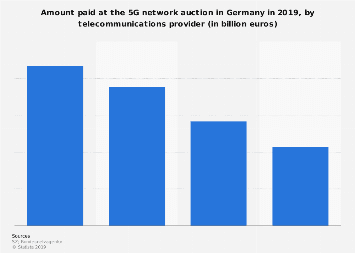](https://www.statista.com/statistics/1015835/5g-auction-winnings-by-telecommunications-provider-germany/)

#### Jun 12, 2019 | Operators & Providers

###  5G network auction winnings in Germany 2019, by provider

This year’s 5G auction in Germany concluded with a sum total of over 6 billion euros in winnings for the German government. The money is paid by the four participating telecommunications providers listed in this statistic, with Deutsche Telekom spending the most at 2.17 billion euros. **What is 5G?** 5G, which stands for “fifth generation”, is a cellular network system for broadband connection that is being [eagerly supported](https://www.statista.com/chart/17506/5g-and-4g-comparison/) internationally. Advantages in comparison to previous technology include faster latency (time between an order given to a device and its completion) and better bandwidth. Considering that Germany still has [a lot of work to do](https://www.statista.com/chart/16419/mobile-interent-speed/) in terms of improving its mobile internet speed in particular, it’s understandable why 5G is an issue occupying both providers and consumers alike. Current frequencies are expected to be exhausted and not fit to hold up to rising data volume exchanges, which is why the 5G auction was held among Germany’s leading telecommunication companies. **5G and the future** 5G is hailed as being crucial for high quality, quicker mobile connectivity and improved network functions. While the enthusiasm from telecommunications providers is peaking, experts do warn that worldwide 5G coverage will take time, with [global implementation](https://www.statista.com/chart/9604/5g-subscription-forecast/) expected to roll out in 2021. In Germany this might happen even later.

[**Read more](https://www.statista.com/statistics/1015835/5g-auction-winnings-by-telecommunications-provider-germany/)

[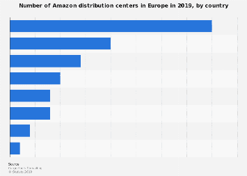](https://www.statista.com/statistics/1011874/amazon-fulfillment-centers-by-country-europe/)

#### May 24, 2019 | Logistics

###  Number of Amazon fulfillment centers in Europe 2019, by country

This statistic shows the number of Amazon fulfillment centers in Europe in 2019. As of that year, Amazon operated 53 distribution centers on the continent, the majority of which were located in the United Kingdom.

[**Read more](https://www.statista.com/statistics/1011874/amazon-fulfillment-centers-by-country-europe/)

[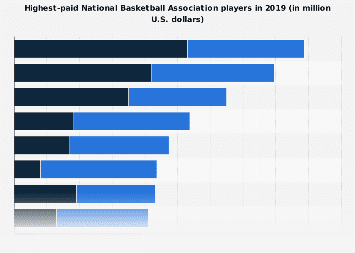](https://www.statista.com/statistics/202939/nba-players-with-the-highest-salaries/)

#### Feb 12, 2019 | Professional Sports

###  National Basketball Association highest-paid players (salaries & endorsements) 2019

The graph shows the top-ten NBA players in terms of earnings (salary & endorsement deals) in 2019. LeBron James was the top-earning player in the National Basketball Association in 2019, with a salary of 35.7 million U.S. dollars and around 53 million U.S. dollars in off-court income. ** Highest paid NBA players – additional information **[NBA](https://www.statista.com/topics/967/national-basketball-association/) players have two main sources of revenues: salary from the team and endorsements. NBA players not only have deals with sports brands such as Nike and Adidas, but also with brands such as Coca-Cola, Panini, Kia Motors, Red Bull, to name a few. Shoe deals are particularly profitable for NBA players. Michael Jordan, for example, still profits from endorsements, as its signature shoes have a large share of the basketball shoe market. Thanks to endorsements, L.A. Lakers’ LeBron James is the highest-paid NBA player in 2019. During that year, James’ earnings stood at 88.7 million U.S. dollars, and about 60 percent of his earnings were generated from endorsements. Some of James' endorsements include Nike, Coca-Cola, Beats By Dre, Blaze Pizza and 2K Sports. Golden State Warriors' Steph Curry was the second highest-paid NBA player, with a salary of 37.5 million U.S. dollars and 42 million U.S. dollars in income from endorsement deals.

[**Read more](https://www.statista.com/statistics/202939/nba-players-with-the-highest-salaries/)

[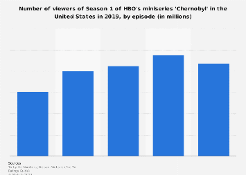](https://www.statista.com/statistics/1013191/chernobyl-series-viewers/)

#### Jun 4, 2019 | TV & Video

###  'Chernobyl' Season 1 viewer numbers in the U.S. 2019

The statistic shows the number of viewers of Season 1 of HBO's miniseries 'Chernobyl' in the United States in 2019, sorted by episode. The data reveals that the fourth episode of HBO show 'Chernobyl' had the most viewers, with an audience of over 1.19 million in the United States within the 18 to 49 demographic.

[**Read more](https://www.statista.com/statistics/1013191/chernobyl-series-viewers/)

[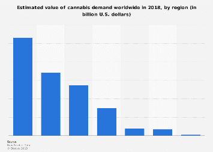](https://www.statista.com/statistics/1015224/cannabis-demand-value-market-world-region/)

#### Jun 1, 2019 | Tobacco

###  Global cannabis demand value in 2018, by region

This statistic presents the global estimated value of cannabis demand in 2018, broken down by world region. In that year, the demand for cannabis in Asia was estimated to be worth around 132.9 billion U.S. dollars.

[**Read more](https://www.statista.com/statistics/1015224/cannabis-demand-value-market-world-region/)

[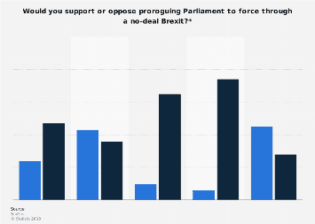](https://www.statista.com/statistics/1015557/no-deal-brexit-support-for-proroguing-parliament-uk/)

#### Jun 11, 2019 | Politics & Government

###  Opinion on proroguing Parliament to force a no-deal Brexit in Great Britain 2019

Close to half of British adults were opposed to the suggestion of forcing through a no-deal Brexit by 'proroguing' Parliament according to an opinion poll in June 2019. The idea of preventing MPs from voting against a no-deal Brexit by formally ending the Parliamentary session shortly before the Brexit deadline in October 2019 was brought forward by some candidates for the leadership of the UK's Conservative Party. Among Remain voters, 74 percent were opposed to prorogation, whereas 45 percent of Leave voters supported the idea.

[**Read more](https://www.statista.com/statistics/1015557/no-deal-brexit-support-for-proroguing-parliament-uk/)

## Popular topics

### Starting point of your research

[Amazon](https://www.statista.com/topics/846/amazon/)[Apple](https://www.statista.com/topics/847/apple/)[Facebook](https://www.statista.com/topics/751/facebook/)[Google](https://www.statista.com/topics/1001/google/)[Netflix](https://www.statista.com/topics/842/netflix/)[Nike](https://www.statista.com/topics/1243/nike/)[Starbucks](https://www.statista.com/topics/1246/starbucks/)[Tesla](https://www.statista.com/topics/2086/tesla/)[Walmart](https://www.statista.com/topics/1451/walmart/)[Agriculture](https://www.statista.com/topics/1126/us-agriculture/)[Automotive](https://www.statista.com/topics/1487/automotive-industry/)[Pharmaceuticals](https://www.statista.com/topics/1764/global-pharmaceutical-industry/)[Tourism](https://www.statista.com/topics/962/global-tourism/)[Wellness](https://www.statista.com/topics/1336/wellness-and-spa/)[Advertising](https://www.statista.com/topics/1176/online-advertising/)[E-Commerce](https://www.statista.com/topics/871/online-shopping/)[Video Games](https://www.statista.com/topics/868/video-games/)[Virtual Reality](https://www.statista.com/topics/2532/virtual-reality-vr/)[Employment](https://www.statista.com/topics/771/employment/)[GDP](https://www.statista.com/topics/772/gdp/)[Health](https://www.statista.com/topics/799/health/)[Population](https://www.statista.com/topics/776/population/)[Poverty](https://www.statista.com/topics/781/poverty/)[Terrorism](https://www.statista.com/topics/2267/terrorism/)[Forecasts](https://www.statista.com/stats/Forecast)[European Union](https://www.statista.com/topics/921/european-union/)[Germany](https://www.statista.com/topics/1903/germany/)[India](https://www.statista.com/topics/754/india/)[United Kingdom](https://www.statista.com/topics/755/uk/)

##  News & Reports

###  Expert research in condensed form

New

####  Dossier: Banking Industry in Saudi Arabia

This dossier presents a range of statistics and facts about the banking industry in Saudi Arabia, including chapters on the following:

- Islamic banking
- Loans
- Capital market
- and more

[** More Information](https://www.statista.com/study/63673/banking-industry-in-saudi-arabia/)

New

####  DossierPlus: European financial KPI+cost benchmark

This DossierPlus benchmarks the performance of selected European economies. Get insights on:

- Development of European economies since 2007
- Cost structure and profitability ratios
- Solvency and activity ratios

[** More Information](https://www.statista.com/study/63930/european-financial-kpi-and-cost-benchmark/)

New

####  New features on ecommerceDB.com

Specify your ranking and only select online stores

- Within a certain net sales range
- Focusing on a predefined product category
- Which are online pure players

[** More Information](https://ecommercedb.com/en/ranking/ww/all)

New

####  Beauty & Personal Care extention

Data for 14 new segments in 150 countries, including:

- Lip Cosmetics
- Eye Cosmetics
- Natural Cosmetics
- Sun Protection
- Shower & Bath

[** More Information](https://www.statista.com/outlook/70000000/100/beauty-personal-care/worldwide)

New

####  Dossier: Facebook usage in the United States

This dossier presents insights and statistics on Facebook usage in the United States. It provides an overview of the company's financials, domestic reach as well as extensive statistics on user demographics and usage behavior, especially in light of recent user data privacy concerns.

[** More Information](https://www.statista.com/study/63766/facebook-usage-in-the-united-states/)

New

####  Dossier: Strategic global resources

This dossier contains and overview of statistics on strategic raw materials. Strategically, the raw materials cobalt, lithium, tungsten, and tantalum are used globally by key industries such as the automotive and electronics industries.

[** More Information](https://www.statista.com/study/63735/worldwide-strategic-resources/)

New

####  ecommerceDB.com adds two more countries

From now on, you can get insights into the eCommerce markets of Australia and New Zealand.

- In-depth revenue analyses of relevant URLs
- Extensive KPI analyses
- Various filter options

[** More Information](https://ecommercedb.com/en/ranking/au/all)

New

####  Dossier: Fitness equipment in the United States

As more people in the U.S. become aware of the benefits of exercise, the fitness equipment market continues to grow. This dossier includes the following chapters: market overview, wholesale sales, leading companies in the industry, and consumer behavior within the U.S. fitness equipment market.

[** More Information](https://www.statista.com/study/63282/fitness-equipment-market-in-the-united-states/)

New

####  Dossier: European Elections 2019

Europe prepares to vote for its next 751 MEPs between May 23 and 26, as populist forces threaten the European project. Find out more, including;

- Key facts on the European Union
- Voting intentions by country
- The European Parliament's composition
- Perceptions on the European Union

[** More Information](https://www.statista.com/study/61403/european-parliamentary-elections-2019/)

Updated

####  Update: UK Industry Reports

The reports offer

- An exclusive Brexit analysis
- Statistics
- Forecasts
- > 40 KPIs

in order to assess 42 industries.

[** More Information](https://www.statista.com/industry-reports#region=150-826)

New

####  ecommerceDB.com gets a shiny new look

Visit ecommerceDB.com now and convince yourself of the new design of your eCommerce tool.

[** More Information](https://ecommercedb.com/)

New

####  Dossier: Multichannel retail in the United Kingdom

Get access for insights into:

- Online and offline retail growth rate figures
- Retailers' multichannel and omnichannel capabilities
- Multichannel customer experience

[** More Information](https://www.statista.com/study/61452/multichannel-retail-in-the-united-kingdom-uk/)

New

####  DossierPlus: Cross-border e-commerce

Over a fifth of online shopping sales in 2022 will be generated internationally. Find out more:

- Cross-border e-commerce market overview
- Cross-border shopping behavior
- Logistics
- Challenges and regulations

[** More Information](https://www.statista.com/study/61740/cross-border-e-commerce/)

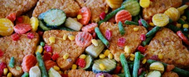
New

####  New Dossier: Frozen food market in Canada

Frozen food is a convenient and practical option for many busy people. Beginning with a global overview, this dossier on the Canadian frozen food market also provides chapters on the key figures, retail overview, and consumer behavior.

[** More Information](https://www.statista.com/study/63119/frozen-food-market-in-canada/)

Updated

####  Global Consumer Survey Update 2019

The GCS 2019 contains more of everything

- more countries - now 46
- more respondents - over 400,000
- more brands - over 5,000
- more industries - over 50
- more possibilities - trend and country comparisons

[** More Information](https://www.statista.com/customercloud/global-consumer-survey)

New

####  Make report: Ford

Ford realized a market share of 8.1% in worldwide revenues in 2018. Find out more, including:

- Market overview and key facts
- Regional comparison
- Performance analysis by segments
- Growth comparison and car prices

[** More Information](https://www.statista.com/study/60872//)

New

####  New Dossier: Dairy industry in India

Dairy is an important part of many people's diets worldwide. This dossier presents key information about the Indian dairy industry, including production of milk and milk products, as well as dairy retail in India.

[** More Information](https://www.statista.com/study/62727/dairy-industry-in-india/)

New

####  230 slides about the Digital Economy:

- Data explosion
- Artificial Intelligence
- Investment & funding
- Forecasts on eight digital markets

[** More Information](https://www.statista.com/page/compass)

## Market Outlooks

### Analyze markets across 150+ countries

Consumer MarketsDigital MarketsMobility Markets

We provide current market figures and forecasts for the most important consumer goods within a total of more than 200 markets. All key figures are internationally comparable and are based on extensive analyses of data from national and international statistical offices, associations, company reports and the trade press.

[Explore the tool](https://www.statista.com/outlook/consumer-markets)[** Watch the tutorial](https://vimeo.com/208289086)

## Statista accounts

### Our complete solutions

####  Basic Account

#####  Get to know us

- Access to basic statistics
- Download as PDF & PNG initial

Free

####  Premium Account

#####  Your perfect start with Statista

- Full access to all statistics
- Stand-alone licenseinitial

$49 / month*

#### Corporate Account

#####  Our company solution

- All functions of the Premium Account
- Access to all dossiers, forecasts, studies initial

starting at $650 / month*
*All products require an annual contract. Prices do not include sales tax.
[Go to product overview](https://www.statista.com/accounts/)

## Daily Infographics

### Global stories vividly visualized

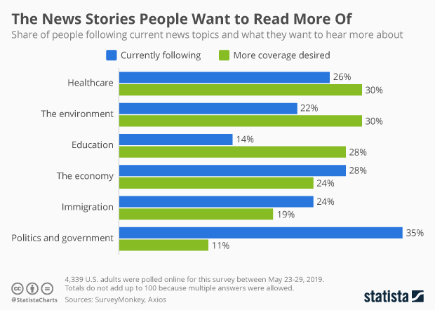[(L)](https://www.statista.com/chart/18383/news-topics-readers-want/)

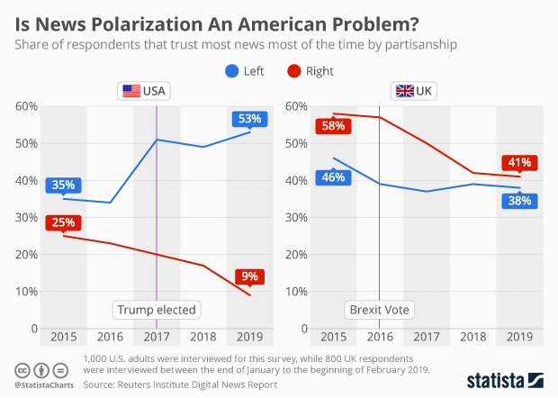[(L)](https://www.statista.com/chart/18382/trust-in-news-polarization/)

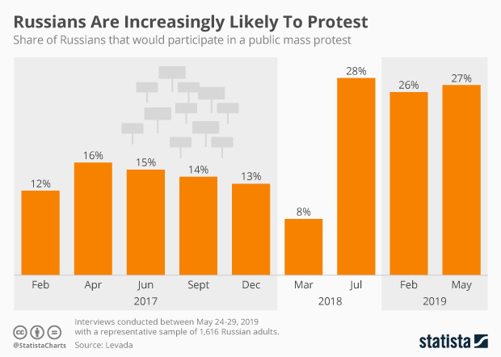[(L)](https://www.statista.com/chart/18381/russia-public-protest/)

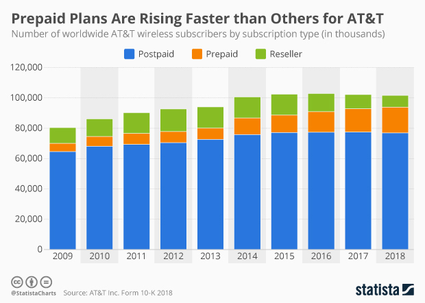[(L)](https://www.statista.com/chart/18380/prepaid-subscription-rise/)

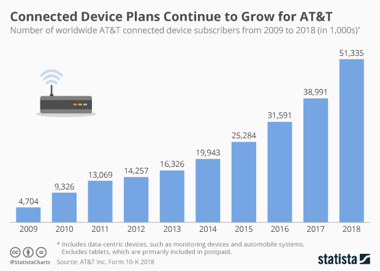[(L)](https://www.statista.com/chart/18379/connected-device-subscriptions/)

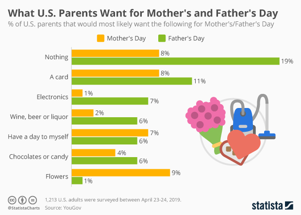[(L)](https://www.statista.com/chart/18378/fathers-and-mothers-day-gifts/)

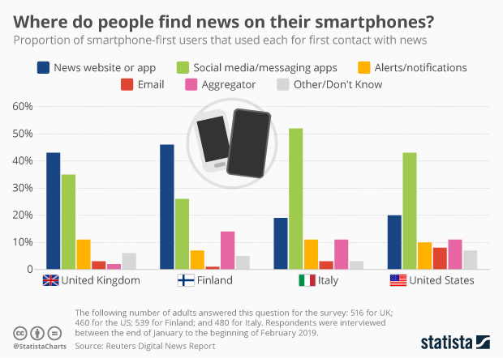[(L)](https://www.statista.com/chart/18377/smartphone-news-access/)

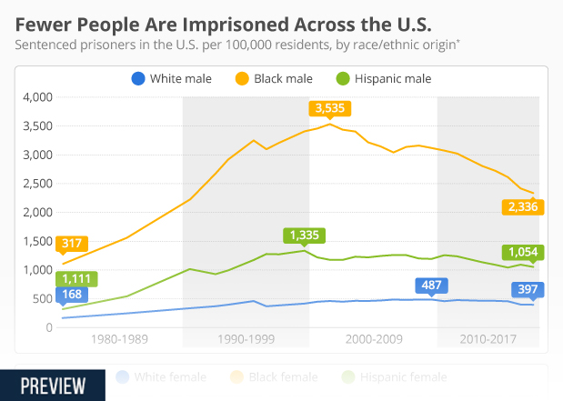[(L)](https://www.statista.com/chart/18376/us-incarceration-rates-by-sex-and-race-ethnic-origin/)

## Global Consumer Survey

### Reveal how consumers think

The Global Consumer Survey helps marketers, planners and product managers to understand consumer behavior and their interaction with brands. Explore consumption and media usage on a global basis.

400,000+consumers
28countries
50+industries
5,000+brands

[Explore the tool](https://www.statista.com/customercloud/global-consumer-survey)[** Watch the tutorial](https://www.vimeo.com/259152340)

## Our Service

### Save time & money with Statista

[![](data:image/svg+xml,%3csvg id='transparency' xmlns='http://www.w3.org/2000/svg' width='120' height='120' class='homeService__icon js-evernote-checked' aria-labelledby='transparencyTitle' data-evernote-id='1567'%3e%3ctitle id='transparencyTitle' data-evernote-id='1568' class='js-evernote-checked'%3eOur sources%3c/title%3e%3cg data-evernote-id='1569' class='js-evernote-checked'%3e%3ccircle fill='%23f0f6fd' cx='59' cy='61' r='50' data-evernote-id='1570' class='js-evernote-checked'%3e%3c/circle%3e%3ccircle id='circle' fill='%23fff' cx='60.5' cy='77.5' r='21.5' data-evernote-id='1571' class='js-evernote-checked'%3e%3c/circle%3e%3cpath id='medal' fill-rule='evenodd' fill='%230f2741' d='M61.838%2c54.407V51.324h6.847A1.618%2c1.618%2c0%2c0%2c0%2c70.4%2c49.612V43.275L83.75%2c22.725a1.556%2c1.556%2c0%2c0%2c0%2c0-1.712%2c1.3%2c1.3%2c0%2c0%2c0-1.369-1.027H68.685a1.525%2c1.525%2c0%2c0%2c0-1.37.856L60.126%2c31.8l-7.019-10.96a2.042%2c2.042%2c0%2c0%2c0-1.541-.856H37.872a1.8%2c1.8%2c0%2c0%2c0-1.541.856%2c1.556%2c1.556%2c0%2c0%2c0%2c0%2c1.713L49.684%2c43.1V49.44A1.618%2c1.618%2c0%2c0%2c0%2c51.4%2c51.153h6.847v3.083a23.923%2c23.923%2c0%2c1%2c0%2c25.677%2c23.8A23.493%2c23.493%2c0%2c0%2c0%2c61.838%2c54.407Zm7.7-31h9.586L67.658%2c40.878H58.072Zm-28.588%2c0H50.54L57.9%2c34.884l-3.937%2c5.994H52.423ZM53.279%2c47.728V44.3H66.974v3.425H53.279Zm6.847%2c51.034a20.551%2c20.551%2c0%2c1%2c1%2c20.542-20.55A20.607%2c20.607%2c0%2c0%2c1%2c60.126%2c98.762Z' data-evernote-id='1572' class='js-evernote-checked'%3e%3c/path%3e%3cpath id='star' fill-rule='evenodd' fill='%232f84e5' d='M73.944%2c73.761a1.423%2c1.423%2c0%2c0%2c0-1.187-1.005L64.9%2c71.607l-3.56-6.894A1.57%2c1.57%2c0%2c0%2c0%2c60%2c64a1.428%2c1.428%2c0%2c0%2c0-1.335.862L55.1%2c71.75%2c47.242%2c72.9A1.423%2c1.423%2c0%2c0%2c0%2c46.056%2c73.9a1.276%2c1.276%2c0%2c0%2c0%2c.445%2c1.436l5.637%2c5.314L50.8%2c88.266A1.346%2c1.346%2c0%2c0%2c0%2c51.4%2c89.7a1.636%2c1.636%2c0%2c0%2c0%2c1.632.144L60%2c86.255l6.972%2c3.59A1.7%2c1.7%2c0%2c0%2c0%2c68.6%2c89.7a1.346%2c1.346%2c0%2c0%2c0%2c.593-1.436l-1.335-7.611L73.5%2c75.341A1.586%2c1.586%2c0%2c0%2c0%2c73.944%2c73.761Zm-8.752%2c5.314a1.964%2c1.964%2c0%2c0%2c0-.445%2c1.292l1.038%2c5.457-5.044-2.585a1.142%2c1.142%2c0%2c0%2c0-1.335%2c0l-5.044%2c2.585L55.4%2c80.367a1.42%2c1.42%2c0%2c0%2c0-.445-1.292L50.8%2c75.2l5.637-.862a2.049%2c2.049%2c0%2c0%2c0%2c1.187-.718l2.522-4.883%2c2.522%2c4.883a1.177%2c1.177%2c0%2c0%2c0%2c1.187.718L69.494%2c75.2Z' data-evernote-id='1573' class='js-evernote-checked'%3e%3c/path%3e%3c/g%3e%3c/svg%3e)](https://www.statista.com/sources/1/)

####  Trusted content

All of our statistics provide detailed information on the data source. Statista works closely with more than 22,500 trusted partners.

[**Our sources](https://www.statista.com/sources/1/)

[![](data:image/svg+xml,%3csvg id='expertise' xmlns='http://www.w3.org/2000/svg' width='120' height='120' class='homeService__icon js-evernote-checked' aria-labelledby='expertiseTitle' data-evernote-id='1575'%3e%3ctitle id='expertiseTitle' data-evernote-id='1576' class='js-evernote-checked'%3eOur team%3c/title%3e%3cg data-evernote-id='1577' class='js-evernote-checked'%3e%3ccircle fill='%23f0f6fd' cx='57' cy='61' r='50' data-evernote-id='1578' class='js-evernote-checked'%3e%3c/circle%3e%3cpath fill='%23fff' fill-rule='evenodd' d='M73%2c14c-2.415%2c1.791-5%2c9-5%2c9l1%2c10%2c4%2c8v4l9%2c1h9v6l16-8h4l-1-28S75.415%2c12.209%2c73%2c14Z' data-evernote-id='1579' class='js-evernote-checked'%3e%3c/path%3e%3cpath fill='%230f2741' fill-rule='evenodd' d='M57.953%2c26.993a21.628%2c21.628%2c0%2c0%2c0-6.9%2c1.2A13.325%2c13.325%2c0%2c0%2c0%2c41.977%2c39.8c-0.044.578-.044%2c1.112-0.044%2c1.645v0.445a31.136%2c31.136%2c0%2c0%2c0%2c3.1%2c12.9h0a18.981%2c18.981%2c0%2c0%2c0%2c4.6%2c5.958A12.134%2c12.134%2c0%2c0%2c0%2c57.865%2c63.9h0.4a11.859%2c11.859%2c0%2c0%2c0%2c8.055-3.157%2c20.389%2c20.389%2c0%2c0%2c0%2c4.6-5.958%2c29.823%2c29.823%2c0%2c0%2c0%2c3.1-12.9V41.444c0-.578%2c0-1.111-0.044-1.69A13.362%2c13.362%2c0%2c0%2c0%2c64.9%2c28.149%2c21.473%2c21.473%2c0%2c0%2c0%2c57.953%2c26.993ZM69.681%2c40.244a5.029%2c5.029%2c0%2c0%2c1%2c0%2c1.156v0.489a25.926%2c25.926%2c0%2c0%2c1-2.7%2c11.028A14.868%2c14.868%2c0%2c0%2c1%2c63.4%2c57.541a7.935%2c7.935%2c0%2c0%2c1-5.09%2c2.046H57.6a7.615%2c7.615%2c0%2c0%2c1-5-2%2c14.857%2c14.857%2c0%2c0%2c1-3.585-4.624%2c25.922%2c25.922%2c0%2c0%2c1-2.7-11.028v-1.6a8.976%2c8.976%2c0%2c0%2c1%2c6.24-7.915%2c15.323%2c15.323%2c0%2c0%2c1%2c5.4-.934%2c16.256%2c16.256%2c0%2c0%2c1%2c5.444.934A8.662%2c8.662%2c0%2c0%2c1%2c69.681%2c40.244ZM87.827%2c95.006A2.177%2c2.177%2c0%2c0%2c0%2c90%2c92.827V81.464c0.044-1.023-.266-5.914-7.258-8.271-0.443-.178-11.2-3.824-13.941-4.669l-1.239-.4L58%2c77.729l-9.559-9.6-1.239.4c-2.7.845-13.454%2c4.535-13.941%2c4.669C26.266%2c75.55%2c26%2c80.486%2c26%2c81.464V92.827a2.169%2c2.169%2c0%2c1%2c0%2c4.337%2c0v-11.5c0-.267.088-2.535%2c4.293-3.957%2c0.089-.044%2c8.719-2.979%2c12.569-4.224L57.953%2c83.954%2c68.708%2c73.149c3.85%2c1.245%2c12.48%2c4.18%2c12.569%2c4.224%2c4.2%2c1.423%2c4.293%2c3.691%2c4.293%2c3.913v11.54A2.254%2c2.254%2c0%2c0%2c0%2c87.827%2c95.006Z' data-evernote-id='1580' class='js-evernote-checked'%3e%3c/path%3e%3cpath fill='%232f84e5' fill-rule='evenodd' d='M90.943%2c55.006a2.261%2c2.261%2c0%2c0%2c1-1.032-.273%2c2.175%2c2.175%2c0%2c0%2c1-1.147-1.959l0.115-6.327H79.726a2.127%2c2.127%2c0%2c0%2c1%2c0-4.254H91.048a2.162%2c2.162%2c0%2c0%2c1%2c1.513.639l0.031%2c0.033a2.252%2c2.252%2c0%2c0%2c1%2c.583%2c1.507L93.1%2c48.97l10.5-6.462%2c0.033-.017a2.376%2c2.376%2c0%2c0%2c1%2c1.058-.272h3.025a1.146%2c1.146%2c0%2c0%2c0%2c.979-1.134V17.419a1.136%2c1.136%2c0%2c0%2c0-1.134-1.134H73.387a1.136%2c1.136%2c0%2c0%2c0-1.134%2c1.134v5.714a2.127%2c2.127%2c0%2c1%2c1-4.254%2c0V17.419A5.421%2c5.421%2c0%2c0%2c1%2c73.414%2c12h34.174A5.42%2c5.42%2c0%2c0%2c1%2c113%2c17.419V41.111a5.437%2c5.437%2c0%2c0%2c1-5.071%2c5.413l-0.055%2c0h-2.526L92.066%2c54.7A2.087%2c2.087%2c0%2c0%2c1%2c90.943%2c55.006Z' data-evernote-id='1581' class='js-evernote-checked'%3e%3c/path%3e%3c/g%3e%3c/svg%3e)](https://www.statista.com/working-at-statista/)

#### Industry expertise

Over 300 researchers and specialists gather and double-check every statistic we publish. Experts provide country and industry-based forecasts.

[**Our team](https://www.statista.com/working-at-statista/)

[![](data:image/svg+xml,%3csvg id='flatrate' xmlns='http://www.w3.org/2000/svg' width='120' height='120' class='homeService__icon js-evernote-checked' aria-labelledby='flatrateTitle' data-evernote-id='1583'%3e%3ctitle id='flatrateTitle' data-evernote-id='1584' class='js-evernote-checked'%3eOur Accounts%3c/title%3e%3cg data-evernote-id='1585' class='js-evernote-checked'%3e%3ccircle fill='%23f0f6fd' cx='57' cy='61' r='50' data-evernote-id='1586' class='js-evernote-checked'%3e%3c/circle%3e%3ccircle fill='%23fff' cx='87' cy='86' r='18' data-evernote-id='1587' class='js-evernote-checked'%3e%3c/circle%3e%3cpath fill='%230f2741' fill-rule='evenodd' d='M58%2c27.287c-15.964%2c0-28%2c5.491-28%2c12.813V83.115c0%2c7.322%2c12.036%2c12.9%2c28%2c12.9%2c1.5%2c0%2c3.009-.083%2c4.513-0.167a2.087%2c2.087%2c0%2c1%2c0-.334-4.16c-1.421.083-2.842%2c0.166-4.179%2c0.166-13.624%2c0-23.821-4.576-23.821-8.653v-7.4C39.027%2c79.372%2c47.719%2c81.7%2c58%2c81.7c1%2c0%2c1.922%2c0%2c2.842-.083a2.12%2c2.12%2c0%2c0%2c0%2c2.006-2.163%2c2.065%2c2.065%2c0%2c0%2c0-2.173-2c-0.919%2c0-1.755.084-2.675%2c0.084-13.624%2c0-23.821-4.576-23.821-8.653v-7.4C39.027%2c65.061%2c47.719%2c67.39%2c58%2c67.39c15.964%2c0%2c28-5.491%2c28-12.813V40.1C86%2c32.779%2c73.964%2c27.287%2c58%2c27.287ZM81.821%2c54.494c0%2c4.077-10.2%2c8.653-23.821%2c8.653s-23.821-4.576-23.821-8.653v-7.4C39.027%2c50.667%2c47.719%2c53%2c58%2c53s18.973-2.329%2c23.821-5.907v7.4ZM58%2c48.754c-13.624%2c0-23.821-4.576-23.821-8.653S44.376%2c31.448%2c58%2c31.448%2c81.821%2c36.023%2c81.821%2c40.1%2c71.624%2c48.754%2c58%2c48.754Z' data-evernote-id='1588' class='js-evernote-checked'%3e%3c/path%3e%3cpath fill='%232f84e5' fill-rule='evenodd' d='M87.495%2c65.994a20.5%2c20.5%2c0%2c1%2c0%2c20.51%2c20.5A20.546%2c20.546%2c0%2c0%2c0%2c87.495%2c65.994ZM87.4%2c102.267a15.775%2c15.775%2c0%2c1%2c1%2c15.784-15.775A15.807%2c15.807%2c0%2c0%2c1%2c87.4%2c102.267ZM96.474%2c84.13H89.763V77.424a2.363%2c2.363%2c0%2c0%2c0-4.726%2c0v9.068A2.339%2c2.339%2c0%2c0%2c0%2c87.4%2c88.854h9.074A2.362%2c2.362%2c0%2c1%2c0%2c96.474%2c84.13Z' data-evernote-id='1589' class='js-evernote-checked'%3e%3c/path%3e%3c/g%3e%3c/svg%3e)](https://www.statista.com/accounts/)

#### Flatrate access

With our solutions you find data that matters within minutes – ready to go in your favorite format.

[**Our Accounts](https://www.statista.com/accounts/)

## Contact

### Get in touch with us. We are happy to help.

#### Esther Shaulova

##### Operations Manager

Email
[support@statista.com](https://www.statista.com/mailto:support@statista.com)
Tel
[+1 212 419-5770](https://www.statista.com/fon:+1 212 419-5770)
Mon - Fri, 9am - 6pm (EST)

#### Ziyan Zhang

##### Customer Relations

Email

[asia.support@statista.com](https://www.statista.com/mailto:asia.support@statista.com)

Tel
[+91 80 490164-28](https://www.statista.com/fon:+91 80 490164-28)
Mon - Fri, 11:30am - 10pm (IST)

#### Lodovica Biagi

##### Operations Manager UK

Email

[eu.support@statista.com](https://www.statista.com/mailto:eu.support@statista.com)

Tel
[+44 203 709-9960](https://www.statista.com/fon:+44 203 709-9960)
Mon - Fri, 9:30am - 5pm (GMT)

#### Isabella Sanchez

##### Key Account Manager

Email

[Isabella.Sanchez@statista.com](https://www.statista.com/mailto:Isabella.Sanchez@statista.com)

Tel
[+1 212 419-8296](https://www.statista.com/fon:+1 212 419-8296)
Mon - Fri, 9am - 6pm (EST)