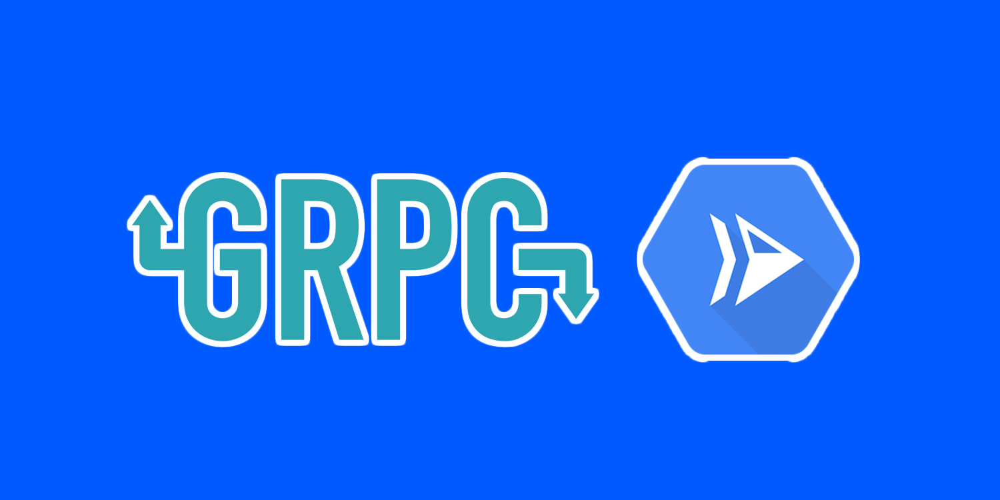
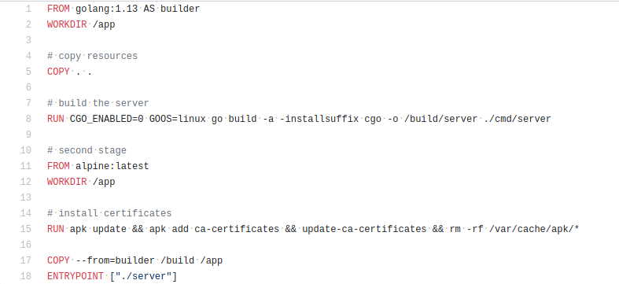
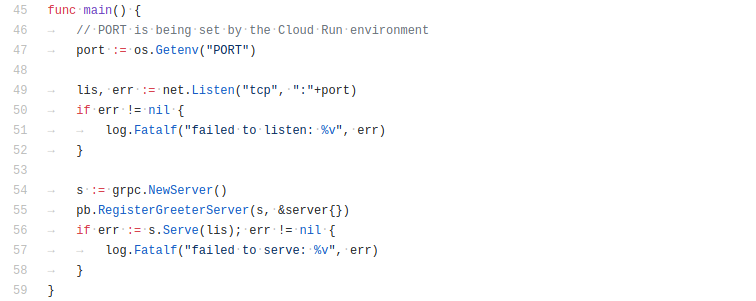
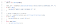
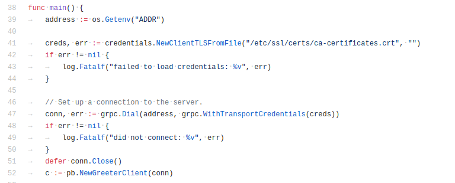
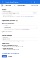
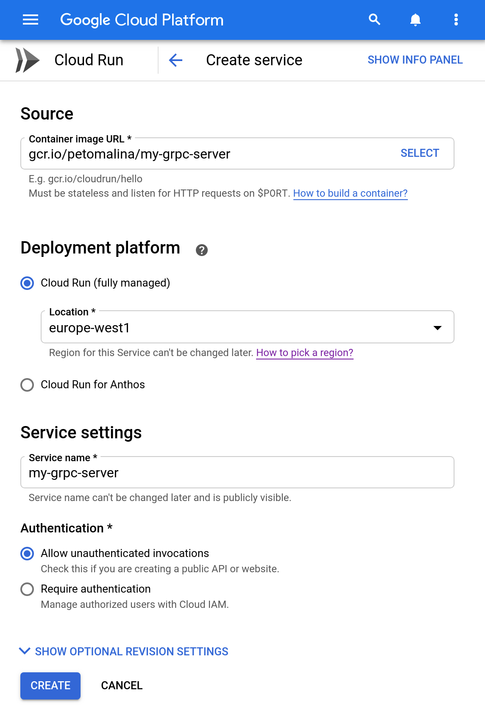

☁️Serverless gRPC with Cloud Run

# ☁️Serverless gRPC with Cloud Run

[Peter Malina](https://medium.com/@petomalina?source=post_page-----bab3622a47da----------------------)

[Oct 9](https://medium.com/@petomalina/%EF%B8%8Fserverless-grpc-with-cloud-run-bab3622a47da?source=post_page-----bab3622a47da----------------------) · 4 min read

Serverless, gRPC, containers. The dream has been becoming real with the first releases of [Google Cloud Run](https://cloud.google.com/run/) , which only supported HTTP. However, with the recent releases, the fully-managed platform now also supports **unary gRPC requests**.**  **Let’s find out what you need to do to run such a setup.

Cloud Run release notes stating it now supports unary gRPC

* * *

*...*

#  Requirements

First, because we are running containers, we’ll need **Dockerfile**. The Dockerfile will allow us to build our container image and push it into the Google Cloud Registry (gcr.io). Next, we’ll need to work out the connections between our gRPC services.

*I am going to use the Go language as an example, but because we are running containers, there is no limit as long as you can build your image.*

[ ## petomalina/cloudrun-grpc  ###  Source code for the hello world example that is using some adjustments to run on the Cloud Run properly. Links to all files under images.     ####  github.com](https://github.com/petomalina/cloudrun-grpc?source=post_page-----bab3622a47da----------------------)

https://github.com/petomalina/cloudrun-grpc/blob/master/build/package/Dockerfile

Note mainly line 15 where we install the certificates. These are needed if your application wants to communicate with the outside world. You can use this Dockerfile to build both client and server parts.

* * *

*...*

#  Server Implementation

Now, the gRPC support is out-of-the-box, so we don’t need to make any changes to our existing code. However, Cloud Run uses a unique **env variable PORT **to that is set for you by the platform, and your server **needs to listen on it**. Note that we are only using the installed certificates if we want to call other services from the server. No special setup is needed for this part.

https://github.com/petomalina/cloudrun-grpc/blob/master/cmd/server/main.go#L45

#  Client Implementation

Cloud Run uses HTTPS to secure all connections to the servers, so all clients need to encrypt the communication. Because the platform uses trusted certificates, we only need to install them the same way we do with our server (Dockerfile line 15).

https://github.com/petomalina/cloudrun-grpc/blob/master/cmd/client/main.go#L38

These certificates are then be loaded on line 41 via the gRPC credentials package. All languages have their equivalent to this function in Go. Next, we’ll pass the credentials into the `grpc.Dial` to create the TLS transport on line 47.

The client can be run using `ADDR=<your-cr-url> go run cmd/client/main.go` . You will only need to replace the Cloud Run URL.

#  Deploying to Cloud Run

Now that we have our implementations of the Client and the Server, we can build and push the server image using these commands (from the repository root):

docker build . \
-t gcr.io/<your-project>/my-grpc-server \
-f build/package/Dockerfiledocker push gcr.io/<your-project>/my-grpc-server

Once the image is pushed into the `gcr.io` , we can continue by deploying the image either from the CLI or using the UI on the Google Cloud.

Cloud Run Console for creating new Cloud Run Service
We are targeting our newly pushed image in the **Container Image URL**.

Moreover, if you want to hit the service from the internet without authentication, you can simply check the **Allow unauthenticated invocations** radio button.

Once the service is deployed, you should get the URL that can be hit using the Client secured with the trusted public certificate

#  Conclusion

You should now be able to call the gRPC service either from the public internet or from other services running on GCP. Make sure to only use the Unary gRPC at the moment, as the streaming will get killed by the platform.

Questions? Reach out to me here or on my [Twitter](https://twitter.com/petomalina)