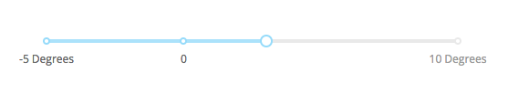
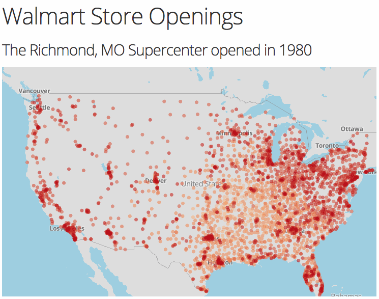
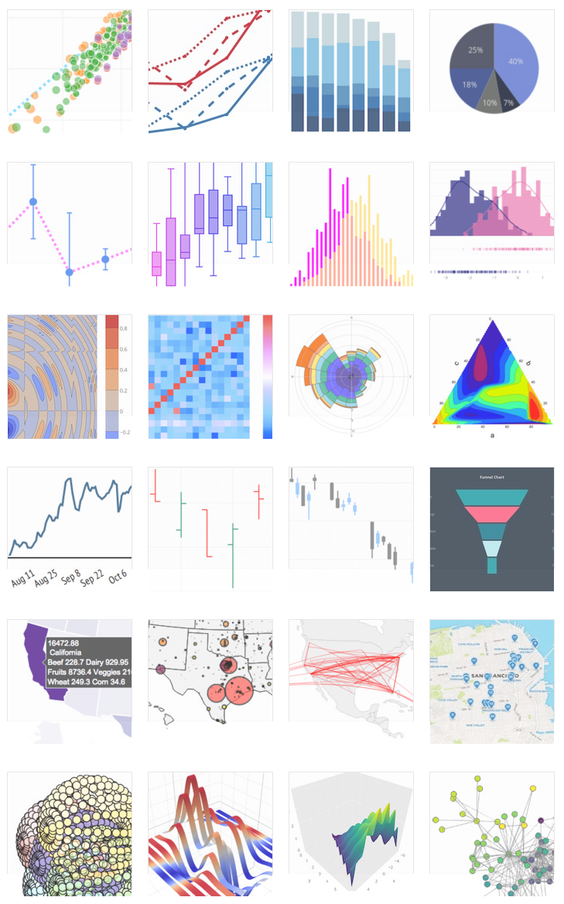

🌟 Introducing Dash 🌟 – plotly – Medium

# 🌟 Introducing Dash 🌟

### Create Reactive Web Apps in pure Python

[Dash](https://plot.ly/products/dash) is a Open Source Python library for creating reactive, Web-based applications. Dash started as a public proof-of-concept on GitHub 2 years ago. We kept this prototype online, but subsequent work on Dash occurred behind closed doors. We used feedback from private trials at banks, labs, and data science teams to guide the product forward. **Today, we’re excited to announce the first public release of Dash that is both enterprise-ready and a first-class member of Plotly’s open-source tools.** Dash can be downloaded today from Python’s package manager with `pip install dash` — it’s entirely open-source and MIT licensed. You’ll find a [getting started guide here](https://plot.ly/dash) and the [Dash code on GitHub here](https://github.com/plotly/dash).

Dash is a user interface library for creating analytical web applications. Those who use Python for data analysis, data exploration, visualization, modelling, instrument control, and reporting will find immediate use for Dash.

Dash makes it dead-simple to build a GUI around your data analysis code. Here’s a 43-line example of a Dash App that ties a Dropdown to a D3.js Plotly Graph. As the user selects a value in the Dropdown, the application code dynamically exports data from Google Finance into a Pandas DataFrame. This app was written in just 43 lines of code ([view the source](https://gist.github.com/chriddyp/3d2454905d8f01886d651f207e2419f0)). *Simple*.

Hello World Dash app. For more examples, check out the [user guide](https://plot.ly/dash/).

Dash app code is declarative and reactive, which makes it easy to build complex apps that contain many interactive elements. Here’s an example with 5 inputs, 3 outputs, and cross filtering. This app was composed in just 160 lines of code, all of which were Python.

Dash app with cross filtering, multiple inputs, and multiple outputs. Built in around 163 lines of Python. [View the source](https://gist.github.com/chriddyp/9b2b3e8a6c67697279d3724dce5dab3c)

Every aesthetic element of the app is customizable: The sizing, the positioning, the colors, the fonts. Dash apps are built and published in the Web, so the full power of CSS is available. Here’s an example of a highly customized, interactive Dash report app, in the brand and style of a Goldman Sachs report.

A highly customized Dash app, styled just like a Goldman Sachs report. [View the source](https://plot.ly/~jackp/17561).

While Dash apps are viewed in the web browser, you don’t have to write any Javascript or HTML. Dash provides a Python interface to a rich set of interactive web-based components.

import dash_core_components as dcc
dcc.Slider(value=4, min=-10, max=20, step=0.5,
labels={-5: '-5 Degrees', 0: '0', 10: '10 Degrees'})

An example of a simple Dash Slider component

Dash provides a simple reactive decorator for binding your custom data analysis code to your Dash user interface.

@dash_app.callback(Output('graph-id', 'figure'),
[Input('slider-id', 'value')])
def your_data_analysis_function(new_slider_value):
new_figure = your_compute_figure_function(new_slider_value)
return new_figure

When an input element changes (e.g. when you select an item in the dropdown or drag a slider), Dash’s decorator provides your Python code with the new value of the input.

Your Python function can do anything that it wants with this input new value: It could filter a [Pandas](http://pandas.pydata.org/)  `DataFrame`, make a SQL query, run a simulation, perform a calculation, or start an experiment. Dash expects that your function will return a new property of some element in the UI, whether that’s a new graph,a new table, or a new text element.

For example, here’s a simple Dash application that updates a text box as you interact with the `Graph` element. The application code filters data in a Pandas `DataFrame` based off of the currently selected point.

Dash app that displays custom meta information as you hover over points by filtering a Pandas DataFrame. 60 lines of code. [View the source](https://gist.github.com/chriddyp/1a95f6582a5256db9847086232987bff).

This Dash application displays meta information about drugs as you hover over points in the `Graph` component. The application code also appends rows to the `Table` component when elements are added to the multi `Dropdown` component.

component.

A Dash App for drug discovery. Hovering over points displays a description of the drug. Selecting drugs in the dropdown highlights their position in the chart and appends their symbol in the table below. Built in a few hundred lines of Python code.

Through these two abstractions — Python components and reactive functional decorators — Dash abstracts away all of the technologies and protocols that are required to build an interactive web-based application. Dash is simple enough that you can bind a user interface around your Python code in an afternoon.

### Architecture

**Flask and React**

Dash applications are web servers running [Flask](http://flask.pocoo.org/) and communicating JSON packets over HTTP requests. Dash’s frontend renders components using React.js, the Javascript user-interface library written and maintained by Facebook.

Flask is great. It’s widely adopted by the Python community and deployed in production environments everywhere. The underlying instance of Flask and all of its configurable properties is accessible to Dash app developers. For advanced developers, Dash apps can be extended through the rich set of [Flask Plugins](http://flask.pocoo.org/extensions/) as well.

React is fantastic too. At Plotly, we’ve rewritten our entire web-platform and our [online chart editor](https://plot.ly/create) with React. One of the incredible things about React is how prolific and talented the community is. The open source React community has published thousands of high quality interactive components, from [Dropdowns](https://github.com/JedWatson/react-select) to [Sliders](http://react-component.github.io/slider/examples/range.html) to [Calendar Pickers](https://github.com/airbnb/react-dates) to [Interactive Tables](https://react.rocks/tag/DataTable).

Dash leverages the power of Flask and React, putting them to work for Python data scientists who may not be expert Web programmers.

**From React.js to Python Dash Components**

Dash components are Python classes that encode the properties and values of a specific React component and that serialize as JSON. Dash provides a [toolset](https://github.com/plotly/dash-components-archetype) to easily package React components (written in Javascript) as components that can be used in Dash. This toolset uses dynamic programming to automatically generate standard Python classes from annotated React propTypes. The resulting Python classes that represent Dash components are user friendly: They come with automatic argument validation, docstrings, and more.

Here’s an example of the dynamically generated argument validation:
>>> import dash_core_components as dcc
>>> dcc.Dropdown(valu=3)
Exception: Unexpected keyword argument `valu`
Allowed arguments: id, className, disabled, multi, options, placeholder, value
and an example of the dynamically generated component docstrings:
>>> help(dcc.Dropdown)
class Dropdown(dash.development.base_component.Component)

| A Dropdown component.
| Dropdown is an interactive dropdown element for selecting one or more
| items.
| The values and labels of the dropdown items are specified in the `options`
| property and the selected item(s) are specified with the `value` property.

|

| Use a dropdown when you have many options (more than 5) or when you are
| constrained for space. Otherwise, you can use RadioItems or a Checklist,
| which have the benefit of showing the users all of the items at once.

|

| Keyword arguments:
| - id (string; optional)
| - className (string; optional)
| - disabled (boolean; optional): If true, the option is disabled
| - multi (boolean; optional): If true, the user can select multiple values
| - options (list; optional)
| - placeholder (string; optional): The grey, default text shown when no option is selected
| - value (string | list; optional): The value of the input. If `multi` is false (the default)
| then value is just a string that corresponds to the values
| provided in the `options` property. If `multi` is true, then
| multiple values can be selected at once, and `value` is an
| array of items with values corresponding to those in the
| `options` prop.

|

| Available events: 'change

The full set of HTML tags, like `
`, ``, `<table/>` are also rendered dynamically with React and their Python classes are available through the `dash_html_component` library. A core set of interactive components like `Dropdown`, `Graph`, `Slider` will be maintained by the Dash core team through the `dash_core_components` library. Both of these libraries use the standard open-source React-to-Dash toolchain that *you* could use if you were to write your own component library.

You’re not tied to using the standard Dash component library. The Dash component libraries are imported separately from the core Dash library. With the React-to-Dash toolchain, you can easily write or port a React.js component into a Python class that can be used in your Dash application. Here’s [the tutorial on building your own components](https://plot.ly/dash/plugins). Or, the Dash core team can [build one for you](https://plot.ly/products/consulting-and-oem/).

**Concurrency — Multi-User Applications**

The state of a Dash application is stored in the front-end (i.e. the web browser). This allows Dash apps to be used in a multitenant setting: Multiple users can have independent sessions while interacting with a Dash app at the same time. Dash application code is functional: Your application code can read values from the global Python state but it can’t modify them. This functional approach is easy to reason about and easy to test: It’s just inputs and outputs with no side-effects or state.

**CSS and Default Styles**

CSS and default styles are kept out of the core library for modularity, independent versioning, and to encourage Dash App developers to customize the look-and-feel of their apps. The Dash core team maintains a [core style guide here](https://codepen.io/chriddyp/pen/bWLwgP).

**Data Visualization**

Dash ships with a Graph component that renders charts with [plotly.js](https://github.com/plotly/plotly.js). Plotly.js is a great fit for Dash: it’s declarative, open source, fast, and supports a complete range of scientific, financial, and business charts. Plotly.js is built on top of D3.js (for publication-quality, vectorized image export) and WebGL (for high performance visualization).

Dash’s Graph element shares the same syntax as the open-source [plotly.py](https://plot.ly/python) library, so you can easily to switch between the two. Dash’s Graph component hooks into the plotly.js event system, allowing Dash app authors to write applications that respond to hovering, clicking, or selecting points on a Plotly graph.

Some of the available chart types in Dash’s Plotly.js Graph component. See more in the [plotly.py documentation](https://plot.ly/python).

A Dash app with [Plotly.js charts](https://github.com/plotly/plotly.js) from the [Dash app gallery](https://plot.ly/dash/gallery).